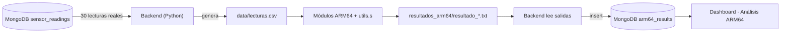
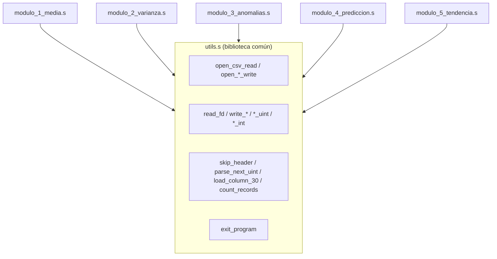

# Procesamiento de datos en ARM64 / AArch64

El sistema incorpora procesamiento estadístico en ensamblador **ARM64/AArch64**, ejecutado directamente sobre la arquitectura de la Raspberry Pi. Cada integrante desarrolla una rutina individual que opera sobre los **30 datos reales** del archivo `lecturas.csv` generado por el invernadero.

> Los cálculos estadísticos se realizan únicamente en ARM64; Python no calcula estos resultados, solo genera el CSV, ejecuta los módulos, lee sus salidas y las publica en MongoDB y el dashboard.

---

## 1. Flujo de integración

```text
Sensores reales → Python → lecturas.csv → Módulos ARM64 → resultados_arm64/
→ Python → MongoDB (arm64_results) → Dashboard (sección Análisis ARM64)
```



---

## 2. Archivo de entrada `lecturas.csv`

Generado por Python con **exactamente 30 registros reales**. Formato obligatorio:

```csv
ID,TEMP,HUM_AIRE,HUM_SUELO_1,HUM_SUELO_2,LUZ,GAS,RIEGO_1,RIEGO_2
1,28,70,45,48,320,120,0,0
2,29,68,42,47,300,130,0,0
3,31,65,38,43,250,145,1,0
...
30,30,66,41,44,260,150,0,0
```

| Índice | Columna     |     | Índice | Columna       |
| ------ | ----------- | --- | ------ | ------------- |
| 0      | ID          |     | 5      | LUZ           |
| 1      | TEMP        |     | 6      | GAS           |
| 2      | HUM_AIRE    |     | 7      | RIEGO_1 (0/1) |
| 3      | HUM_SUELO_1 |     | 8      | RIEGO_2 (0/1) |
| 4      | HUM_SUELO_2 |     |        |               |

Todos los valores son enteros no negativos; los decimales se truncan desde Python.

---

## 3. Biblioteca común `utils.s`

Todos los módulos se enlazan con `utils.s`, que centraliza las tareas comunes de bajo nivel:

| Categoría            | Rutinas                                                                                                                             |
| -------------------- | ----------------------------------------------------------------------------------------------------------------------------------- |
| Apertura de archivos | `open_csv_read`, `open_media_write`, `open_varianza_write`, `open_anomalias_write`, `open_prediccion_write`, `open_tendencia_write` |
| Entrada/salida       | `read_fd`, `close_fd`, `write_all`, `write_cstr`, `write_newline`, `write_uint`, `write_int`                                        |
| Parseo del CSV       | `skip_header`, `parse_next_uint`, `load_column_30`, `count_records`                                                                 |
| Salida del programa  | `exit_program`                                                                                                                      |

Responsabilidades cubiertas: lectura de `lecturas.csv`, recorrido de registros, separación de columnas (9 por registro), conversión ASCII↔entero, almacenamiento temporal en memoria, manejo de buffers y escritura de resultados. Documenta su convención de llamada AAPCS64 (x0–x7 argumentos, x8 syscall, x9–x18 temporales, x19–x28 callee-saved, x30 enlace de retorno, `sp` alineado a 16).



---

## 4. Módulos individuales

Cada integrante desarrolla, compila, ejecuta, depura y defiende su propio módulo. Todos trabajan sobre una variable X = conjunto de 30 datos (temperatura, humedad, luz, gas o humedad de suelo).

| #   | Módulo                           | Responsable                      | Archivo                 | Salida                     | Ficha                                                      |
| --- | -------------------------------- | -------------------------------- | ----------------------- | -------------------------- | ---------------------------------------------------------- |
| 1   | Media aritmética ponderada       | Claudia Maribel Tigüilá Tecum    | `modulo_1_media.s`      | `resultado_media.txt`      | [claudia_media.md](integrantes/claudia_media.md)           |
| 2   | Varianza y desviación estándar   | Emiliana Elizabeth Pú Lara       | `modulo_2_varianza.s`   | `resultado_varianza.txt`   | [elizabeth_varianza.md](integrantes/elizabeth_varianza.md) |
| 3   | Detección de anomalías (z-score) | Kevin Rodrigo Sandoval Hernández | `modulo_3_anomalias.s`  | `resultado_anomalias.txt`  | [kevin_anomalias.md](integrantes/kevin_anomalias.md)       |
| 4   | Predicción lineal simple         | Alex Oswaldo López Alquejay      | `modulo_4_prediccion.s` | `resultado_prediccion.txt` | [oswaldo_prediccion.md](integrantes/oswaldo_prediccion.md) |
| 5   | Tendencia acumulada avanzada     | Alex Ricardo Castañeda Rodríguez | `modulo_5_tendencia.s`  | `resultado_tendencia.txt`  | [ricardo_tendencia.md](integrantes/ricardo_tendencia.md)   |

### Fórmulas y formatos de salida

**Módulo 1 — Media aritmética ponderada** (pesos `W_i = 1..30`):

```text
MEDIA_PONDERADA = Σ(X_i · W_i) / ΣW_i
```

```text
MODULE=WEIGHTED_MEAN
TOTAL_VALUES=30
SUM_X=920
WEIGHT_SUM=465
WEIGHTED_MEAN=31
```

**Módulo 2 — Varianza y desviación estándar** (`N = 30`):

```text
MEDIA = ΣX / N      VAR = Σ(X − MEDIA)² / N      DESV = sqrt(VAR)
```

```text
MODULE=VARIANCE
TOTAL_VALUES=30
MEAN=31
VARIANCE=18
STD_DEV=4
```

**Módulo 3 — Detección de anomalías** (z-score, `|Z| ≥ 2` = anomalía):

```text
Z = (X − MEDIA) / DESVIACION_ESTANDAR
```

```text
MODULE=ANOMALY_DETECTION
TOTAL_VALUES=30
MEAN=29
STD_DEV=3
ANOMALIES=4
SYSTEM_RISK=HIGH
```

Riesgo: 0 → `NORMAL`, 1–3 → `MEDIUM`, 4+ → `HIGH`.

**Módulo 4 — Predicción lineal simple** (`N = 30`):

```text
DIF = XFINAL − XINICIAL    PROMEDIO_CAMBIO = DIF / (N − 1)    PREDICCION = XFINAL + PROMEDIO_CAMBIO
```

```text
MODULE=PREDICTION
INITIAL_VALUE=28
FINAL_VALUE=34
TOTAL_DIFF=6
AVG_CHANGE=0.20
NEXT_VALUE=34.20
```

**Módulo 5 — Tendencia acumulada avanzada** (`DIF_i = X_i − X_(i-1)`, `DIF_ACUM = ΣDIF_i`):

```text
DIF_ACUM > 0 = UP    DIF_ACUM < 0 = DOWN    DIF_ACUM = 0 = STABLE
```

```text
MODULE=ADVANCED_TREND
TOTAL_VALUES=30
INCREMENTS=18
DECREMENTS=10
MAX_UP_STREAK=5
MAX_DOWN_STREAK=3
ACCUM_DIFF=7
TREND=UP
```

---

## 5. Restricciones técnicas (cumplidas por cada módulo)

1. Desarrollado en ensamblador ARM64/AArch64.
2. Compilado mediante `as`/`ld`.
3. Archivo `.s` propio por integrante.
4. Salida en archivo `.txt` propio.
5. Lee datos desde `lecturas.csv`.
6. Procesa únicamente los 30 datos.
7. Usa registros, memoria, ciclos y saltos condicionales.
8. Conversión ASCII→entero (entrada) y entero→ASCII (salida).
9. Al menos una subrutina propia.
10. Usa la biblioteca común `utils.s`.
11. Evidencia de depuración con GDB.
12. Defensa individual del autor.

---

## 6. Compilación y ejecución (Makefile)

Toolchain definido en `arm64/Makefile`: `AS = aarch64-linux-gnu-as`, `LD = aarch64-linux-gnu-ld`.

| Comando                                                | Acción                                              |
| ------------------------------------------------------ | --------------------------------------------------- |
| `make`                                                 | Compila el módulo de tendencia (`all: tendencia`).  |
| `make tendencia` / `make run-tendencia`                | Compila / compila y ejecuta el módulo de tendencia. |
| `make media` / `varianza` / `anomalias` / `prediccion` | Targets reservados para cada módulo.                |
| `make run-all`                                         | Ejecuta los módulos disponibles.                    |
| `make clean`                                           | Limpia `build/`.                                    |

El enlace con la biblioteca común se hace con `utils.o`:

```bash
cd arm64
make run-tendencia        # genera ../resultados_arm64/resultado_tendencia.txt
```

---

## 7. Depuración con GDB

```bash
cd arm64
make
gdb-multiarch build/modulo_5_tendencia
```

Comandos: `break _start`, `run`, `stepi`, `nexti`, `info registers`, `x/16x $sp`, `x/s $x1`, `continue`, `quit`.

Cada integrante presenta su sesión GDB: breakpoints, registros, memoria revisada, saltos principales y ciclos del parser.

---

## 8. Integración de resultados

Python ejecuta los módulos, lee los `resultado_*.txt` y los almacena en la colección `arm64_results` de MongoDB; el dashboard los presenta en la sección **Análisis ARM64**. Detalle del endpoint y del guardado en [backend_fastapi.md](backend_fastapi.md).

---

## 9. Estado de implementación

| Componente                                           | Estado                      |
| ---------------------------------------------------- | --------------------------- |
| Biblioteca común `utils.s`                           | Implementada                |
| Módulo 5 — Tendencia (`modulo_5_tendencia.s`)        | Implementado                |
| Módulos 1–4 (media, varianza, anomalías, predicción) | A cargo de cada responsable |
