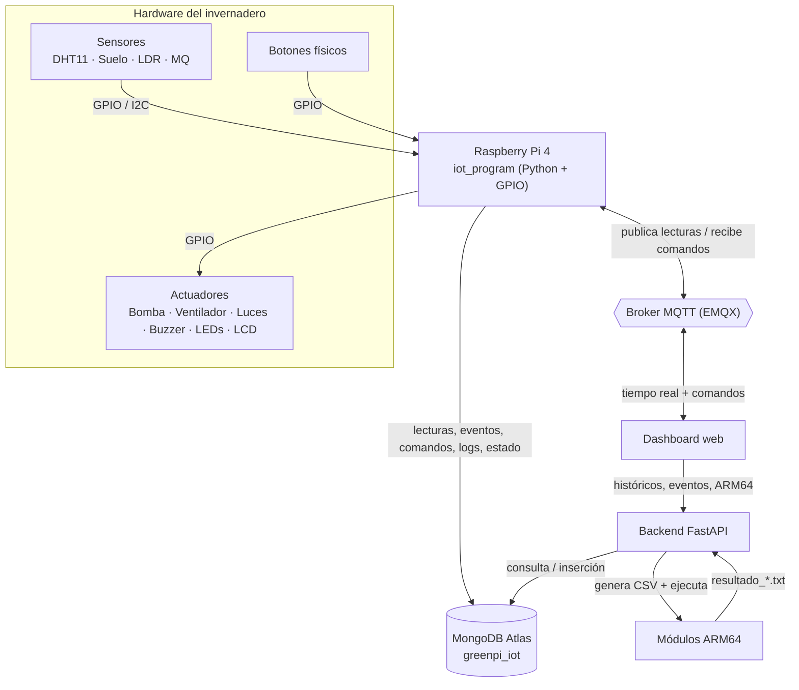
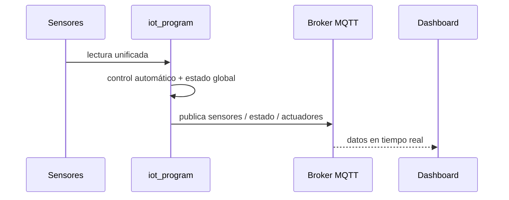
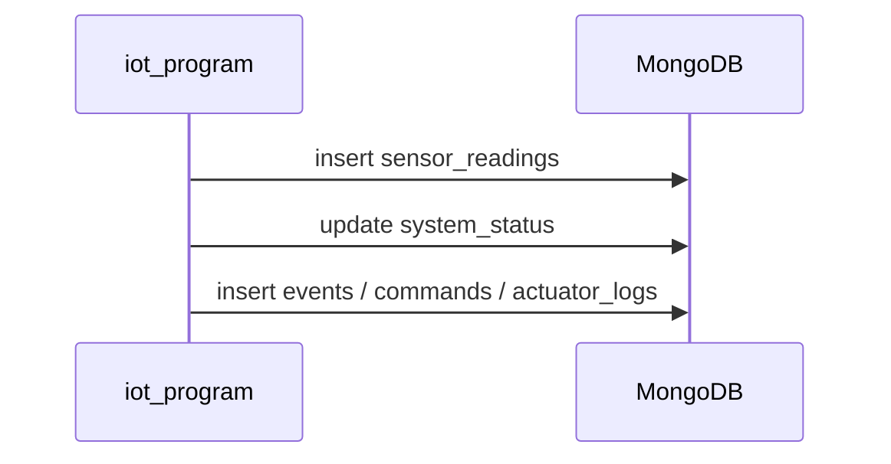
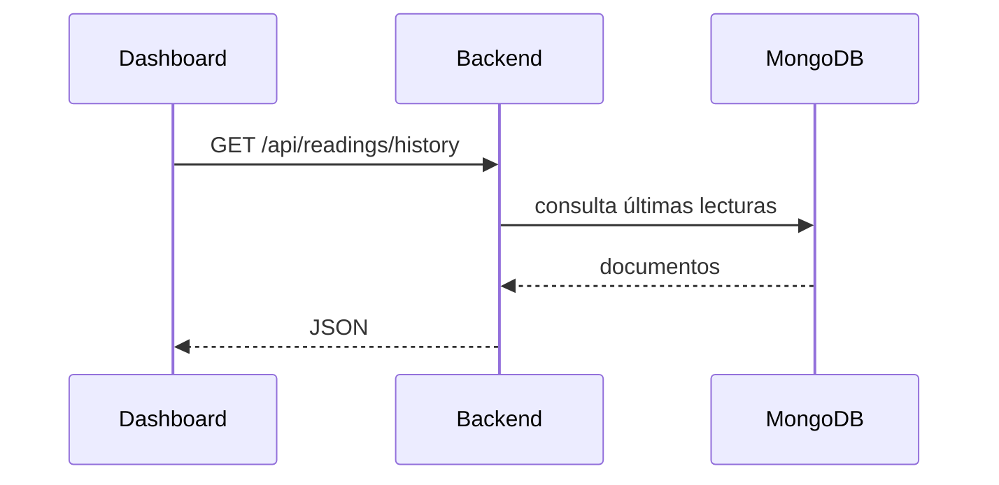
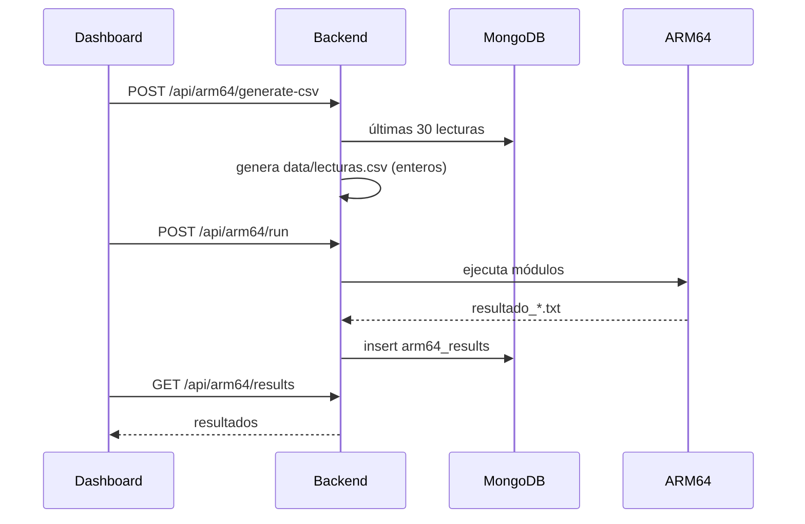
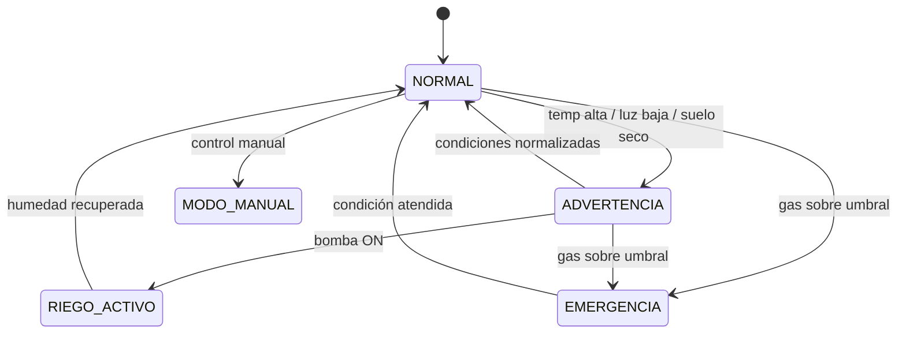

# Arquitectura general

El sistema es un invernadero inteligente IoT sobre **Raspberry Pi** que monitorea y controla dos áreas de cultivo y un centro de control, integrando sensores, actuadores, comunicación MQTT, persistencia en MongoDB Atlas, un dashboard web y procesamiento estadístico en ARM64.

---

## 1. Componentes del sistema

| Componente    | Carpeta             | Tecnología                 | Función                                                                                                                  |
| ------------- | ------------------- | -------------------------- | ------------------------------------------------------------------------------------------------------------------------ |
| Programa IoT  | `iot_program/`      | Python (GPIO)              | Lee sensores, ejecuta el control automático/manual, acciona actuadores, publica y recibe por MQTT y persiste en MongoDB. |
| Backend       | `server/`           | Python + FastAPI           | API REST para el dashboard; genera `lecturas.csv`, ejecuta los módulos ARM64 y guarda sus resultados.                    |
| Dashboard     | `client/`           | Next.js + React + Three.js | Visualiza datos en tiempo real (MQTT) e históricos (backend); envía comandos de control.                                 |
| Procesamiento | `arm64/`            | Ensamblador ARM64/AArch64  | Calcula estadísticas sobre 30 datos reales del invernadero.                                                              |
| Datos         | `data/`             | CSV                        | Ubicación de `lecturas.csv`.                                                                                             |
| Resultados    | `resultados_arm64/` | TXT                        | Salidas de los módulos ARM64.                                                                                            |
| Broker        | EMQX                | MQTT                       | Mensajería entre Raspberry Pi y dashboard.                                                                               |
| Base de datos | MongoDB Atlas       | NoSQL                      | Persistencia compartida (`greenpi_iot`).                                                                                 |

---

## 2. Diagrama general

---

## 3. Subsistemas obligatorios

| Subsistema              | Componentes                 | Función                                            |
| ----------------------- | --------------------------- | -------------------------------------------------- |
| Monitoreo ambiental     | DHT11                       | Temperatura y humedad ambiental.                   |
| Monitoreo de suelo      | Sensor de humedad de suelo  | Clasifica el suelo como seco, normal o saturado.   |
| Iluminación inteligente | LDR + LEDs blancos          | Enciende iluminación artificial con poca luz.      |
| Ventilación             | Ventilador DC               | Se activa por temperatura alta o gas.              |
| Riego funcional         | Bomba de agua + relé        | Riego real en el área con suelo seco.              |
| Detección de gas        | Sensor MQ                   | Detecta gas, humo o mala calidad del aire.         |
| Panel local             | LCD 16×2 + botones          | Muestra lecturas/estados y permite control manual. |
| Alarma                  | Buzzer + LED rojo           | Alerta en condiciones críticas.                    |
| Estado visual           | LEDs verde, amarillo y rojo | Representa el estado global.                       |
| Comunicación IoT        | MQTT                        | Envía lecturas y recibe comandos.                  |
| Persistencia            | MongoDB Atlas               | Guarda lecturas, eventos, comandos y resultados.   |
| Dashboard               | Web                         | Visualiza datos y controla actuadores remotamente. |

---

## 4. Responsabilidades por componente

| Componente                   | Responsabilidad                                                                                             | No le corresponde                                                         |
| ---------------------------- | ----------------------------------------------------------------------------------------------------------- | ------------------------------------------------------------------------- |
| Raspberry Pi / `iot_program` | Leer sensores, control automático/manual, accionar actuadores, publicar/recibir MQTT, persistir en MongoDB. | Cálculos estadísticos ARM64; generar `lecturas.csv`; servir el dashboard. |
| MQTT                         | Transportar lecturas, estado y comandos en tiempo real (texto plano, QoS 0).                                | Persistencia y lógica de negocio.                                         |
| MongoDB Atlas                | Almacenar el histórico del sistema.                                                                         | Procesar datos; ser consultada directamente por el dashboard.             |
| Backend FastAPI              | API REST, generar `lecturas.csv`, ejecutar ARM64, guardar resultados.                                       | Leer sensores o accionar actuadores.                                      |
| Dashboard                    | Visualizar tiempo real e histórico, enviar comandos.                                                        | Ejecutar ARM64; generar CSV; conectarse a MongoDB.                        |
| ARM64                        | Calcular estadísticas con enteros sobre 30 datos.                                                           | Comunicación o simulación de datos.                                       |

---

## 5. Tiempo real vs histórico

|            | Tiempo real                      | Histórico                           |
| ---------- | -------------------------------- | ----------------------------------- |
| Transporte | MQTT                             | HTTP (backend)                      |
| Origen     | `iot_program` publica cada ciclo | MongoDB                             |
| Consumidor | Dashboard suscrito a topics      | Dashboard consulta la API           |
| Uso        | KPIs, estado global, control     | Gráficas, historial, análisis ARM64 |

---

## 6. Flujos de datos

### Tiempo real: sensores → MQTT → dashboard

### Persistencia: sensores → MongoDB

### Histórico: dashboard → backend → MongoDB

### Procesamiento: backend → CSV → ARM64 → resultados → MongoDB → dashboard

---

## 7. Modos de operación

El `iot_program` opera en **modo simulación** (sin hardware, para desarrollo) o **modo Raspberry** (GPIO/I2C reales), según la variable `SIMULATION_MODE`. La interfaz de sensores y actuadores es la misma en ambos modos.

---

## 8. Estado global del sistema

El sistema mantiene un estado global que se publica por MQTT (`invernadero/estado/global`) y se persiste en MongoDB:

| Estado       | Condición                                       |
| ------------ | ----------------------------------------------- |
| NORMAL       | Sensores dentro de rangos seguros.              |
| ADVERTENCIA  | Temperatura alta, poca luz o suelo seco.        |
| RIEGO_ACTIVO | La bomba está funcionando.                      |
| MODO_MANUAL  | El usuario controla los actuadores manualmente. |
| EMERGENCIA   | Gas/humo por encima del umbral.                 |

> En EMERGENCIA el sistema no regresa automáticamente a NORMAL mientras el sensor de gas siga por encima del umbral.
