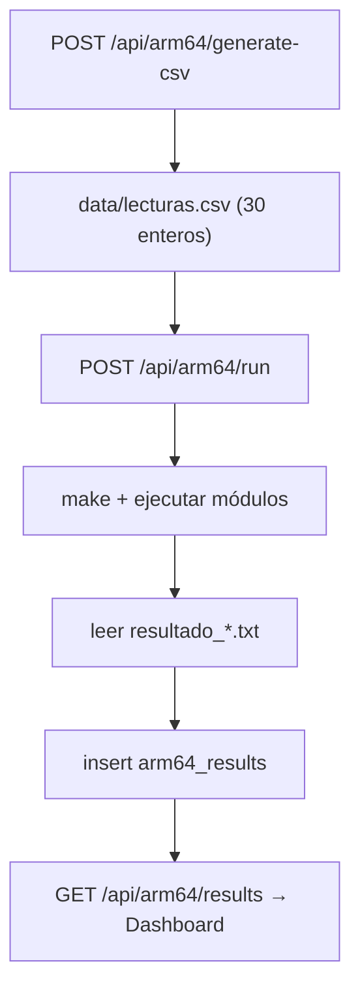

# Backend FastAPI

API REST que alimenta al dashboard y orquesta el procesamiento ARM64. Consulta MongoDB para los históricos, genera el archivo `lecturas.csv` con datos reales, ejecuta los módulos ARM64 y guarda sus resultados.

Carpeta: `server/` · Aplicación: `app.main:app`.

---

## 1. Responsabilidades

| Hace                                                              | No hace                                          |
| ----------------------------------------------------------------- | ------------------------------------------------ |
| Expone endpoints REST bajo `/api`.                                | No lee sensores ni acciona actuadores.           |
| Consulta MongoDB (lecturas, eventos, comandos, logs, estado).     | No realiza cálculos estadísticos (eso es ARM64). |
| Genera `data/lecturas.csv` con las últimas 30 lecturas (enteros). |                                                  |
| Ejecuta los módulos ARM64 y lee sus salidas.                      |                                                  |
| Guarda resultados en `arm64_results`.                             |                                                  |

CORS restringido al origen del dashboard (`FRONTEND_URL`).

---

## 2. Estructura

```text
server/app/
├── main.py                  # app, CORS, ciclo de vida (MongoDB)
├── core/config.py           # configuración y rutas (arm64, data, resultados)
├── core/database.py         # cliente asíncrono de MongoDB
├── api/endpoints/           # health, readings, events, commands, status, actuator_logs, arm64
├── services/records.py      # lecturas, eventos, comandos, estado, logs
├── services/arm64.py        # generación de CSV, ejecución y lectura de resultados
└── repositories/mongo_repository.py
```

---

## 3. Endpoints

| Método | Ruta                             | Descripción                |
| ------ | -------------------------------- | -------------------------- |
| GET    | `/health`                        | Comprobación de estado.    |
| GET    | `/api/readings/latest`           | Última lectura.            |
| GET    | `/api/readings/history?limit=30` | Histórico de lecturas.     |
| POST   | `/api/readings/test`             | Lectura de prueba.         |
| GET    | `/api/events?limit=20`           | Eventos.                   |
| POST   | `/api/events/test`               | Evento de prueba.          |
| GET    | `/api/commands?limit=20`         | Comandos.                  |
| POST   | `/api/commands`                  | Registro de comando.       |
| GET    | `/api/status`                    | Estado actual.             |
| PUT    | `/api/status`                    | Actualiza el estado.       |
| GET    | `/api/actuator-logs?limit=20`    | Logs de actuadores.        |
| POST   | `/api/actuator-logs/test`        | Log de prueba.             |
| GET    | `/api/arm64/results?limit=10`    | Resultados ARM64.          |
| POST   | `/api/arm64/generate-csv`        | Genera `lecturas.csv`.     |
| POST   | `/api/arm64/run`                 | Ejecuta los módulos ARM64. |

Documentación interactiva en `http://127.0.0.1:8000/docs`.

---

## 4. Generación de `lecturas.csv`

`POST /api/arm64/generate-csv` toma las últimas 30 lecturas de `sensor_readings`, las ordena cronológicamente y escribe `data/lecturas.csv` con la parte entera de cada valor:

```csv
ID,TEMP,HUM_AIRE,HUM_SUELO_1,HUM_SUELO_2,LUZ,GAS,RIEGO_1,RIEGO_2
1,28,70,45,48,320,120,0,0
```

Python solo adapta los datos al formato del CSV; no calcula resultados estadísticos.

---

## 5. Ejecución de los módulos ARM64

`POST /api/arm64/run`:

1. Verifica que exista `data/lecturas.csv` y la carpeta `arm64/` con su `Makefile`.
2. Compila con `make`.
3. Ejecuta los módulos ARM64.
4. Lee los archivos `resultado_*.txt` de `resultados_arm64/`.
5. Inserta el resultado combinado en `arm64_results`.



Los fallos de ejecución se devuelven como errores HTTP con el detalle de qué falta (CSV, Makefile o archivos de salida).

---

## 6. Configuración

| Variable       | Valor por defecto           | Uso                             |
| -------------- | --------------------------- | ------------------------------- |
| `MONGODB_URI`  | `mongodb://localhost:27017` | Conexión a MongoDB.             |
| `MONGODB_DB`   | `greenpi_iot`               | Base de datos.                  |
| `FRONTEND_URL` | `http://localhost:3000`     | Origen permitido (CORS).        |
| `ARM64_DIR`    | `../arm64`                  | Ubicación de los módulos ARM64. |

---

## 7. Ejecución

```bash
cd server
pip install -r requirements.txt
fastapi dev        # http://127.0.0.1:8000   (alternativa: uvicorn app.main:app --reload)
```
