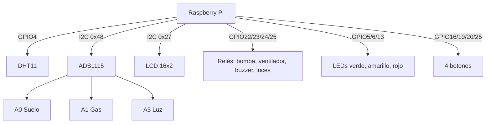

# Conexión física

Distribución de pines y conexiones de la Raspberry Pi. La numeración corresponde a **BCM** (la usada en el código); se incluye la equivalencia con el pin físico del header de 40 pines.

---

## 1. Sensores

| Sensor                        | Interfaz      | Pin / Canal      |
| ----------------------------- | ------------- | ---------------- |
| DHT11 (temperatura + humedad) | GPIO          | GPIO4 (físico 7) |
| Humedad de suelo              | ADS1115 (I2C) | Canal A0         |
| Gas (MQ)                      | ADS1115 (I2C) | Canal A1         |
| Luz (LDR)                     | ADS1115 (I2C) | Canal A3         |

### ADS1115 (conversor analógico-digital)

- Interfaz I2C, dirección **0x48**.
- Canales: A0 = suelo, A1 = gas, A3 = luz.
- Los sensores analógicos (suelo, gas, LDR) se leen a través del ADS1115 porque la Raspberry Pi no tiene entradas analógicas.

---

## 2. Actuadores

| Actuador                                                | Pin BCM | Pin físico | Control                  |
| ------------------------------------------------------- | ------- | ---------- | ------------------------ |
| Bomba de riego                                          | GPIO22  | 15         | Relé (activo en bajo)    |
| Ventilador                                              | GPIO23  | 16         | Relé (activo en bajo)    |
| Buzzer / alarma                                         | GPIO24  | 18         | Relé (activo en bajo)    |
| Luces                                                   | GPIO25  | 22         | Relé (activo en bajo)    |
| LED verde (NORMAL)                                      | GPIO5   | 29         | Directo (activo en alto) |
| LED amarillo (ADVERTENCIA / RIEGO_ACTIVO / MODO_MANUAL) | GPIO6   | 31         | Directo (activo en alto) |
| LED rojo (EMERGENCIA)                                   | GPIO13  | 33         | Directo (activo en alto) |

Los relés son de tipo activo en bajo: el pin se mantiene en alto (actuador apagado) y pasa a bajo para activar. La bomba y el ventilador se alimentan con fuente externa a través del relé; toda fuente externa comparte tierra (GND) con la Raspberry Pi.

---

## 3. Botones físicos

| Botón            | Pin BCM | Pin físico | Función                |
| ---------------- | ------- | ---------- | ---------------------- |
| Botón 1 (MODE)   | GPIO19  | 35         | Modo automático/manual |
| Botón 2 (WATER)  | GPIO26  | 37         | Riego manual           |
| Botón 3 (LIGHTS) | GPIO16  | 36         | Encender/apagar luces  |
| Botón 4 (ALARM)  | GPIO20  | 38         | Silenciar alarma       |

Se configuran con resistencia **pull-up interna**: en reposo el pin está en alto y al presionar conecta a tierra (no requieren resistencia externa).

---

## 4. Pantalla LCD

| Componente               | Interfaz | Dirección | Tamaño |
| ------------------------ | -------- | --------- | ------ |
| LCD con expansor PCF8574 | I2C      | 0x27      | 16×2   |

---

## 5. Bus I2C

El bus I2C es compartido por el ADS1115 (0x48) y la LCD (0x27):

| Señal | Pin BCM | Pin físico |
| ----- | ------- | ---------- |
| SDA   | GPIO2   | 3          |
| SCL   | GPIO3   | 5          |

Verificación: `i2cdetect -y 1` debe mostrar las direcciones `0x27` y `0x48`. Se recomiendan resistencias de pull-up en SDA/SCL para un bus estable.

---

## 6. Niveles de alimentación

| Dispositivo        | Lógica                                       |
| ------------------ | -------------------------------------------- |
| GPIO Raspberry Pi  | 3.3 V                                        |
| ADS1115            | 3.3 V (lado del Pi)                          |
| Relés              | lado lógico 3.3 V; bobina alimentada con 5 V |
| Bomba / ventilador | fuente externa a través del relé             |

La bomba y el ventilador no se alimentan directamente desde los pines GPIO: se usa relé y fuente externa con tierra común.

---

## 7. Tabla maestra de pines

| Pin BCM | Pin físico | Uso             |
| ------- | ---------- | --------------- |
| GPIO2   | 3          | I2C SDA         |
| GPIO3   | 5          | I2C SCL         |
| GPIO4   | 7          | DHT11           |
| GPIO5   | 29         | LED verde       |
| GPIO6   | 31         | LED amarillo    |
| GPIO13  | 33         | LED rojo        |
| GPIO16  | 36         | Botón LIGHTS    |
| GPIO19  | 35         | Botón MODE      |
| GPIO20  | 38         | Botón ALARM     |
| GPIO22  | 15         | Relé bomba      |
| GPIO23  | 16         | Relé ventilador |
| GPIO24  | 18         | Relé buzzer     |
| GPIO25  | 22         | Relé luces      |
| GPIO26  | 37         | Botón WATER     |

ADS1115 (I2C 0x48): A0 = suelo · A1 = gas · A3 = luz.

