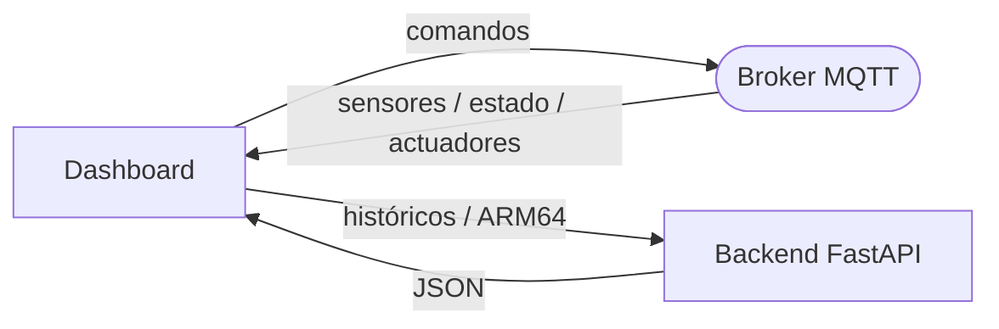

# Dashboard web

Interfaz web de monitoreo y control del invernadero. Recibe datos en tiempo real por MQTT (WebSocket), consulta históricos al backend FastAPI y envía comandos de control. Construido con **Next.js + React + Three.js**.

Carpeta: `client/`.

---

## 1. Secciones

| Sección          | Contenido                                                                                                               |
| ---------------- | ----------------------------------------------------------------------------------------------------------------------- |
| Panel principal  | Estado global y últimas lecturas de temperatura, humedad, suelo por área, luz, gas, riego, ventilación, luces y alarma. |
| Áreas de cultivo | Estado de cada zona (humedad de suelo y riego).                                                                         |
| Sensores         | Lecturas en tiempo real de los sensores.                                                                                |
| Actuadores       | Controles remotos y visualización de cada actuador.                                                                     |
| Historial        | Últimos eventos, comandos y activaciones de actuadores.                                                                 |
| Análisis ARM64   | Resultados de los cinco módulos ARM64.                                                                                  |

---

## 2. Panel principal

Muestra en tiempo real: estado global del invernadero, temperatura, humedad ambiental, humedad de suelo de las dos áreas, nivel de luz, nivel de gas, y estado de riego, ventilación, luces y alarma.

---

## 3. Gráficas históricas

Gráficas de temperatura, humedad ambiental, humedad de suelo (área 1 y 2), nivel de luz y nivel de gas, con datos almacenados en MongoDB y servidos por el backend.

---

## 4. Controles remotos

Permite: activar/desactivar riego, seleccionar área de riego, encender/apagar luces, activar/desactivar ventilación, silenciar alarma y cambiar entre modo automático y manual. Cada control publica un comando MQTT en `invernadero/control/manual`.

| Control        | Comando                                           |
| -------------- | ------------------------------------------------- |
| Riego general  | `ACTIVAR_RIEGO` / `DESACTIVAR_RIEGO`              |
| Riego por área | `ACTIVAR_RIEGO_1` / `ACTIVAR_RIEGO_2`             |
| Iluminación    | `ENCENDER_LUCES` / `APAGAR_LUCES`                 |
| Ventilación    | `ACTIVAR_VENTILADOR` / `DESACTIVAR_VENTILADOR`    |
| Alarma         | `SILENCIAR_ALARMA`                                |
| Modo           | `CAMBIAR_MODO_AUTOMATICO` / `CAMBIAR_MODO_MANUAL` |

---

## 5. Historial

Tabla con pestañas que muestra los últimos eventos, comandos y activaciones de actuadores, consultados al backend (`/api/events`, `/api/commands`, `/api/actuator-logs`).

---

## 6. Análisis ARM64

Sección dedicada que coordina la generación del CSV (`POST /api/arm64/generate-csv`) y la ejecución de los módulos (`POST /api/arm64/run`), y muestra los resultados (`GET /api/arm64/results`):

| Módulo                         | Resultado mostrado                                              |
| ------------------------------ | --------------------------------------------------------------- |
| Media aritmética ponderada     | Valor calculado sobre una variable.                             |
| Varianza y desviación estándar | Medidas de dispersión sobre 30 datos.                           |
| Detección de anomalías         | Cantidad de anomalías y nivel de riesgo.                        |
| Predicción lineal simple       | Valor inicial, final, diferencia, cambio promedio y predicción. |
| Tendencia acumulada avanzada   | Incrementos, decrementos, rachas y tendencia final.             |

---

## 7. Origen de los datos

| Datos                                                 | Fuente                             |
| ----------------------------------------------------- | ---------------------------------- |
| Sensores, estado global, estado de actuadores         | MQTT (tiempo real)                 |
| Históricos, eventos, comandos, logs, resultados ARM64 | Backend FastAPI (HTTP)             |
| Comandos de control                                   | MQTT (publicados por el dashboard) |



El dashboard no ejecuta ARM64, no genera `lecturas.csv` y no se conecta directamente a MongoDB: todo el histórico pasa por el backend.

---

## 8. Ejecución

```bash
cd client
pnpm install
pnpm dev          # http://localhost:3000   (build: pnpm build / start: pnpm start)
```

| Variable                        | Uso                                                  |
| ------------------------------- | ---------------------------------------------------- |
| `NEXT_PUBLIC_API_URL`           | URL del backend FastAPI.                             |
| `NEXT_PUBLIC_MQTT_WSS_URL`      | Broker MQTT por WebSocket seguro.                    |
| `NEXT_PUBLIC_MQTT_TOPIC_PREFIX` | Prefijo de topics (coincide con el del iot_program). |
