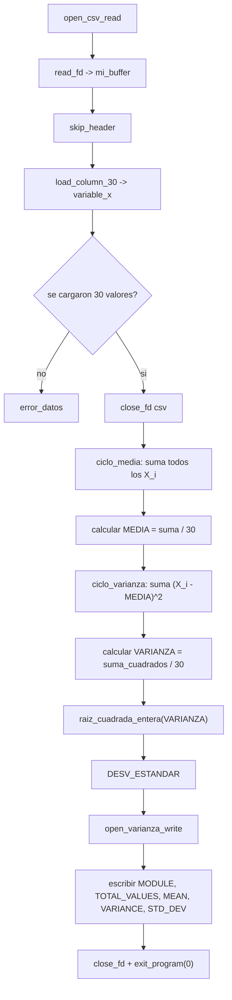

# Módulo 2 — Varianza y desviación estándar

| Campo                          | Detalle                                                             |
| ------------------------------ | ------------------------------------------------------------------- |
| **Responsable**                | Emiliana Elizabeth Pú Lara                                          |
| **Subsistema del invernadero** | Área de cultivo 2 — sensor de humedad de suelo 2 y riego del área 2 |
| **Archivo ARM64**              | `arm64/modulo_2_varianza.s`                                         |
| **Biblioteca común**           | `arm64/utils.s`                                                     |
| **Salida**                     | `resultados_arm64/resultado_varianza.txt`                           |
| **Colección de resultados**    | `arm64_results`                                                     |

---

## 1. Descripción general

Esta rutina toma los 30 valores de una variable del invernadero (cargados desde `lecturas.csv`) y calcula tres medidas estadísticas relacionadas entre sí: la media, la varianza y la desviación estándar. Cada cálculo depende del anterior, por lo que la rutina está organizada en tres etapas secuenciales que reutilizan el mismo arreglo de datos cargado en memoria.

Fórmulas aplicadas:

```text
MEDIA    = (Σ X_i) / N
VARIANZA = (Σ (X_i - MEDIA)²) / N
DESV_ESTANDAR = sqrt(VARIANZA)
```

Donde `N = 30`.

---

## 2. Flujo del programa



---

## 3. Registros utilizados

| Registro | Uso |
|---|---|
| `x19` | descriptor de archivo (primero del CSV, luego del archivo de salida) |
| `x20` | bytes leídos del CSV |
| `x21` | puntero al final del contenido leído en el buffer |
| `x22` | dirección base del arreglo `variable_x` (no se mueve) |
| `x23` | índice `i`, reutilizado en `ciclo_media` y `ciclo_varianza` |
| `x24` | desplazamiento `i * 8` (offset en bytes dentro del arreglo) |
| `x10` | suma acumulada en `ciclo_media` |
| `x11` | media calculada |
| `x12` | suma de cuadrados de diferencias en `ciclo_varianza` |
| `x13` | varianza calculada |
| `x14` | desviación estándar calculada |
| `x0–x7` | parámetros y retornos en llamadas a subrutinas de `utils.s` |

En `raiz_cuadrada_entera`: `x1` (copia del número original), `x2` (estimación actual), `x3` (nueva estimación).

---

## 4. Memoria

Sección `.bss`:

| Símbolo | Tamaño | Uso |
|---|---|---|
| `mi_buffer` | 4096 bytes | contenido completo de `lecturas.csv` leído del disco |
| `variable_x` | 240 bytes (30 × 8) | los 30 valores extraídos de la columna seleccionada |
| `media_res` | 8 bytes | resultado de la media |
| `variance_res` | 8 bytes | resultado de la varianza |
| `std_dev_res` | 8 bytes | resultado de la desviación estándar |
| `columna_res` | 8 bytes | número de columna a procesar |

Todo alineado a 8 bytes (`.balign 8`) por requerimiento de `ldr`/`str` de 64 bits en ARM64.

---

## 5. Ciclos, saltos y subrutina propia

**Ciclos:**
- `ciclo_media`: recorre los 30 elementos de `variable_x` acumulando la suma total.
- `ciclo_varianza`: recorre nuevamente los 30 elementos, calculando `(X_i - MEDIA)²` y acumulando.

**Saltos condicionales:**
- `b.hs` en ambos ciclos para detenerse al llegar a 30 (`cmp x23, #30`).
- `cmp x0, #30` / `b.ne error_datos` para validar que `load_column_30` devolvió exactamente 30 registros.
- `cmp x0, #0` / `b.lt error_salida` al validar la apertura de archivos.

**Subrutina propia: `raiz_cuadrada_entera`**

Implementa el método babilónico (Newton-Raphson para raíces) para calcular la raíz cuadrada entera de la varianza sin usar la FPU. Parte de una estimación inicial (`N/2`) y la refina iterativamente con:

```text
nueva_estimacion = (estimacion + N / estimacion) / 2
```

hasta que la nueva estimación deja de mejorar (`b.ge sqrt_done`). Maneja como casos especiales `N = 0` y `N = 1`.

---

## 6. Entrada y salida

**Entrada:** `../data/lecturas.csv`, 30 registros con 9 columnas separadas por coma. La extracción de la columna se realiza con `load_column_30` de `utils.s`, que internamente usa `parse_next_uint` para la conversión ASCII→entero.

**Salida:** `../resultados_arm64/resultado_varianza.txt`, escrita con `write_cstr` (texto) y `write_int` (conversión entero→ASCII):

```text
MODULE=VARIANCE
TOTAL_VALUES=30
MEAN=<valor>
VARIANCE=<valor>
STD_DEV=<valor>
```

---

## 7. Relación con `utils.s`

El módulo depende completamente de la biblioteca común para E/S y parseo: `open_csv_read`, `read_fd`, `skip_header`, `load_column_30`, `close_fd`, `open_varianza_write`, `write_cstr`, `write_int`, `write_newline`, `exit_program`. La única lógica propia del módulo es el cálculo estadístico (media, varianza, raíz cuadrada) y el manejo de los dos ciclos sobre `variable_x`.

---

## 8. Compilación, ejecución y depuración

```bash
cd arm64
make run-varianza      # compila y ejecuta; genera ../resultados_arm64/resultado_varianza.txt
```

Depuración con GDB:

```bash
cd arm64
make
gdb-multiarch build/modulo_2_varianza
```

Comandos de evidencia: `break _start`, `break ciclo_varianza`, `run`, `stepi`, `info registers x10 x11 x12 x13`, `x/30gx &variable_x`, `continue`.