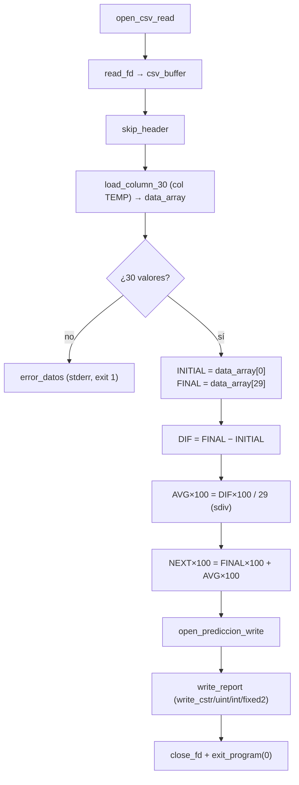

# Módulo 4 — Predicción lineal simple

| Campo | Detalle |
| ----- | ------- |
| **Responsable** | Alex Oswaldo López Alquejay |
| **Subsistema del invernadero** | Centro de control — LCD, botones, LEDs de estado y buzzer |
| **Archivo ARM64** | `arm64/modulo_4_prediccion.s` |
| **Biblioteca común** | `arm64/utils.s` |
| **Salida** | `resultados_arm64/resultado_prediccion.txt` |
| **Colección de resultados** | `arm64_results` |
| **Variable procesada** | TEMP (columna 1 de `lecturas.csv`) |

---

## 1. Algoritmo

Predicción lineal simple por tendencia promedio sobre los 30 datos de una variable (TEMP):

```text
DIF             = XFINAL − XINICIAL
PROMEDIO_CAMBIO = DIF / (N − 1)          con N = 30  →  DIF / 29
PREDICCION      = XFINAL + PROMEDIO_CAMBIO
```

Donde `XINICIAL` es el primer dato y `XFINAL` el último (dato 30). Calcula: valor inicial, valor final, diferencia total, promedio de cambio y predicción del siguiente valor.

### Punto fijo (2 decimales)
ARM64 trabaja solo con enteros, pero `AVG_CHANGE` y `NEXT_VALUE` deben mostrarse con 2 decimales. Se usa **punto fijo escalado ×100**:

```text
AVG_CHANGE(×100)  = (DIF × 100) / 29        (división con signo, truncada)
NEXT_VALUE(×100)  = XFINAL × 100 + AVG_CHANGE(×100)
```

Al imprimir, la subrutina `write_fixed2` separa parte entera y centésimos e inserta el punto y el cero a la izquierda cuando corresponde.

---

## 2. Flujo



---

## 3. Registros usados (en `_start`)

| Registro | Uso |
| -------- | --- |
| `x19` | fd del CSV (luego fd del archivo de salida) |
| `x20` | bytes leídos del CSV |
| `x21` | puntero al fin del buffer |
| `x22` | base de `data_array` |
| `x23` | INITIAL_VALUE (primer dato) |
| `x24` | FINAL_VALUE (último dato) |
| `x25` | TOTAL_DIFF (con signo) |
| `x26` | AVG_CHANGE escalado ×100 (con signo) |
| `x27` | NEXT_VALUE escalado ×100 (con signo) |

Temporales: `x9`/`x10` para las multiplicaciones y divisiones (`mul`, `sdiv`).

---

## 4. Memoria (`.bss`)

| Símbolo | Tamaño | Uso |
| ------- | ------ | --- |
| `csv_buffer` | `BUFFER_SIZE = 4096` | contenido crudo del CSV |
| `data_array` | 240 bytes (30 × 8) | los 30 valores de la columna |

Constantes: `COLUMN_INDEX = 1` (TEMP), `N_DATOS = 30`, `N_MENOS_1 = 29`.

---

## 5. Subrutina propia: `write_fixed2(fd, valor×100)`

Imprime un valor escalado ×100 como decimal de 2 cifras `"[-]entero.frac"`:
- si el valor es negativo, escribe `-` y lo vuelve positivo;
- separa parte entera (`/100`) y centésimos (`% 100` con `msub`);
- escribe la parte entera (`write_uint`), el punto, un `0` a la izquierda si los centésimos son `< 10`, y los centésimos.

Ejemplos: `20 → "0.20"`, `6 → "0.06"`, `3420 → "34.20"`, `-20 → "-0.20"`. Preserva `x19–x22` y `x30` en la pila.

---

## 6. Entrada y salida

**Entrada:** `../data/lecturas.csv` (30 registros, 9 columnas, enteros). Conversión ASCII→entero mediante `parse_next_uint`/`load_column_30` de `utils.s`.

**Salida:** `../resultados_arm64/resultado_prediccion.txt`, con conversión entero→ASCII (`write_uint`, `write_int`, `write_fixed2`):

```text
MODULE=PREDICTION
INITIAL_VALUE=<entero>
FINAL_VALUE=<entero>
TOTAL_DIFF=<entero con signo>
AVG_CHANGE=<n.dd>
NEXT_VALUE=<n.dd>
```

### Salida verificada (con `data/lecturas.csv` de prueba, TEMP)
```text
MODULE=PREDICTION
INITIAL_VALUE=28
FINAL_VALUE=30
TOTAL_DIFF=2
AVG_CHANGE=0.06
NEXT_VALUE=30.06
```
(28 → 30: DIF = 2; 2/29 = 0.06; 30 + 0.06 = 30.06.)

---

## 7. Relación con `utils.s`

Usa de la biblioteca común: `open_csv_read`, `read_fd`, `skip_header`, `load_column_30`, `close_fd`, `open_prediccion_write`, `write_cstr`, `write_uint`, `write_int`, `write_newline`, `exit_program`. La lógica de predicción y el formateo de decimales (`write_fixed2`) son propios del módulo.

---

## 8. Compilación, ejecución y depuración

```bash
cd arm64
make run-prediccion     # compila y ejecuta; genera ../resultados_arm64/resultado_prediccion.txt
```

Depuración con GDB:
```bash
cd arm64
make prediccion
gdb-multiarch build/modulo_4_prediccion
```
Comandos de evidencia: `break _start`, `break write_fixed2`, `run`, `stepi`, `info registers`, `x/16x $sp`, `x/s $x1`, `continue`.

---

## 9. Restricciones del enunciado cumplidas
- Ensamblador ARM64/AArch64, archivo `.s` propio, salida `.txt` propia.
- Lee `lecturas.csv` y procesa exactamente 30 datos de una variable.
- Usa registros, memoria, ciclos/saltos condicionales y conversión ASCII↔entero.
- Subrutina propia (`write_fixed2`) y uso de la biblioteca común `utils.s`.
