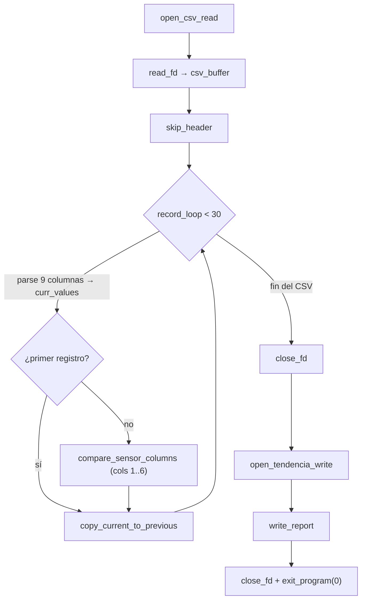

# Módulo 5 — Tendencia acumulada avanzada

| Campo                          | Detalle                                         |
| ------------------------------ | ----------------------------------------------- |
| **Responsable**                | Alex Ricardo Castañeda Rodríguez                |
| **Subsistema del invernadero** | MQTT, MongoDB, dashboard e integración general  |
| **Archivo ARM64**              | `arm64/modulo_5_tendencia.s`                    |
| **Biblioteca común**           | `arm64/utils.s` (mantenida por este integrante) |
| **Salida**                     | `resultados_arm64/resultado_tendencia.txt`      |
| **Colección de resultados**    | `arm64_results`                                 |

---

## 1. Algoritmo

La rutina analiza la tendencia general de los 30 registros considerando estabilidad y cambios consecutivos entre lecturas. Para cada registro posterior al primero compara las columnas sensoras (TEMP, HUM_AIRE, HUM_SUELO_1, HUM_SUELO_2, LUZ, GAS) contra el registro anterior:

```text
DIF_i = X_i − X_(i-1)
```

Por cada diferencia acumula:

- si `DIF_i > 0` → suma de subidas y un cambio positivo;
- si `DIF_i < 0` → suma de bajadas (valor absoluto) y un cambio negativo;
- si `DIF_i = 0` → un cambio estable.

Diferencia acumulada y clasificación:

```text
TENDENCIA_NETA = SUMA_SUBIDAS − SUMA_BAJADAS
TENDENCIA_NETA > 0  =>  SUBE   (UP)
TENDENCIA_NETA < 0  =>  BAJA   (DOWN)
TENDENCIA_NETA = 0  =>  ESTABLE (STABLE)
```

---

## 2. Flujo de la rutina



---

## 3. Registros utilizados

Registros persistentes en `_start` (callee-saved, preservados según AAPCS64):

| Registro | Uso                                 |
| -------- | ----------------------------------- |
| `x19`    | descriptor del CSV                  |
| `x20`    | puntero actual dentro del CSV       |
| `x21`    | puntero al fin del buffer           |
| `x22`    | registros procesados                |
| `x23`    | suma de subidas                     |
| `x24`    | suma de bajadas                     |
| `x25`    | contador de cambios positivos       |
| `x26`    | contador de cambios negativos       |
| `x27`    | contador de cambios estables        |
| `x28`    | descriptor del archivo de resultado |

Temporales: en el lazo de columnas `x9` (índice) y `x10` (puntero a `curr_values`); en `compare_sensor_columns` `x9` (columna 1..6), `x10`/`x11` (curr/prev), `x12`/`x13` (valores) y `x14` (diferencia).

---

## 4. Memoria

Sección `.bss`:

| Símbolo       | Tamaño                 | Uso                                      |
| ------------- | ---------------------- | ---------------------------------------- |
| `csv_buffer`  | `CSV_MAX_BYTES = 8192` | buffer de lectura del CSV                |
| `prev_values` | 8 × 9 = 72 bytes       | registro anterior (9 enteros de 64 bits) |
| `curr_values` | 8 × 9 = 72 bytes       | registro actual                          |

Constantes: `CSV_MAX_BYTES = 8192`, `MAX_RECORDS = 30`, `COLS_PER_RECORD = 9`.

---

## 5. Ciclos, saltos y subrutinas

- **Ciclos:** `record_loop` (recorre hasta 30 registros), `column_loop` (parsea las 9 columnas de cada registro), `compare_loop` (recorre las columnas sensoras 1..6), `copy_loop` (copia `curr_values`→`prev_values`).
- **Saltos condicionales:** fin de registros (`cmp x22, #MAX_RECORDS`), primer registro (`cbz x22, save_first_record`), clasificación de la diferencia (`b.gt`/`b.lt`/igual) y clasificación final (`write_label_up`/`write_label_down`/estable).
- **Subrutinas propias:** `compare_sensor_columns`, `copy_current_to_previous`, `write_report`. Además invoca las de `utils.s`.

---

## 6. Entrada y salida

**Entrada:** `../data/lecturas.csv` (30 registros, 9 columnas, enteros), conversión ASCII→entero mediante `parse_next_uint` de `utils.s`.

**Salida:** `../resultados_arm64/resultado_tendencia.txt`, escrita con conversión entero→ASCII (`write_uint`/`write_int` de `utils.s`):

```text
Modulo 5 - Tendencia acumulada avanzada
Responsable: Alex Ricardo Castaneda Rodriguez
Registros procesados: <n>
Suma subidas: <n>
Suma bajadas: <n>
Tendencia neta: <n>
Cambios positivos: <n>
Cambios negativos: <n>
Cambios estables: <n>
Clasificacion: SUBE | BAJA | ESTABLE
```

---

## 7. Relación con `utils.s`

`modulo_5_tendencia.s` se apoya en la biblioteca común para toda la E/S y el parseo: `open_csv_read`, `read_fd`, `skip_header`, `parse_next_uint`, `close_fd`, `open_tendencia_write`, `write_cstr`, `write_newline`, `write_uint`, `write_int`, `exit_program`. Esto permite que los cinco módulos compartan la misma lógica de lectura del CSV, conversión ASCII↔entero y escritura de resultados.

---

## 8. Compilación, ejecución y depuración

```bash
cd arm64
make run-tendencia      # compila y ejecuta; genera ../resultados_arm64/resultado_tendencia.txt
```

Depuración con GDB:

```bash
cd arm64
make
gdb-multiarch build/modulo_5_tendencia
```

Comandos de evidencia: `break _start`, `break compare_sensor_columns`, `run`, `stepi`, `info registers`, `x/16x $sp`, `x/s $x1`, `continue`.
