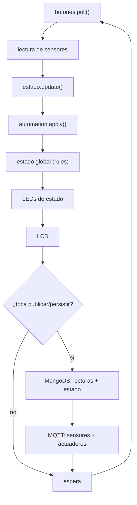

# Lógica de control en Python (`iot_program`)

El programa que corre en la Raspberry Pi implementa el núcleo del invernadero: lectura de sensores por GPIO/I2C, control automático y manual de actuadores, manejo del estado global, publicación/recepción por MQTT y persistencia en MongoDB.

---

## 1. Estructura

```text
iot_program/
├── main.py                  # bucle principal e integración
├── config.py                # configuración (.env)
├── global_state.py          # estado global (último valor conocido)
├── rules.py                 # estado global por reglas de umbral
├── automation.py            # control automático con histéresis
├── topics.py                # topics MQTT
├── mqtt_client.py           # cliente MQTT (texto plano)
├── mongo_repository.py      # persistencia en MongoDB
├── sensors/                 # un archivo por sensor + managers
├── actuators/               # un archivo por actuador + managers
└── local_panel/             # LCD y botones físicos
```

---

## 2. Bucle principal

Cada ciclo (`SENSOR_INTERVAL_SECONDS`): lee botones, lee sensores, aplica el control automático, calcula el estado global, actualiza LEDs y LCD, y —según `MQTT_PUBLISH_INTERVAL_SECONDS`— publica por MQTT y persiste en MongoDB.



---

## 3. Subsistemas

### 3.1 Monitoreo ambiental (DHT11)

Mide temperatura y humedad ambiental (GPIO4). Las lecturas se publican por MQTT, se almacenan en MongoDB, se muestran en LCD y dashboard, y alimentan el estado global. Incluye caché breve y recuperación automática del sensor ante errores de lectura.

### 3.2 Monitoreo de suelo

Mide la humedad del suelo (ADS1115 A0) y la clasifica en **SECO**, **NORMAL** o **SATURADO**. Cada lectura se publica, almacena, muestra y se usa para activar el riego automático.

### 3.3 Riego funcional

Bomba de agua controlada por relé (GPIO22). Soporta:

- riego automático por humedad baja;
- riego manual desde botón físico;
- riego remoto desde el dashboard;
- registro de cada activación;
- protección contra activación continua.

Estados del riego: `RIEGO_OFF`, `RIEGO_AREA_1`, `RIEGO_AREA_2`, `RIEGO_MANUAL`, `BLOQUEADO_POR_SATURACION`. La bomba no permanece encendida indefinidamente (duración controlada), respeta una pausa mínima entre ciclos y se bloquea con suelo saturado.

### 3.4 Iluminación inteligente (LDR + LEDs)

Enciende las luces cuando el nivel de luz es bajo y las apaga cuando es suficiente. Funciona en modo **AUTOMATICO** (decide el sensor) y **MANUAL** (botón o dashboard).

### 3.5 Ventilación

Ventilador por relé (GPIO23). Se activa por temperatura alta, por gas detectado, o por orden manual (dashboard/panel). Estados: `VENTILACION_ON`, `VENTILACION_OFF`, `VENTILACION_MANUAL`, `VENTILACION_EMERGENCIA`. En emergencia por gas, la ventilación se activa aunque el sistema esté en modo manual.

### 3.6 Detección de gas (MQ)

Monitorea el nivel de gas (ADS1115 A1). Al superar el umbral activa el buzzer y el LED rojo, enciende ventilación, cambia el estado global a EMERGENCIA, registra el evento y muestra alerta en dashboard y LCD. No regresa a NORMAL mientras el valor siga por encima del umbral.

### 3.7 Centro de control (LCD, botones, LEDs, buzzer)

- **LCD 16×2** (I2C, 0x27): muestra de forma rotativa temperatura, humedad, suelo, luz, gas, estados de actuadores y estado global; en emergencia muestra una alerta fija.
- **Botones físicos** (4): modo automático/manual, riego manual, encender/apagar luces y silenciar alarma.
- **LEDs de estado**: verde (NORMAL), amarillo (ADVERTENCIA/RIEGO_ACTIVO/MODO_MANUAL), rojo (EMERGENCIA).
- **Buzzer**: alarma sonora en condiciones críticas.

---

## 4. Sensores

| Sensor                | Archivo                          | Conexión      | Salida        |
| --------------------- | -------------------------------- | ------------- | ------------- |
| Temperatura y humedad | `sensors/temperatura_humedad.py` | DHT11 (GPIO4) | °C / %        |
| Humedad de suelo      | `sensors/suelo_area1.py`         | ADS1115 A0    | % (0–100)     |
| Gas                   | `sensors/gas.py`                 | ADS1115 A1    | escala 0–1000 |
| Luz                   | `sensors/luz.py`                 | ADS1115 A3    | escala 0–1000 |

Pines y bus I2C en [conexiones_fisicas.md](conexiones_fisicas.md).

---

## 5. Actuadores

| Actuador        | Archivo                    | Pin (BCM)        |
| --------------- | -------------------------- | ---------------- |
| Bomba de riego  | `actuators/riego_area1.py` | GPIO22           |
| Riego área 2    | `actuators/riego_area2.py` | bomba compartida |
| Ventilador      | `actuators/ventilador.py`  | GPIO23           |
| Luces           | `actuators/luces.py`       | GPIO25           |
| Buzzer / alarma | `actuators/alarma.py`      | GPIO24           |
| LEDs de estado  | `actuators/leds_estado.py` | GPIO5 / 6 / 13   |

---

## 6. Control automático (umbrales con histéresis)

`automation.py` aplica las reglas en modo AUTOMATICO (la emergencia de gas actúa siempre):

| Variable                      | Disparo | Recuperación |
| ----------------------------- | ------- | ------------ |
| Suelo seco → riego            | < 35 %  | ≥ 55 %       |
| Suelo saturado → bloqueo      | ≥ 85 %  | < 85 %       |
| Luz baja → luces              | < 250   | ≥ 320        |
| Temperatura alta → ventilador | ≥ 34 °C | ≤ 31 °C      |
| Gas → emergencia              | ≥ 600   | < 520        |

Cada acción registra evento (`events`) y log de actuador (`actuator_logs`) en MongoDB y actualiza el estado global.

---

## 7. Control manual

- **Botones físicos** (lectura por GPIO en cada ciclo): modo, riego manual, luces y silenciar alarma.
- **Dashboard**: comandos publicados por MQTT en `invernadero/control/manual`.

| Botón   | Acción                         |
| ------- | ------------------------------ |
| Botón 1 | Cambiar modo automático/manual |
| Botón 2 | Activar riego manual           |
| Botón 3 | Encender/apagar luces          |
| Botón 4 | Silenciar buzzer               |

---

## 8. Estado global (`rules.py`)

Clasifica el estado cada ciclo: gas sobre umbral → EMERGENCIA; bomba activa → RIEGO_ACTIVO; modo manual → MODO_MANUAL; temperatura alta / suelo seco / luz baja / suelo saturado → ADVERTENCIA; en otro caso → NORMAL. Cada condición relevante genera un evento en MongoDB.

---

## 9. Estado global y último valor conocido (`global_state.py`)

`GlobalState` mantiene el último valor de todas las variables (temperatura, humedad, suelos, luz, gas, riego, ventilador, luces, alarma, modo y estado global), de modo que el sistema conserve un estado consistente aunque una lectura puntual falle.

---

## 10. Por qué Python controla en tiempo real y ARM64 calcula el histórico

Python controla el hardware (lecturas y accionamiento de relés/LEDs) de forma inmediata; eso es control en tiempo real. El cálculo estadístico sobre los 30 registros (media, varianza, anomalías, predicción y tendencia) corresponde a los módulos ARM64. Python genera el CSV y ejecuta esos módulos, pero no realiza esos cálculos.

---

## 11. Ejecución

```bash
cd iot_program
python main.py        # modo simulación por defecto; SIMULATION_MODE=false para hardware
```
