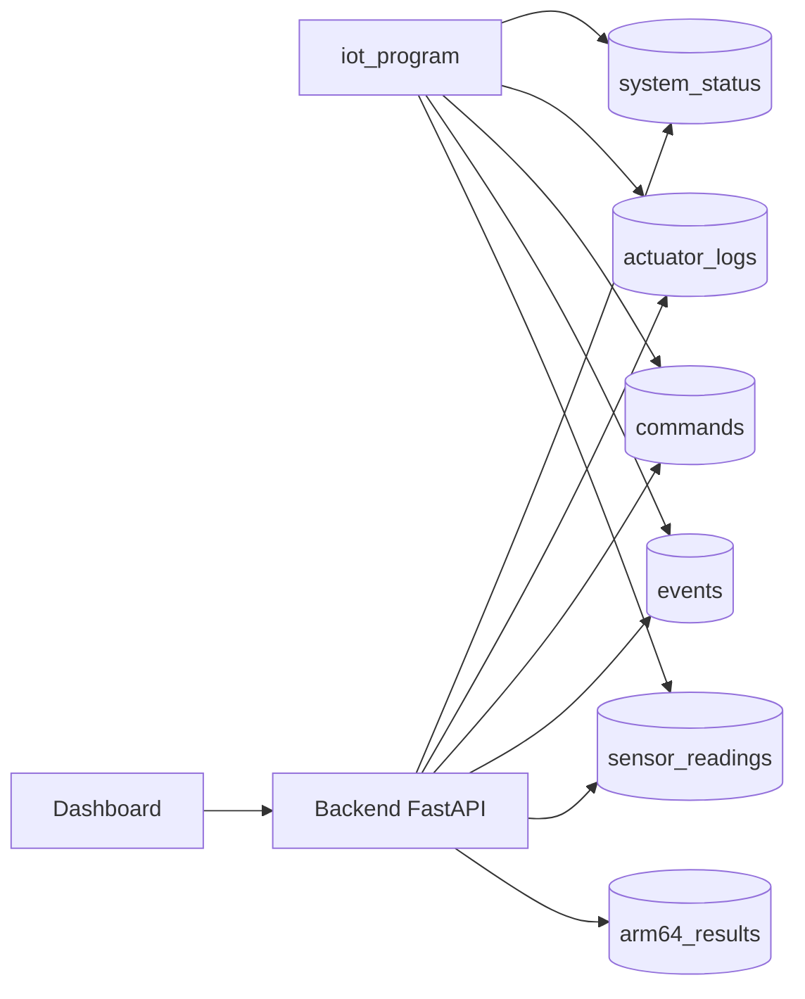

# Modelo de datos (MongoDB Atlas)

La persistencia del sistema vive en **MongoDB Atlas**, base de datos `greenpi_iot`. La Raspberry Pi registra lecturas, eventos, comandos, logs y estado; el backend agrega los resultados ARM64 y realiza las consultas históricas. El dashboard accede a los datos siempre a través del backend, nunca de forma directa.

---

## 1. Colecciones

| Colección         | Contenido                                                | Escribe               | Consulta |
| ----------------- | -------------------------------------------------------- | --------------------- | -------- |
| `sensor_readings` | Lecturas de sensores con timestamp.                      | iot_program           | backend  |
| `events`          | Alertas, emergencias, activaciones y cambios de estado.  | iot_program           | backend  |
| `commands`        | Comandos enviados desde el dashboard o los botones.      | iot_program / backend | backend  |
| `system_status`   | Estado global actual (`_id = "current"`).                | iot_program / backend | backend  |
| `actuator_logs`   | Activaciones de bomba, ventilador, luces, buzzer y LEDs. | iot_program           | backend  |
| `arm64_results`   | Resultados de los cinco módulos ARM64.                   | backend               | backend  |



---

## 2. Estructura de los documentos

Cada documento incluye, como mínimo: fecha y hora, tipo de dato, valor, origen y estado relacionado.

```json
{
  "timestamp": "fecha y hora (UTC)",
  "tipo_dato": "tipo del registro",
  "valor": {},
  "origen": "iot_program | backend_fastapi | dashboard | arm64",
  "estado_relacionado": "NORMAL | ADVERTENCIA | EMERGENCIA | RIEGO_ACTIVO | MODO_MANUAL | PENDIENTE"
}
```

---

## 3. Ejemplos

### `sensor_readings`

```json
{
  "timestamp": "2026-06-14T12:00:00Z",
  "tipo_dato": "lectura_sensores",
  "valor": {
    "temperatura": 28.7,
    "humedad_ambiente": 70.4,
    "humedad_suelo_area1": 45.8,
    "humedad_suelo_area2": 45.8,
    "luz": 320,
    "gas": 120,
    "riego_1": 0,
    "riego_2": 0
  },
  "origen": "iot_program",
  "estado_relacionado": "NORMAL"
}
```

### `events`

```json
{
  "timestamp": "2026-06-14T12:00:05Z",
  "tipo_dato": "evento_iot",
  "valor": {
    "descripcion": "riego automatico activado area 1",
    "humedad_suelo": 30.0,
    "area": 1
  },
  "origen": "iot_program",
  "estado_relacionado": "RIEGO_ACTIVO"
}
```

### `commands`

```json
{
  "timestamp": "2026-06-14T12:01:00Z",
  "tipo_dato": "comando_mqtt",
  "valor": { "accion": "ENCENDER_LUCES", "payload_original": "ENCENDER_LUCES" },
  "origen": "dashboard_mqtt",
  "estado_relacionado": "NORMAL"
}
```

### `actuator_logs`

```json
{
  "timestamp": "2026-06-14T12:01:00Z",
  "tipo_dato": "log_actuador",
  "valor": { "accion": "ENCENDER_LUCES", "cambios": { "luces": "ON" } },
  "origen": "iot_program",
  "estado_relacionado": "NORMAL"
}
```

### `system_status` (`_id = "current"`)

```json
{
  "_id": "current",
  "timestamp": "2026-06-14T12:01:02Z",
  "tipo_dato": "estado_sistema",
  "valor": {
    "temperatura": 28.7,
    "humedad_ambiente": 70.4,
    "humedad_suelo_area1": 45.8,
    "humedad_suelo_area2": 45.8,
    "luz": 320,
    "gas": 120,
    "riego_1": 0,
    "riego_2": 0,
    "ventilador": "VENTILACION_OFF",
    "luces": "ON",
    "alarma": "OFF",
    "modo": "AUTOMATICO",
    "estado_global": "NORMAL"
  },
  "origen": "iot_program",
  "estado_relacionado": "NORMAL"
}
```

### `arm64_results`

```json
{
  "timestamp": "2026-06-14T12:05:00Z",
  "tipo_dato": "resultado_arm64",
  "valor": {
    "media": "MODULE=WEIGHTED_MEAN\nTOTAL_VALUES=30\n...",
    "varianza": "MODULE=VARIANCE\n...",
    "anomalias": "MODULE=ANOMALY_DETECTION\n...",
    "prediccion": "MODULE=PREDICTION\n...",
    "tendencia": "MODULE=ADVANCED_TREND\n..."
  },
  "origen": "arm64",
  "estado_relacionado": "NORMAL"
}
```

El documento de `arm64_results` guarda el contenido de cada archivo `resultado_*.txt`, indexado por módulo.

---

## 4. Conexión

- **iot_program:** cliente síncrono (PyMongo). Si la base no está disponible, el sistema continúa con MQTT y simulación.
- **backend:** cliente asíncrono (PyMongo), abierto al iniciar la API y cerrado al apagarla.

Base de datos: `greenpi_iot`. La cadena de conexión real se mantiene fuera del repositorio mediante variables de entorno.
