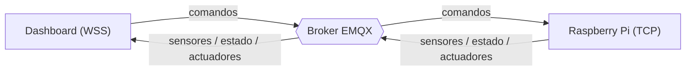
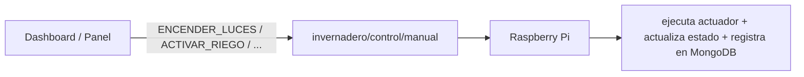

# Comunicación IoT (MQTT)

MQTT es el canal de comunicación en tiempo real del sistema. La Raspberry Pi publica lecturas y estado y recibe comandos; el dashboard consume esas lecturas y envía comandos de control. Todos los payloads son **texto plano** con **QoS 0**.

---

## 1. Broker y configuración

| Parámetro         | iot_program (Raspberry Pi) | Dashboard (navegador)       |
| ----------------- | -------------------------- | --------------------------- |
| Broker            | `broker.emqx.io`           | `broker.emqx.io`            |
| Transporte        | MQTT TCP                   | MQTT sobre WebSocket seguro |
| Puerto            | 1883                       | 8084 (`/mqtt`)              |
| QoS               | 0                          | 0                           |
| Payload           | texto plano                | texto plano                 |
| Prefijo de topics | `greenpi/g15`              | `greenpi/g15`               |

El dashboard usa WebSocket seguro porque un navegador no abre sockets TCP crudos; la Raspberry Pi, como proceso, usa MQTT TCP directo. Se antepone un prefijo de topics (`greenpi/g15`) para evitar interferencia en el broker público; ambos extremos comparten el mismo prefijo.

**Por qué texto plano y no JSON:** cada variable tiene su propio topic, por lo que se publica un único valor por topic (`28.7`, `ON`, `NORMAL`). Es directo de inspeccionar y liviano.

---

## 2. Topics

### Sensores (publica la Raspberry Pi)

| Topic                                      | Ejemplo |
| ------------------------------------------ | ------- |
| `invernadero/sensores/temperatura`         | `28.7`  |
| `invernadero/sensores/humedad_ambiente`    | `70.4`  |
| `invernadero/sensores/humedad_suelo_area1` | `45.8`  |
| `invernadero/sensores/humedad_suelo_area2` | `45.8`  |
| `invernadero/sensores/luz`                 | `320`   |
| `invernadero/sensores/gas`                 | `120`   |

### Estado

| Topic                       | Payload                                                                  |
| --------------------------- | ------------------------------------------------------------------------ |
| `invernadero/estado/global` | `NORMAL` · `ADVERTENCIA` · `RIEGO_ACTIVO` · `MODO_MANUAL` · `EMERGENCIA` |

### Actuadores (publica la Raspberry Pi)

| Topic                                | Payload                                                                                |
| ------------------------------------ | -------------------------------------------------------------------------------------- |
| `invernadero/actuadores/riego`       | `ON` / `OFF`                                                                           |
| `invernadero/actuadores/riego_area1` | `ON` / `OFF`                                                                           |
| `invernadero/actuadores/riego_area2` | `ON` / `OFF`                                                                           |
| `invernadero/actuadores/ventilador`  | `VENTILACION_ON` / `VENTILACION_OFF` / `VENTILACION_MANUAL` / `VENTILACION_EMERGENCIA` |
| `invernadero/actuadores/luces`       | `ON` / `OFF`                                                                           |
| `invernadero/actuadores/alarma`      | `ON` / `OFF`                                                                           |

### Control (publica el dashboard / panel)

| Topic                        | Uso                                   |
| ---------------------------- | ------------------------------------- |
| `invernadero/control/manual` | Comandos del dashboard y panel local. |
| `invernadero/control/remoto` | Comandos remotos.                     |

La Raspberry Pi se suscribe a ambos topics de control.

---

## 3. Comandos (texto plano)

| Comando                                           | Efecto                       |
| ------------------------------------------------- | ---------------------------- |
| `ACTIVAR_RIEGO` / `DESACTIVAR_RIEGO`              | Activa / desactiva el riego. |
| `ACTIVAR_RIEGO_1` / `ACTIVAR_RIEGO_2`             | Riego por área.              |
| `ACTIVAR_RIEGO_MANUAL`                            | Riego manual (botón físico). |
| `ENCENDER_LUCES` / `APAGAR_LUCES`                 | Iluminación.                 |
| `ACTIVAR_VENTILADOR` / `DESACTIVAR_VENTILADOR`    | Ventilación.                 |
| `ACTIVAR_ALARMA` / `SILENCIAR_ALARMA`             | Alarma / buzzer.             |
| `CAMBIAR_MODO_AUTOMATICO` / `CAMBIAR_MODO_MANUAL` | Cambio de modo.              |

Cada comando recibido se ejecuta sobre el actuador correspondiente, actualiza el estado global y se registra en MongoDB (`commands` y `actuator_logs`).

---

## 4. Diagramas

### Dashboard ↔ broker ↔ Raspberry Pi



### Topic de comandos



---

## 5. Ejemplo

Comando del dashboard:

```text
Topic:   invernadero/control/manual
Payload: ENCENDER_LUCES
```

Respuesta publicada por la Raspberry Pi:

```text
Topic:   invernadero/actuadores/luces
Payload: ON
```

---

## 6. Verificación con MQTTX

1. Conectar a `broker.emqx.io:1883`.
2. Suscribirse a `greenpi/g15/invernadero/#` (o `invernadero/#` sin prefijo).
3. Observar las lecturas en `invernadero/sensores/*` y el estado en `invernadero/estado/global`.
4. Publicar un comando en `invernadero/control/manual` y verificar el cambio en `invernadero/actuadores/*`.
