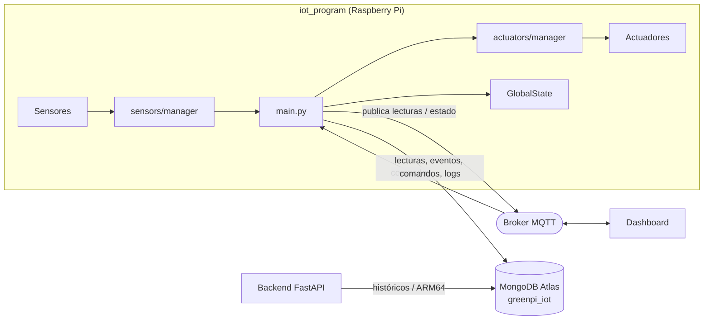
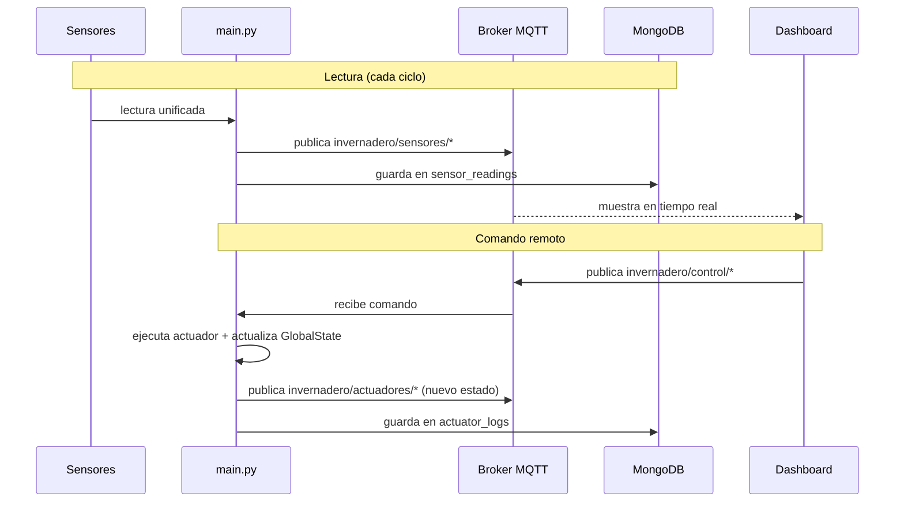

# 🌿 iot_program — GreenPi Grupo 15

Programa base de integración IoT del proyecto **GreenPi**. Se enfoca en **sensores, actuadores, MQTT y persistencia de lecturas**.

> El **backend FastAPI** es un componente separado: consulta históricos, genera `lecturas.csv`, ejecuta ARM64, lee resultados `.txt` y guarda resultados ARM64 en MongoDB. Este `iot_program` **no ejecuta ARM64** y **no genera** `lecturas.csv`.

---

## 🗺️ Cómo funciona



El `iot_program` y el backend **comparten la misma base** `greenpi_iot`, pero hacen cosas distintas: este alimenta los datos, el backend los consulta y procesa.

### Flujo de una lectura y de un comando



## Qué hace

- Lee sensores **simulados** en modo local, sin Raspberry Pi.
- **Publica** lecturas por MQTT en texto plano.
- **Recibe** comandos MQTT en texto plano.
- Simula actuadores con `fake_actuators.py`.
- Guarda lecturas, comandos, eventos, estado y logs en **MongoDB Atlas**.
- Mantiene un `GlobalState` con el último estado conocido del sistema.

---

## 🧱 Estructura

```text
iot_program/
├── main.py
├── config.py
├── global_state.py
├── topics.py
├── models.py
├── rules.py
├── mongo_repository.py
├── mqtt_client.py
├── sensors/
│   ├── base.py
│   ├── fake_sensors.py
│   ├── manager.py
│   ├── temperatura_humedad.py
│   ├── suelo_area1.py
│   ├── suelo_area2.py
│   ├── luz.py
│   ├── gas.py
│   └── raspberry_sensors.py
├── actuators/
│   ├── base.py
│   ├── fake_actuators.py
│   ├── manager.py
│   ├── riego_area1.py
│   ├── riego_area2.py
│   ├── ventilador.py
│   ├── luces.py
│   ├── alarma.py
│   ├── leds_estado.py
│   └── raspberry_actuators.py
└── local_panel/
    ├── fake_lcd.py
    ├── lcd_display.py
    └── buttons.py
```

---

## 👥 Trabajo por integrante

Para evitar conflictos de Git, cada integrante trabaja en **su propio archivo** de sensor, actuador o componente físico.

| Sensores                         | Actuadores                 |
| -------------------------------- | -------------------------- |
| `sensors/temperatura_humedad.py` | `actuators/riego_area1.py` |
| `sensors/suelo_area1.py`         | `actuators/riego_area2.py` |
| `sensors/suelo_area2.py`         | `actuators/ventilador.py`  |
| `sensors/luz.py`                 | `actuators/luces.py`       |
| `sensors/gas.py`                 | `actuators/alarma.py`      |
|                                  | `actuators/leds_estado.py` |

**Archivos de integración** (tocar lo menos posible):

```text
main.py
sensors/manager.py
actuators/manager.py
mqtt_client.py
mongo_repository.py
global_state.py
```

> `sensors/manager.py` junta las lecturas de cada sensor individual y entrega una **lectura unificada** al programa principal. De forma similar, `actuators/manager.py` recibe comandos y **delega** la acción al archivo del actuador correspondiente.

### Qué hacer después de implementar un sensor o actuador

No es solo meter código en el archivo asignado. Después hay que revisar que ese archivo sí lo esté usando el programa principal.

#### Sensores

Para sensores, `sensors/manager.py` ya llama estas clases y métodos. Entonces hay que mantener esos nombres:

| Archivo | Clase/métodos que debe conservar |
| ------- | -------------------------------- |
| `sensors/temperatura_humedad.py` | `TemperaturaHumedadSensor.leer_temperatura()` y `leer_humedad()` |
| `sensors/suelo_area1.py` | `SueloArea1Sensor.read()` |
| `sensors/suelo_area2.py` | `SueloArea2Sensor.read()` |
| `sensors/luz.py` | `LuzSensor.read()` |
| `sensors/gas.py` | `GasSensor.read()` |

Checklist antes de subir:

- Implementar la lectura real en el archivo que te toca.
- Retornar número (`int` o `float`), no texto.
- No cambiar nombres de clases ni métodos sin coordinar.
- Ejecutar `python main.py`.
- Ver en consola o MQTTX que se publique el tópico de tu sensor en `invernadero/sensores/*`.
- Si hay MongoDB configurado, revisar que entren lecturas en `sensor_readings`.

Si tu sensor necesita parámetros, pines o inicialización especial y ya no alcanza con `Sensor()`, ahí sí hay que tocar y coordinar:

```text
sensors/manager.py
```

#### Actuadores

Para actuadores, `actuators/manager.py` ya llama estas clases y métodos. Hay que mantener la misma interfaz:

| Archivo | Clase/métodos que debe conservar |
| ------- | -------------------------------- |
| `actuators/riego_area1.py` | `RiegoArea1Actuator.activar()` y `desactivar()` |
| `actuators/riego_area2.py` | `RiegoArea2Actuator.activar()` y `desactivar()` |
| `actuators/ventilador.py` | `VentiladorActuator.activar()` y `desactivar()` |
| `actuators/luces.py` | `LucesActuator.encender()` y `apagar()` |
| `actuators/alarma.py` | `AlarmaActuator.silenciar()` |
| `actuators/leds_estado.py` | `LedsEstadoActuator.modo_automatico()` y `modo_manual()` |

Checklist antes de subir:

- Implementar la acción real GPIO/relé en el archivo que te toca.
- Retornar un diccionario con el estado que cambió.
- No cambiar nombres de clases ni métodos sin coordinar.
- Ejecutar `python main.py`.
- Probar desde MQTTX publicando un comando en `invernadero/control/manual`.
- Ver que el estado salga en `invernadero/actuadores/*`.
- Si hay MongoDB configurado, revisar que entren logs en `actuator_logs`.

Ejemplo:

```text
Topic:   invernadero/control/manual
Payload: ENCENDER_LUCES
```

Respuesta esperada:

```text
Topic:   invernadero/actuadores/luces
Payload: ON
```

#### Modo simulado y modo Raspberry

`main.py` ya escoge entre modo simulado y modo Raspberry con `SIMULATION_MODE`.

```env
SIMULATION_MODE=true   # usa managers normales
SIMULATION_MODE=false  # usa raspberry_sensors.py y raspberry_actuators.py
```

En modo Raspberry se usan estos archivos:

```text
sensors/raspberry_sensors.py
actuators/raspberry_actuators.py
```

Pero ojo: esos archivos no reemplazan el trabajo individual. Solo juntan todo.

Para este avance, lo más directo es:

1. Cada quien implementa su archivo individual.
2. `raspberry_sensors.py` o `raspberry_actuators.py` ya lo llama.
3. Para probar hardware real, poner `SIMULATION_MODE=false`.
4. Ejecutar `python main.py`.

---

## 🚀 Puesta en marcha

### 1. Entorno virtual

```bash
cd iot_program
python -m venv .venv
source .venv/bin/activate
```

### 2. Dependencias

```bash
pip install -r requirements.txt
```

```text
paho-mqtt
pymongo
python-dotenv
```

### 3. Configurar `.env`

```bash
cp .env.example .env
```

```env
MQTT_HOST=broker.emqx.io
MQTT_PORT=1883
MQTT_CLIENT_ID_PREFIX=greenpi-g15-iot
MQTT_USERNAME=
MQTT_PASSWORD=
MQTT_QOS=0
MQTT_TOPIC_PREFIX=

MONGODB_URI=mongodb+srv://usuario@cluster.mongodb.net/?retryWrites=true&w=majority
MONGODB_DB=greenpi_iot

SIMULATION_MODE=true
SENSOR_INTERVAL_SECONDS=0.2
MQTT_PUBLISH_INTERVAL_SECONDS=1
```

> ⚠️ No subas credenciales reales. Si `MONGODB_URI` queda vacío, el programa sigue funcionando con simulación y MQTT, pero muestra una advertencia y **no guarda en MongoDB**.

### 4. Ejecutar

```bash
python main.py
```

Corre en **modo simulación** por defecto. No necesita Raspberry Pi para arrancar.

---

## 🧪 Probar con MQTTX Web

1. Abrir MQTTX Web y crear una conexión nueva.
2. Broker: `broker.emqx.io` · Puerto: `1883`
3. **Sin** TLS/SSL y sin usuario/contraseña (si el broker público no lo requiere).
4. Conectarse y suscribirse a:

```text
invernadero/#
```

> Los payloads son **texto plano**, no JSON.

---

## 📡 Tópicos MQTT

### Publica

| Categoría      | Tópicos                                                                                                                                                                                                                               |
| -------------- | ------------------------------------------------------------------------------------------------------------------------------------------------------------------------------------------------------------------------------------- |
| **Sensores**   | `invernadero/sensores/temperatura`<br>`invernadero/sensores/humedad_ambiente`<br>`invernadero/sensores/humedad_suelo_area1`<br>`invernadero/sensores/humedad_suelo_area2`<br>`invernadero/sensores/luz`<br>`invernadero/sensores/gas` |
| **Estado**     | `invernadero/estado/global`                                                                                                                                                                                                           |
| **Actuadores** | `invernadero/actuadores/riego`<br>`invernadero/actuadores/riego_area1`<br>`invernadero/actuadores/riego_area2`<br>`invernadero/actuadores/ventilador`<br>`invernadero/actuadores/luces`<br>`invernadero/actuadores/alarma`            |

Ejemplo:

```text
Topic: invernadero/sensores/temperatura
Payload: 28.7
```

### Escucha

```text
invernadero/control/remoto
invernadero/control/manual
```

Comandos soportados:

```text
ACTIVAR_RIEGO            DESACTIVAR_RIEGO
ACTIVAR_RIEGO_1          ACTIVAR_RIEGO_2
ENCENDER_LUCES           APAGAR_LUCES
ACTIVAR_VENTILADOR       DESACTIVAR_VENTILADOR
SILENCIAR_ALARMA
CAMBIAR_MODO_AUTOMATICO  CAMBIAR_MODO_MANUAL
```

Ejemplo de prueba desde MQTTX:

```text
Topic:   invernadero/control/manual
Payload: ENCENDER_LUCES
```

Respuesta esperada en `invernadero/actuadores/luces` con payload `ON`.

---

## 🗄️ MongoDB

Base de datos: `greenpi_iot`

| Colección         | Contenido                              |
| ----------------- | -------------------------------------- |
| `sensor_readings` | Lecturas de sensores                   |
| `events`          | Eventos del sistema                    |
| `commands`        | Comandos recibidos                     |
| `system_status`   | Estado del sistema (`_id = "current"`) |
| `actuator_logs`   | Activaciones de actuadores             |

---

## 🔌 Pasar de simulado a Raspberry Pi

### Sensores reales

La simulación vive en `sensors/fake_sensors.py`. Para sensores reales, implementá `RaspberrySensors.read_all()` en:

```text
sensors/raspberry_sensors.py
```

> La interfaz debe devolver **las mismas claves** para no romper el resto del programa.

### Actuadores reales (GPIO)

La simulación vive en `actuators/fake_actuators.py`. Para bombas, ventilador, luces o buzzer, implementá `RaspberryActuators.apply_command()` en:

```text
actuators/raspberry_actuators.py
```

> El resto del flujo no cambia: se recibe MQTT, se ejecuta la acción, se guarda log, se actualiza `GlobalState` y se publica el nuevo estado.

### Panel local (futuro)

La carpeta `local_panel/` queda preparada para LCD y botones físicos. Por ahora `fake_lcd.py` solo imprime en consola y `buttons.py` no retorna comandos.

---

## 🔗 Relación con backend y dashboard

- El **dashboard** usa MQTT para enviar comandos en tiempo real.
- El **dashboard** también consulta el **backend FastAPI** para históricos.
- El **backend FastAPI** consulta MongoDB y ejecuta ARM64.
- El **`iot_program`** alimenta MongoDB con lecturas, eventos, comandos y logs.
- Ambos componentes comparten la base `greenpi_iot`.

---

## 📝 Notas importantes

- MQTT usa **QoS 0** por defecto.
- MQTT usa **texto plano**, no JSON.
- El `client_id` incluye un número aleatorio para evitar conflictos.
- No se usa TLS/SSL por defecto.
- No se usan credenciales MQTT si las variables están vacías.
- **No** se hacen cálculos estadísticos ARM64 en Python.
