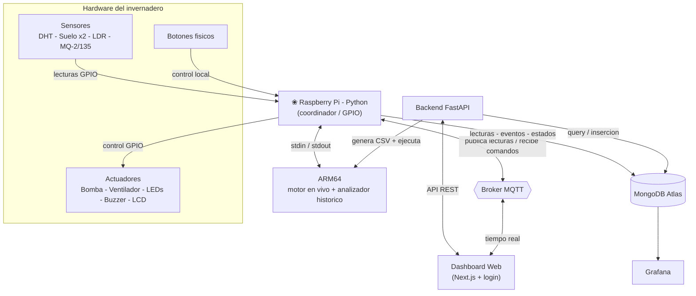
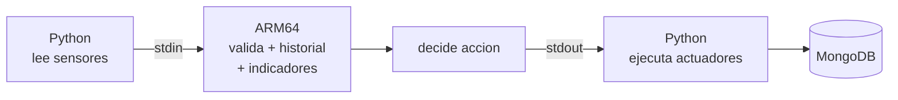
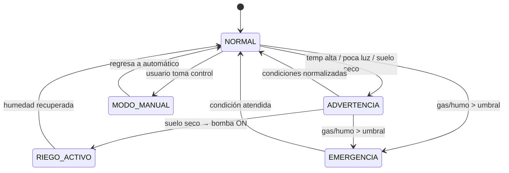

# Invernadero Inteligente IoT con Motor ARM64 de Decisión y Análisis Histórico

Proyecto académico del curso **Arquitectura de Computadores y Ensambladores 1 (AEYC1)** — **Fase 2**, Segundo Semestre 2026.
Universidad de San Carlos de Guatemala · Facultad de Ingeniería · Ingeniería en Ciencias y Sistemas.

> **Ponderación:** 60 pts · **Tiempo estimado:** 70 hrs

Sistema IoT sobre **Raspberry Pi** que monitorea y controla un invernadero dividido en dos áreas de cultivo y un centro de control. La Fase 2 evoluciona hacia una **arquitectura híbrida**: Python coordina el hardware y la comunicación, pero **la decisión automática principal y el análisis histórico se calculan en ensamblador ARM64/AArch64**. Integra sensores, actuadores, MQTT, MongoDB Atlas, backend FastAPI, dashboard web con login, despliegue público y visualización en Grafana.

---

## ☰ Contenido

- [Integrantes](#-integrantes)
- [Objetivo](#-objetivo)
- [Resumen de la Fase 2](#-resumen-de-la-fase-2)
- [Arquitectura general](#-arquitectura-general)
- [Estructura del proyecto](#-estructura-del-proyecto)
- [Componente A · Motor ARM64 en vivo](#-componente-a--motor-arm64-en-vivo)
- [Componente B · Analizador histórico ARM64](#-componente-b--analizador-histórico-arm64)
- [Integración Python ↔ ARM64](#-integración-python--arm64)
- [Registro en MongoDB y visualización](#-registro-en-mongodb-y-visualización)
- [Distribución física de la maqueta](#-distribución-física-de-la-maqueta)
- [Estados globales del sistema](#-estados-globales-del-sistema)
- [Sensores y actuadores](#-sensores)
- [Tecnologías](#-tecnologías)
- [Módulos ARM64](#-módulos-arm64)
- [Distribución del trabajo](#-distribución-del-trabajo)
- [Entregables](#-entregables)
- [Estado del proyecto](#-estado-del-proyecto)

---

## ◉ Integrantes

| Carnet    | Nombre                           |
| --------- | -------------------------------- |
| 202406918 | Claudia Maribel Tigüilá Tecum    |
| 202403929 | Emiliana Elizabeth Pú Lara       |
| 202300476 | Alex Ricardo Castañeda Rodríguez |
| 202100171 | Alex Oswaldo López Alquejay      |
| 202001376 | Kevin Rodrigo Sandoval Hernández |

---

## ◎ Objetivo

Ampliar el Invernadero Inteligente IoT de la Fase 1 incorporando un **motor de decisión en vivo en ARM64**, **análisis histórico de archivos grandes**, visualización con **Grafana**, registro de resultados ARM64 en **MongoDB** y un dashboard web con **login** desplegado públicamente. Python sigue como coordinador (lee sensores, controla GPIO, ejecuta actuadores, publica por MQTT y persiste datos), pero **no calcula la decisión automática principal**: esa responsabilidad es de ARM64.

La maqueta física se divide en tres zonas: **área de cultivo 1**, **área de cultivo 2** (cada una con planta, sensor de humedad de suelo, riego e iluminación) y el **centro de control** (Raspberry Pi, LCD, botones físicos, LEDs de estado y buzzer).

---

## ❖ Resumen de la Fase 2

La Fase 2 se compone de **dos componentes ARM64** que comparten la biblioteca común `utils.s` y trabajan sobre **cantidad variable de datos**:

| Componente                                        | Qué hace                                                                                                         | Entrada                      | Salida                                |
| ------------------------------------------------- | ---------------------------------------------------------------------------------------------------------------- | ---------------------------- | ------------------------------------- |
| **A · Motor en vivo** (`arm64/motor.s`)           | Recibe la lectura actual, mantiene historial reciente, calcula indicadores y devuelve **una decisión principal** | Línea por **stdin**          | Respuesta estructurada por **stdout** |
| **B · Analizador histórico** (`arm64/modulo_*.s`) | Procesa una **columna** dentro de un **rango de líneas** de un archivo de lecturas                               | `archivo inicio fin columna` | Archivo `.txt` en `resultados_arm64/` |

---

## ▦ Arquitectura general



---

## ▸ Estructura del proyecto

```text
.
├── arm64/                  # Componentes A y B en ensamblador (motor.s, modulo_*.s, utils.s, Makefile)
├── iot_program/            # Python en Raspberry Pi: sensores, actuadores, MQTT, panel local, Mongo
├── server/                 # Backend FastAPI: API REST, repos Mongo, puente ARM64
├── client/                 # Dashboard web (Next.js) con login
├── data/                   # lecturas.csv (datos históricos para el analizador)
├── resultados_arm64/       # Salidas .txt generadas por los módulos ARM64
└── docs/                   # Documentación técnica y evidencias
```

Cada subsistema (`arm64/`, `server/`, `client/`, `iot_program/`) tiene su propio README con instrucciones de instalación, compilación y ejecución.

---

## ◆ Componente A · Motor ARM64 en vivo

Python envía la lectura actual por **stdin**; ARM64 la valida, actualiza su **historial interno**, calcula indicadores y devuelve una **decisión estructurada** por **stdout**. Python interpreta la respuesta, ejecuta la acción sobre los actuadores y la registra en MongoDB.



- **Entrada (stdin):** una línea `TEMP,HUM_AIRE,SOIL1,SOIL2,LUZ,GAS,MODO` (ej. `31,68,34,41,280,160,0`).
- **Indicadores:** promedio reciente, tendencia acumulada y amplitud reciente, calculados sobre el historial (no solo sobre la última lectura).
- **Decisión:** una acción por lectura según prioridad — `ALARM_ON` › `RIEGO_1_ON` › `RIEGO_2_ON` › `LIGHT_ON` › `FAN_ON` › `LED_GREEN` › `NO_ACTION`.
- **Salida (stdout):** línea estructurada con `ACTION`, `TARGET`, `RISK`, `REASON`, `VALUE`, `INDICATOR` y `STATUS`. Ante entrada inválida responde `STATUS=ERROR` y Python no ejecuta acciones físicas.

Los umbrales de referencia (gas, suelo, luz, temperatura) están documentados dentro de `arm64/motor.s`; Python no clasifica valores, solo envía datos y ejecuta la acción recibida.

---

## ∿ Componente B · Analizador histórico ARM64

Procesa archivos de lecturas con cantidad variable de filas, interpreta una **columna** como serie temporal (eje Y) sobre el **orden** de las lecturas del rango (eje X) y calcula indicadores históricos.

- **Entrada:** `archivo inicio fin columna` (ej. `lecturas.csv 10 80 TEMP`).
- **Columnas válidas** (encabezado de `data/lecturas.csv`): `TEMP, HUM_AIRE, SOIL1, SOIL2, LUZ, GAS`.
- **Validaciones:** antes de calcular verifica que el archivo, el rango y la columna sean válidos; ante error devuelve una salida estructurada (`STATUS=ERROR`).
- **Restricciones:** todo en ARM64, sin punto flotante y con divisiones enteras truncadas.

**Módulos de Fase 1 actualizados a rango variable:** media, varianza, anomalías, predicción y tendencia.

**Nuevos cálculos de Fase 2:**

| #   | Rutina                            | Archivo sugerido            | Salida                     |
| --- | --------------------------------- | --------------------------- | -------------------------- |
| 1   | RMSE respecto a un valor ideal ✓  | `modulo_1_rmse.s`           | `resultado_rmse.txt`       |
| 2   | Regresión lineal simple ✓         | `modulo_2_regresion.s`      | `resultado_regresion.txt`  |
| 3   | Predicción futura por regresión ✓ | `modulo_3_prediccion.s`     | `resultado_prediccion.txt` |
| 4   | Integral del error (trapecio) ✓   | `modulo_4_integral_error.s` | `resultado_integral.txt`   |
| 5   | Derivada local suavizada ✓        | `modulo_5_derivada_local.s` | `resultado_derivada.txt`   |

---

## ⇄ Integración Python ↔ ARM64

> **Regla clave:** ARM64 genera la decisión principal y los cálculos históricos; Python solo envía datos, interpreta respuestas, ejecuta acciones y registra resultados.

| Responsable | Responsabilidades                                                                                                                                                                        |
| ----------- | ---------------------------------------------------------------------------------------------------------------------------------------------------------------------------------------- |
| **Python**  | Leer sensores · comunicar con ARM64 (stdin/stdout) · ejecutar análisis histórico a petición · ejecutar actuadores por GPIO · MQTT · registrar en MongoDB · alimentar dashboard y Grafana |
| **ARM64**   | Validar y parsear entrada · mantener historial · calcular indicadores · generar la decisión principal · procesar rangos y columnas · producir salidas estructuradas                      |

---

## ▤ Registro en MongoDB y visualización

Los resultados ARM64 se guardan en la colección **`arm64_results`** (con `timestamp`, `source` = `live_engine` / `historical_analyzer`, módulo, entrada, rango/columna, resultado, decisión, riesgo y estado). MongoDB sigue registrando además lecturas, eventos, comandos y estados de Fase 1.

- **Grafana** (solo visualización): lecturas históricas, decisiones del motor, indicadores y resultados del analizador, errores y nivel de riesgo.
- **Dashboard web** (`client/`, Next.js): estado actual, lecturas y decisiones recientes, resultados ARM64, solicitud de análisis histórico y control remoto autorizado.
- **Login y despliegue público:** desplegado en Render / Vercel / Amazon S3 (o equivalente), protegido con autenticación y usuario de prueba documentado.

---

## ⬡ Distribución física de la maqueta

```mermaid
flowchart LR
    subgraph A1["Area de cultivo 1"]
        direction TB
        P1["Planta"]
        HS1["Sensor humedad suelo 1"]
        R1["Riego 1"]
        L1["LEDs"]
    end

    subgraph CC["Centro de control"]
        direction TB
        RPI["❀ Raspberry Pi"]
        LCD["LCD 16x2 / 20x4"]
        BTNS["4+ botones"]
        LEDS["LEDs de estado"]
        BUZ["Buzzer"]
    end

    subgraph A2["Area de cultivo 2"]
        direction TB
        P2["Planta"]
        HS2["Sensor humedad suelo 2"]
        R2["Riego 2"]
        L2["LEDs"]
    end

    A1 --- CC --- A2
```



---

## ◈ Estados globales del sistema



> En **EMERGENCIA** el sistema no regresa automáticamente a NORMAL mientras el sensor de gas siga por encima del umbral.

---

## ◍ Sensores

| Sensor                       | Función                                         |
| ---------------------------- | ----------------------------------------------- |
| DHT11 o DHT22                | Medir temperatura y humedad ambiental           |
| Sensor de humedad de suelo 1 | Medir humedad del suelo en el área de cultivo 1 |
| Sensor de humedad de suelo 2 | Medir humedad del suelo en el área de cultivo 2 |
| LDR                          | Detectar el nivel de luz                        |
| MQ-2 o MQ-135                | Detectar gas, humo o mala calidad del aire      |

## ⌁ Actuadores

| Actuador                    | Función                                        |
| --------------------------- | ---------------------------------------------- |
| Bomba de agua               | Activar el sistema de riego                    |
| Ventilador                  | Activar ventilación por temperatura alta o gas |
| LEDs blancos                | Iluminación artificial del invernadero         |
| LED verde / amarillo / rojo | Estado normal / advertencia / emergencia       |
| Buzzer                      | Alarma sonora                                  |
| LCD                         | Mostrar lecturas y estados                     |
| Botones físicos             | Permitir control manual                        |

---

## ✦ Tecnologías

| Área                   | Tecnología        |
| ---------------------- | ----------------- |
| Control principal      | Raspberry Pi 4    |
| Lenguaje coordinador   | Python            |
| Procesamiento de datos | ARM64 / AArch64   |
| Backend / API          | FastAPI           |
| Dashboard              | Next.js con login |
| Comunicación IoT       | MQTT / MQTTX      |
| Base de datos          | MongoDB Atlas     |
| Visualización          | Grafana           |
| Despliegue público     | Cloudflare        |
| Build / depuración     | Makefile · GDB    |
| Control de versiones   | Git y GitHub      |

---

## ◫ Distribución del trabajo

Cada integrante **entrega, explica y defiende un módulo ARM64 propio**, y actualiza su módulo de Fase 1 a rango variable. Todos participan en la maqueta física y en las pruebas de integración.

| Integrante | Rutina nueva Fase 2             | Archivo sugerido            | Módulo F1 a rango variable |
| ---------- | ------------------------------- | --------------------------- | -------------------------- |
| Claudia    | RMSE respecto a valor ideal     | `modulo_1_rmse.s`           | `modulo_1_media.s`         |
| Ricardo    | Regresión lineal simple ✓       | `modulo_2_regresion.s`      | `modulo_5_tendencia.s`     |
| Oswaldo    | Predicción futura por regresión | `modulo_3_prediccion.s`     | `modulo_4_prediccion.s`    |
| Elizabeth  | Integral del error (trapecio)   | `modulo_4_integral_error.s` | `modulo_2_varianza.s`      |
| Kevin      | Derivada local suavizada        | `modulo_5_derivada_local.s` | `modulo_3_anomalias.s`     |

---

## ▣ Entregables

- **Código fuente** completo (Fase 1 funcional + Fase 2 integrada).
- **Motor en vivo** y **analizador histórico** en ARM64, con un módulo nuevo por integrante.
- **Puente Python** que envía datos a ARM64, lee respuestas y ejecuta acciones.
- **MongoDB** con lecturas, decisiones ARM64 y resultados históricos.
- **Grafana** y **dashboard web** con login, desplegado públicamente (URL y credenciales de prueba).
- **Documentación técnica** (arquitectura, flujo, módulos, fórmulas, despliegue) y **evidencia GDB**.
- **Defensa individual** de cada módulo ARM64.

---

## ● Estado del proyecto

En desarrollo — Fase 2.
