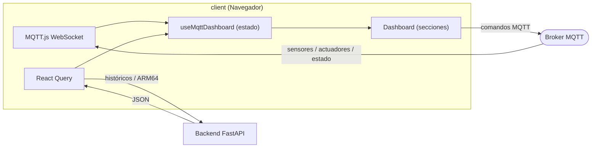
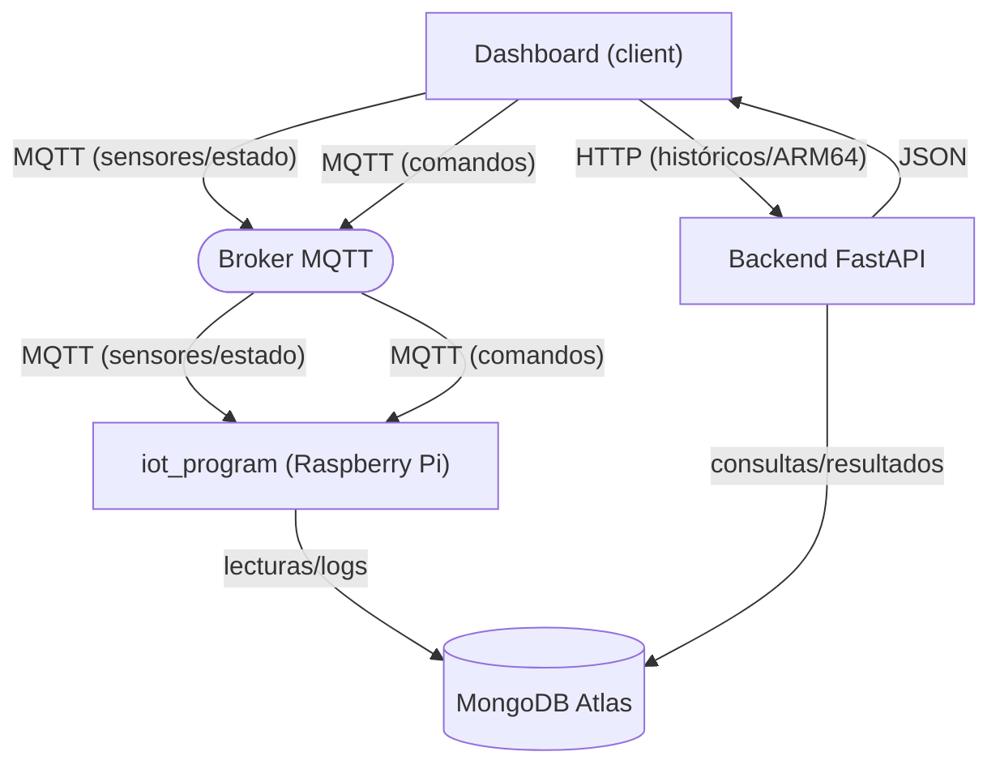

# ❖ Dashboard IoT — Invernadero ARM64 Grupo 15

Frontend web del proyecto **Invernadero ARM64**. Dashboard interactivo de monitoreo y control IoT para el invernadero inteligente. Se comunica con el **backend FastAPI** para consultar históricos y con el **broker MQTT** para datos en tiempo real y envío de comandos.

---

## ⬡ Cómo funciona



El dashboard escucha sensores y estado global vía MQTT en tiempo real, consulta históricos y resultados ARM64 al backend, y envía comandos de control al `iot_program` a través del broker.

---

## ☰ Contenido

- [Qué hace](#-qué-hace)
- [Estructura](#-estructura)
- [Requisitos](#-requisitos)
- [Puesta en marcha](#-puesta-en-marcha)
- [Variables de entorno](#-variables-de-entorno)
- [Tópicos MQTT](#-tópicos-mqtt)
- [Secciones del dashboard](#-secciones-del-dashboard)
- [Relación con otros componentes](#-relación-con-iot_program-y-server)

---

## ✦ Qué hace

- Recibe **sensores y estado global** en tiempo real vía MQTT WebSocket.
- Envía **comandos de control** (riego, ventilación, luces, alarma) vía MQTT.
- Muestra **KPIs** de temperatura, humedad, luz y gas con actualización en vivo.
- Visualiza el invernadero en **3D interactivo** (Three.js).
- Grafica **históricos** (temperatura, humedad, suelo, luz, gas) con SVG.
- Controla actuadores manualmente con toggles ON/OFF.
- Muestra **eventos, comandos y logs** de actuadores en tablas por pestañas.
- Coordina el **análisis histórico ARM64**: genera el CSV, ejecuta los **10 módulos** y muestra sus resultados (cards + 3D).
- Detecta el **estado de conexión** de MQTT, Raspberry Pi y el backend.

---

## ❁ Trabajo por integrante

Cada integrante trabaja en su **propio componente** para evitar conflictos de Git.

| Componente            | Vista / Sección                  |
| --------------------- | -------------------------------- |
| `EstadoGlobal.tsx`    | Hero + KPIs + estado global      |
| `Greenhouse3D.tsx`    | Invernadero 3D interactivo       |
| `TempChart.tsx`       | Gráfico SVG de históricos        |
| `SensoresSection.tsx` | KPIs de sensores                 |
| `SensoresViz3D.tsx`   | Constelación 3D de sensores      |
| `ZonasHumedad3D.tsx`  | Humedad de suelo en 3D           |
| `ActuadoresViz3D.tsx` | Control de actuadores + visual   |
| `ControlPanel.tsx`    | Panel de control manual          |
| `ActivityTable.tsx`   | Tabla de eventos/comandos/logs   |
| `Arm64Section.tsx`    | Análisis ARM64 (cards + botones) |
| `Arm64Viz3D.tsx`      | Resultados ARM64 en 3D           |

**Archivos de integración** (tocar lo menos posible):

```text
src/app/layout.tsx
src/app/page.tsx
src/app/providers.tsx
src/lib/hooks/useMqttDashboard.tsx
src/services/http-client.ts
```

---

## ▦ Estructura

```text
client/
├── package.json
├── next.config.ts
├── tsconfig.json
├── postcss.config.mjs
├── .env.example
├── public/
└── src/
    ├── app/
    │   ├── layout.tsx
    │   ├── page.tsx
    │   ├── providers.tsx
    │   └── icon.svg
    ├── components/
    │   ├── templates/
    │   │   └── DashboardLayout.tsx
    │   ├── organisms/
    │   │   ├── Sidebar.tsx
    │   │   ├── Header.tsx
    │   │   ├── EstadoGlobal.tsx
    │   │   ├── Greenhouse3D.tsx
    │   │   ├── TempChart.tsx
    │   │   ├── ControlPanel.tsx
    │   │   ├── SensoresSection.tsx
    │   │   ├── SensoresViz3D.tsx
    │   │   ├── ActuadoresViz3D.tsx
    │   │   ├── ZonasHumedad3D.tsx
    │   │   ├── ActivityTable.tsx
    │   │   ├── Arm64Section.tsx
    │   │   └── Arm64Viz3D.tsx
    │   ├── molecules/
    │   │   ├── ZoneCard.tsx
    │   │   ├── ControlToggle.tsx
    │   │   ├── KpiCard.tsx
    │   │   ├── NavItem.tsx
    │   │   ├── ActivityRow.tsx
    │   │   └── Arm64Card.tsx
    │   └── atoms/
    │       ├── Badge.tsx
    │       ├── StatusDot.tsx
    │       ├── IconBox.tsx
    │       ├── ProgressBar.tsx
    │       └── Object3D.tsx
    ├── lib/
    │   ├── constants/
    │   │   ├── env.ts
    │   │   ├── dashboard-data.ts
    │   │   ├── commands.ts
    │   │   └── mqtt-topics.ts
    │   ├── helpers/
    │   │   ├── formatters.ts
    │   │   └── mqtt.ts
    │   ├── hooks/
    │   │   └── useMqttDashboard.tsx
    │   └── types.ts
    ├── services/
    │   ├── http-client.ts
    │   ├── readings/
    │   ├── status/
    │   ├── events/
    │   ├── commands/
    │   ├── actuator-logs/
    │   └── arm64/
    └── styles/
        ├── globals.css
        ├── theme.css
        ├── base.css
        ├── utilities.css
        └── components.css
```

---

## ✦ Requisitos

- Node.js 18+
- pnpm (gestor de paquetes)
- Las variables de entorno configuradas (ver abajo)

---

## ✶ Puesta en marcha

### 0. Instalar pnpm (si no lo tenés)

```bash
npm install -g pnpm
```

O con Corepack (incluido en Node.js 16.9+):

```bash
corepack enable
corepack prepare pnpm@latest --activate
```

### 1. Instalar dependencias

```bash
cd client
pnpm install
```

### 2. Configurar variables de entorno

```bash
cp .env.example .env.local
```

Luego completá tus valores (ver la sección siguiente).

### 3. Ejecutar en desarrollo

```bash
pnpm dev
```

El dashboard queda disponible en **http://localhost:3000**

### 4. Build de producción

```bash
pnpm build
pnpm start
```

---

## ✷ Variables de entorno

| Variable                        | Descripción                      | Ejemplo                               |
| ------------------------------- | -------------------------------- | ------------------------------------- |
| `NEXT_PUBLIC_API_URL`           | URL del backend FastAPI          | `http://localhost:8000`               |
| `NEXT_PUBLIC_MQTT_WSS_URL`      | Broker MQTT vía WebSocket seguro | `wss://broker.emqx.io:8084/mqtt`      |
| `NEXT_PUBLIC_MQTT_TOPIC_PREFIX` | Prefijo de tópicos MQTT          | _(vacío para usar `invernadero/...`)_ |

> ❈ Las variables con `NEXT_PUBLIC_` quedan expuestas en el navegador. No pongas credenciales privadas.

---

## ∿ Tópicos MQTT

### Escucha

| Categoría      | Tópicos                                                                                                                                                                                                                               |
| -------------- | ------------------------------------------------------------------------------------------------------------------------------------------------------------------------------------------------------------------------------------- |
| **Sensores**   | `invernadero/sensores/temperatura`<br>`invernadero/sensores/humedad_ambiente`<br>`invernadero/sensores/humedad_suelo_area1`<br>`invernadero/sensores/humedad_suelo_area2`<br>`invernadero/sensores/luz`<br>`invernadero/sensores/gas` |
| **Estado**     | `invernadero/estado/global`                                                                                                                                                                                                           |
| **Actuadores** | `invernadero/actuadores/riego`<br>`invernadero/actuadores/riego_area1`<br>`invernadero/actuadores/riego_area2`<br>`invernadero/actuadores/ventilador`<br>`invernadero/actuadores/luces`<br>`invernadero/actuadores/alarma`            |

### Publica (comandos)

```text
invernadero/control/manual
```

Comandos soportados:

```text
ACTIVAR_RIEGO            DESACTIVAR_RIEGO
ACTIVAR_RIEGO_1          ACTIVAR_RIEGO_2
ENCENDER_LUCES           APAGAR_LUCES
ACTIVAR_VENTILADOR       DESACTIVAR_VENTILADOR
SILENCIAR_ALARMA
CAMBIAR_MODO_AUTOMATICO  CAMBIAR_MODO_MANUAL
```

---

## ❉ Secciones del dashboard

El dashboard es una **single-page app** con scroll anclado a estas secciones:

| Sección        | `#id`         | Contenido                                                   |
| -------------- | ------------- | ----------------------------------------------------------- |
| **Dashboard**  | `#dashboard`  | Estado global (orbe 3D + KPIs), invernadero 3D, gráfico SVG |
| **Áreas**      | `#areas`      | Zonas de cultivo con humedad de suelo y estado de riego     |
| **Sensores**   | `#sensores`   | KPIs en tiempo real de los 6 sensores + constelación 3D     |
| **Actuadores** | `#actuadores` | Toggles de control + visualización 3D de cada actuador      |
| **Historial**  | `#historial`  | Tabla con pestañas: eventos, comandos y logs de actuadores  |
| **ARM64**      | `#arm64`      | Generar CSV, ejecutar módulos y ver resultados en 3D        |

La sección **ARM64** (`Arm64Section.tsx` + `Arm64Viz3D.tsx`) muestra una tarjeta por módulo del analizador histórico
: media, RMSE, varianza, regresión lineal, anomalías, predicción por regresión, predicción, integral del error, derivada local y tendencia (Fase 1 + las 5 rutinas de Fase 2). Cada tarjeta ejecuta su módulo y muestra el resultado; `Arm64Viz3D` los representa como cristales 3D.

### Conexión en tiempo real

El hook `useMqttDashboard` mantiene la conexión MQTT vía WebSocket y expone:

```ts
{
  sensors: SensorReadings       // 6 valores numéricos en vivo
  actuators: ActuatorStates     // 6 booleanos (ON/OFF)
  globalState: string           // estado del sistema
  connectionState: string       // "connecting" | "connected" | "disconnected" | "error"
  raspberryOnline: boolean      // heartbeat detectado
  sendCommand(cmd: string)      // publica comando de control
}
```

Si MQTT no está disponible (modo desarrollo sin broker), el dashboard hace **fallback a la API REST** (`GET /api/readings/latest`) cada 10 segundos.

---

## ◈ Relación con iot_program y server

- El **dashboard** escucha sensores, actuadores y estado vía MQTT publicados por el `iot_program`.
- El **dashboard** envía comandos de control vía MQTT que el `iot_program` recibe y ejecuta.
- El **dashboard** consulta históricos, eventos y resultados ARM64 al **backend FastAPI**.
- El **backend FastAPI** consulta MongoDB y ejecuta los módulos ARM64.
- El **`iot_program`** alimenta MongoDB con lecturas y logs.



---

## ❋ Notas importantes

- La comunicación MQTT usa **WebSocket seguro** (`wss://`) desde el navegador.
- Los payloads MQTT son **texto plano**, no JSON.
- React Query mantiene la caché con **stale time de 10 s** y **gc time de 60 s**.
- El dashboard detecta que la Raspberry Pi está offline si no recibe mensajes por **30 segundos**.
- Los componentes 3D usan **Three.js** con geometrías wireframe y son interactivos (drag + zoom).
- El tema es **oscuro** con design tokens personalizados definidos en `theme.css`.
- Las fuentes son **Bricolage Grotesque** (display), **Sora** (sans) y **JetBrains Mono** (mono).
- No se usa `localStorage` ni cookies. Todo el estado vive en React Query y el contexto MQTT.
