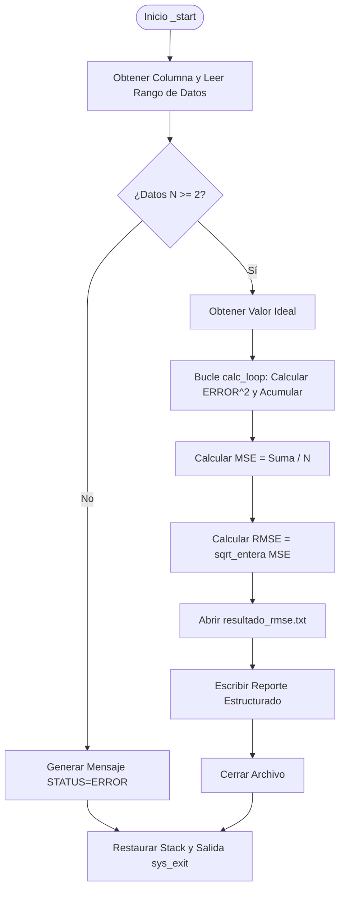

# Rutina 1: Cálculo de RMSE

Esta rutina tiene como objetivo analizar una serie temporal de lecturas de sensores de un invernadero dentro de un rango de líneas configurables por el usuario. Calcula la desviación de los valores reales con respecto a un valor ideal.

---

## 1. Fundamento Matemático

El cálculo se realiza estrictamente en el dominio de los números enteros sin usar el punto flotante, utilizando divisiones enteras truncadas y una rutina de raíz cuadrada entera:

1. **Error Individual ($ERROR_i$):**
   $$ERROR_i = Y_i - \text{IDEAL}$$

2. **Error Cuadrático ($ERROR^2_i$):**
   $$ERROR^2_i = ERROR_i \times ERROR_i$$

3. **Error Cuadrático Medio (MSE - Mean Squared Error):**
   $$\text{MSE} = \frac{\sum_{i=0}^{N-1} ERROR^2_i}{N}$$

4. **Raíz del Error Cuadrático Medio (RMSE):**
   $$\text{RMSE} = \lfloor\sqrt{\text{MSE}}\rfloor$$

---

## 2. Mapa de Registros

A continuación se detalla el uso de los registros de la arquitectura ARM64 a lo largo de la ejecución de este programa:

| Registro | Rol / Variable | Descripción |
| :--- | :--- | :--- |
| `x0` | Retorno / Parámetro | Registro multiusos para el paso de parámetros a funciones de `utils.s` y retornos. |
| `x3` | `Y` (Iterador de datos) | Puntero de lectura que recorre la pila de datos leídos. Avanza en pasos de 16 bytes. |
| `x5` | Contador de iteraciones | Inicializado con $N$ (`x26`). Decrementa hasta llegar a 0. |
| `x6` | Acumulador de Suma ($S$) | Almacena la suma acumulada de los errores cuadráticos ($\sum ERROR^2_i$). |
| `x7` | $Y_i$ (Lectura actual) | El valor numérico del sensor cargado en la iteración actual. |
| `x8` | $ERROR_i$ | Diferencia calculada: $Y_i - \text{IDEAL}$. |
| `x9` | $ERROR^2_i$ | Producto de la diferencia: $ERROR_i \times ERROR_i$. |
| `x10` | $\text{MSE}$ | Resultado de la división entera $\text{Suma} / N$. |
| `x16` | `WINDOW_START` | Línea de inicio del rango de análisis (copia de `x13`). |
| `x17` | `WINDOW_END` | Línea final del rango de análisis (copia de `x14`). |
| `x19` | `IDEAL` | Valor objetivo/esperado para la columna seleccionada. |
| `x20` | File Descriptor (`fd`) | Descriptor de archivo del reporte de salida generado (`resultado_rmse.txt`). |
| `x24` | Dirección inicial de datos | Puntero al inicio del búfer de datos en la pila (retornado por `read_column_to_stack`). |
| `x25` | Puntero a nombre de columna | Dirección de la cadena ASCII con el nombre de la columna (ej. `"TEMP"`). |
| `x26` | $N$ (Cantidad de datos) | Cantidad de lecturas dentro del rango establecido. |
| `x27` | Puntero de restauración de SP | Dirección original del puntero de pila (`sp`) antes de reservar memoria dinámica. |
| `x28` | $\text{RMSE}$ final | Resultado final entero truncado obtenido tras calcular la raíz cuadrada. |

---

## 3. Flujo Lógico y Control de la Aplicación

El programa sigue una estructura secuencial con validación de entrada, cálculo en bucle, generación de archivos y restauración de la pila:



---

## 4. Análisis Detallado del Código

### A. Sección de Datos Constantes (`.rodata`)
Se definen las etiquetas de salida formateadas para el reporte final de análisis histórico y los errores en caso de datos insuficientes:
* `msg_calc`, `msg_column`, `msg_start`, `msg_end`, `msg_count`, `msg_ideal`, `msg_rmse`, `msg_ok`: Estructuran la salida exitosa del archivo de texto.
* `msg_err_status`: Cadena que reporta un error si se intenta procesar una ventana con menos de 2 elementos.

### B. Inicialización y Validación
1. Llama a `get_column_arg` y `read_column_to_stack` para mapear los argumentos y cargar los datos correspondientes en la pila (Stack).
2. Guarda el estado del Stack original en `x27` para evitar fugas de memoria al retornar del programa.
3. Evalúa si existen suficientes datos para computar la desviación estándar:
   ```assembly
   cmp x26, #2
   blt manejar_error_datos
   ```

### C. Bucle Principal de Cálculo (`calc_loop`)
Cada registro cargado de la pila avanza en una ventana de **16 bytes** (`ldr x7, [x3], #16`), lo que denota que los datos están estructurados como registros alineados a 128 bits en memoria (por ejemplo, pares de `[Valor, Timestamp/Relleno]`).

El acumulador va sumando el error cuadrático en cada ciclo:
```assembly
calc_loop:
    cbz x5, calc_done       // Si el contador x5 llega a 0, termina el cálculo.
    ldr x7, [x3], #16       // Carga Y_i y avanza el puntero en 16 bytes.
    sub x8, x7, x19         // ERROR_i = Y_i - IDEAL
    mul x9, x8, x8          // ERROR2_i = ERROR_i * ERROR_i
    add x6, x6, x9          // Acumula la suma en x6
    sub x5, x5, #1          // Decrementa el contador de datos restantes.
    b calc_loop
```

### D. Resolución de RMSE
Una vez que el bucle finaliza:
1. Divide el acumulador `x6` entre la cantidad de lecturas `x26` para hallar el promedio de los errores al cuadrado (MSE):
   ```assembly
   udiv x10, x6, x26
   ```
2. Mueve el resultado a `x0` y ejecuta el llamado a `sqrt_entera` (raíz cuadrada por aproximaciones sucesivas o método babilonio en enteros). El resultado final se resguarda en `x28`.

### E. Escritura del Reporte
Se genera la salida utilizando la API definida en `utils.s`. Se escribe secuencialmente al descriptor de archivo devuelto en `x20` mediante llamadas a `write_text`, `write_cstring` (para cadenas terminadas en nulo) y `write_int` (para valores numéricos convertidos a ASCII en tiempo de ejecución).

### F. Salida Limpia del Sistema
Se restaura el puntero de pila y se invoca la llamada al sistema de salida de Linux (`sys_exit`):
```assembly
exit:
    mov sp, x27          // Restaura el puntero de pila original.
    mov x0, #0           // Código de retorno 0 (sin errores).
    mov x8, #93          // Código de llamada al sistema para sys_exit en ARM64.
    svc #0               // Llamada al supervisor.
```

---

## 5. Formatos de Salida Soportados

### Caso Exitoso (`STATUS=OK`)
El archivo de salida `resultado_rmse.txt` se escribe de la siguiente forma si el procesamiento es correcto:
```text
CALC=RMSE
COLUMN=SOIL1
WINDOW_START=1000
WINDOW_END=1050
COUNT=51
IDEAL=55
RMSE=18
STATUS=OK
```

### Caso Erróneo (`STATUS=ERROR`)
Si la validación de rango no contiene al menos 2 datos, el programa aborta escribiendo a stdout:
```text
STATUS=ERROR
ERROR=INSUFFICIENT_DATA
DETAIL=RMSE_REQUIRES_AT_LEAST_2_VALUES
```
1. **Error Individual ($ERROR_i$):**
   $$ERROR_i = Y_i - \text{IDEAL}$$

2. **Error Cuadrático ($ERROR^2_i$):**
   $$ERROR^2_i = ERROR_i \times ERROR_i$$

3. **Error Cuadrático Medio (MSE - Mean Squared Error):**
   $$\text{MSE} = \frac{\sum_{i=0}^{N-1} ERROR^2_i}{N}$$

4. **Raíz del Error Cuadrático Medio (RMSE):**
   $$\text{RMSE} = \lfloor\sqrt{\text{MSE}}\rfloor$$
