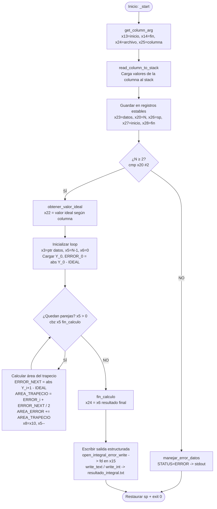

# Módulo 4 — Integral del error por regla del trapecio

| Campo                          | Detalle                                                             |
| ------------------------------ | ------------------------------------------------------------------- |
| **Responsable**                | Emiliana Elizabeth Pú Lara                                          |
| **Subsistema del invernadero** | Área de cultivo 2 — sensor de humedad de suelo 2 y riego del área 2 |
| **Archivo ARM64**              | `arm64/modulo_4_integral_error.s`                                         |
| **Biblioteca común**           | `arm64/utils.s`                                                     |
| **Salida**                     | `resultados_arm64/resultado_integral_error.txt`                           |
| **Colección de resultados**    | `arm64_results`                                                     |

---

## ¿Qué hace este módulo?

Este módulo calcula qué tanto se ha "desviado" una variable del invernadero respecto a un valor ideal a lo largo del tiempo. Para eso, en vez de solo ver un punto, acumula el error entre cada par de lecturas consecutivas usando la regla del trapecio.

El resultado es un número que representa el área total de error acumulado: mientras más grande, más tiempo estuvo la variable alejada del valor ideal.

---

## ¿Cómo se usa?

**Compilar:**
```bash
make integral
```

**Ejecutar con make (usando variables por defecto o personalizadas):**
```bash
make run-integral
make run-integral LEC=../data/lecturas.csv INI=10 FIN=80 COL=SOIL1
```

**Ejecutar el binario directamente:**
```bash
./build/modulo_4_integral_error <archivo> <linea_inicial> <linea_final> <columna>
./build/modulo_4_integral_error ../data/lecturas.csv 10 80 SOIL1
```

Esto analiza las filas 10 a 80 del archivo `lecturas.csv`, usando la columna `SOIL1`.

---

## Fórmulas implementadas

Para cada par de lecturas consecutivas `Y_i` y `Y_(i+1)`:

```
ERROR_i      = abs(Y_i - IDEAL)
ERROR_NEXT   = abs(Y_(i+1) - IDEAL)
AREA_TRAPECIO = (ERROR_i + ERROR_NEXT) / 2
AREA_ERROR   += AREA_TRAPECIO
```

Esto se repite desde `i = 0` hasta `i = N - 2`, es decir, para todas las parejas de puntos dentro del rango.

> Todas las divisiones son enteras y truncadas y el mínimo de datos es 2, una pareja.

---

## Ejemplo de salida

```
CALC=ERROR_INTEGRAL
COLUMN=SOIL1
WINDOW_START=10
WINDOW_END=80
COUNT=71
IDEAL=55
ERROR_INTEGRAL=740
STATUS=OK
```

Si hay menos de 2 datos en el rango:
```
STATUS=ERROR
ERROR=INSUFFICIENT_DATA
DETAIL=INTEGRAL_REQUIRES_AT_LEAST_2_VALUES
```

---

## Registros utilizados

| Registro | Uso |
|----------|-----|
| `x13` | Línea inicial del rango (WINDOW_START) |
| `x14` | Línea final del rango (WINDOW_END) |
| `x24` | Path del archivo de entrada / resultado acumulado final |
| `x25` | Puntero al nombre de la columna seleccionada |
| `x23` | Dirección de inicio de los datos cargados en el stack (lista Y) |
| `x20` | Cantidad de datos N procesados |
| `x26` | Dirección original del stack (para restaurarlo al final) |
| `x27` | Copia de WINDOW_START (para imprimirlo sin perderlo) |
| `x28` | Copia de WINDOW_END |
| `x22` | Valor ideal (IDEAL) obtenido con `obtener_valor_ideal` |
| `x3`  | Puntero iterador que recorre la lista Y en el stack |
| `x4`  | Copia del valor ideal usado dentro del loop |
| `x5`  | Contador de parejas restantes por procesar (N - 1) |
| `x6`  | Acumulador del área de error total (AREA_ERROR) |
| `x7`  | Valor Y_i actual (leído del stack) |
| `x8`  | ERROR_i = abs(Y_i - IDEAL) |
| `x9`  | Valor Y_(i+1) siguiente (leído del stack) |
| `x10` | ERROR_NEXT = abs(Y_(i+1) - IDEAL) |
| `x11` | Suma de errores / área del trapecio actual |
| `x12` | Constante 2 (divisor para la regla del trapecio) |
| `x15` | File descriptor del archivo de salida |

---

## Diagrama de flujo



---

## Flujo del programa paso a paso

### 1. Obtener argumentos (`get_column_arg`)
Se llama a esta función de `utils.s` que lee los parámetros de la línea de comandos y los deja en:
- `x13` → línea inicial
- `x14` → línea final
- `x24` → path del archivo
- `x25` → nombre de la columna

### 2. Leer columna del archivo (`read_column_to_stack`)
Lee el archivo CSV, navega hasta el rango indicado, extrae los valores de la columna seleccionada y los apila en el stack como enteros de 64 bits (cada uno ocupa 16 bytes por alineación).

Retorna:
- `x0` → dirección de inicio de los datos en el stack
- `x2` → cantidad de datos N
- `x3` → puntero para restaurar el stack después

### 3. Guardar retornos en registros estables
```asm
mov x23, x0     // dirección del primer dato en el stack
mov x20, x2     // N (cantidad de datos)
mov x26, x3     // para restaurar el stack al final
mov x27, x13    // WINDOW_START (para imprimir)
mov x28, x14    // WINDOW_END (para imprimir)
```
Esto se hace porque las funciones que se llaman después pueden sobreescribir `x0`, `x2`, `x3`, entonces se guardan los valores en registros que no se tocan.

### 4. Validar mínimo de datos
```asm
cmp x20, #2
blt manejar_error_datos
```
Si hay menos de 2 datos, no se puede calcular ni una sola área de trapecio, así que se salta directo al manejo de error.

### 5. Obtener el valor ideal (`obtener_valor_ideal`)
Dependiendo de la columna seleccionada (`x25`), esta función de `utils.s` retorna en `x0` el valor de referencia ideal para esa variable.

```asm
bl obtener_valor_ideal
mov x22, x0     // guardar el ideal
```

### 6. Inicializar el loop
```asm
mov x3, x23         // x3 apunta al primer dato en el stack
mov x4, x22         // x4 = valor ideal
sub x5, x20, #1     // x5 = N-1 (número de parejas)
mov x6, #0          // x6 = acumulador AREA_ERROR = 0
```

Se carga el primer valor `Y_0` antes de entrar al loop:
```asm
ldr x7, [x3], #16   // leer Y_0 y avanzar puntero 16 bytes
sub x8, x7, x4      // x8 = Y_0 - IDEAL
cmp x8, #0
b.ge error_0_positivo
neg x8, x8          // si es negativo, abs()
```

### 7. Loop principal (`loop_integral`)
Cada iteración procesa una pareja `(Y_i, Y_(i+1))`:

```asm
loop_integral:
    cbz x5, fin_calculo         // si ya no hay parejas, salir

    ldr x9, [x3], #16           // cargar Y_(i+1), avanzar puntero
    sub x10, x9, x4             // x10 = Y_(i+1) - IDEAL
    cmp x10, #0
    b.ge error_next_positivo
    neg x10, x10                // abs(ERROR_NEXT)

error_next_positivo:
    add x11, x8, x10            // suma de los dos errores
    mov x12, #2
    udiv x11, x11, x12          // AREA_TRAPECIO = suma / 2 (truncado)
    add x6, x6, x11             // AREA_ERROR += AREA_TRAPECIO

    mov x8, x10                 // el ERROR_NEXT se convierte en ERROR_i para la próxima vuelta
    sub x5, x5, #1              // una pareja menos
    b loop_integral
```

El `mov x8, x10` evita volver a calcular el error del punto anterior porque ya lo tenemos del ciclo anterior.

### 8. Escribir la salida
```asm
fin_calculo:
    mov x24, x6     // guardar resultado en x24 para imprimir
```

Se abre el archivo de salida con `open_integral_error_write`, se obtiene el file descriptor en `x15`, y luego se imprimen todos los campos uno por uno usando `write_text`, `write_cstring` y `write_int` de `utils.s`.

### 9. Restaurar el stack y salir
```asm
salir_programa:
    mov sp, x26     // restaurar el stack pointer original
    mov x0, #0
    mov x8, #93     // syscall exit
    svc #0
```
Es importante restaurar el stack porque `read_column_to_stack` lo usó para guardar los datos temporalmente.

---

## Funciones de utils.s utilizadas

| Función | Para qué se usa |
|---------|----------------|
| `get_column_arg` | Leer argumentos de la línea de comandos |
| `read_column_to_stack` | Leer el CSV y cargar la columna al stack |
| `obtener_valor_ideal` | Obtener el valor ideal según la columna seleccionada |
| `open_integral_error_write` | Abrir el archivo de salida en modo escritura |
| `write_text` | Escribir texto de longitud conocida |
| `write_cstring` | Escribir una cadena terminada en null (como el nombre de columna) |
| `write_int` | Convertir un entero a texto y escribirlo |
| `close_output_file` | Cerrar el archivo de salida |

---

## Validaciones implementadas

| Validación | Cómo se maneja |
|-----------|----------------|
| Menos de 2 datos | `cmp x20, #2` + `blt manejar_error_datos` -> salida de error estructurada |
| Errores negativos | `cmp` + `neg` para obtener valor absoluto en x8 y x10 |
| División entre cero | No puede ocurrir: el divisor es siempre la constante 2 |

---
