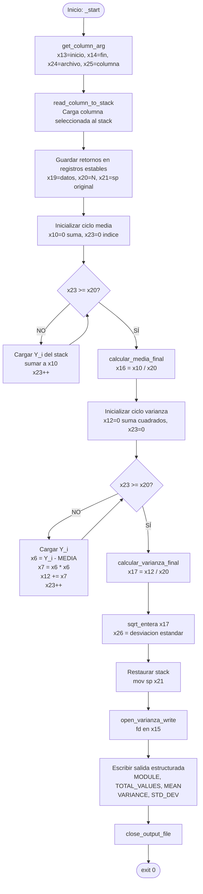

# Módulo 2 — Varianza y desviación estándar

| Campo                          | Detalle                                                             |
| ------------------------------ | ------------------------------------------------------------------- |
| **Responsable**                | Emiliana Elizabeth Pú Lara                                          |
| **Subsistema del invernadero** | Área de cultivo 2 — sensor de humedad de suelo 2 y riego del área 2 |
| **Archivo ARM64**              | `arm64/modulo_2_varianza.s`                                         |
| **Biblioteca común**           | `arm64/utils.s`                                                     |
| **Salida**                     | `resultados_arm64/resultado_varianza.txt`                           |
| **Colección de resultados**    | `arm64_results`                                                     |

---

## ¿Qué hace este módulo?

Este módulo toma una columna de lecturas del invernadero (como temperatura o humedad) dentro de un rango de filas seleccionado, y calcula tres indicadores estadísticos sobre esos datos:

- **Media:** el promedio de todos los valores del rango.
- **Varianza:** qué tanto se alejan los valores de la media en promedio (elevado al cuadrado).
- **Desviación estándar:** la raíz cuadrada de la varianza, que expresa la dispersión en las mismas unidades que el sensor.

El resultado se escribe en un archivo de salida con formato estructurado.

---

## ¿Cómo se usa?

**Compilar:**
```bash
make varianza
```

**Ejecutar con make:**
```bash
make run-varianza
make run-varianza LEC=../data/lecturas.csv INI=1 FIN=30 COL=SOIL1
```

**Ejecutar el binario directamente:**
```bash
./build/modulo_2_varianza <archivo> <linea_inicial> <linea_final> <columna>
./build/modulo_2_varianza ../data/lecturas.csv 1 30 TEMP
```

---

## Fórmulas implementadas

**Media:**
```
MEDIA = suma(Y_i) / N
```

**Varianza:**
```
VARIANZA = suma((Y_i - MEDIA)^2) / N
```

**Desviación estándar:**
```
STD_DEV = sqrt_entera(VARIANZA)
```

> Todas las operaciones son enteras y truncadas. La raíz cuadrada también es entera (función `sqrt_entera` de `utils.s`).

---

## Ejemplo de salida

```
MODULE=VARIANCE
TOTAL_VALUES=30
MEAN=42
VARIANCE=87
STD_DEV=9
```

---

## Registros utilizados

| Registro | Uso |
|----------|-----|
| `x13` | Línea inicial del rango |
| `x14` | Línea final del rango |
| `x24` | Path del archivo / desplazamiento temporal (i×16) |
| `x25` | Puntero al nombre de la columna seleccionada |
| `x19` | Dirección de inicio de los datos en el stack |
| `x20` | Cantidad de datos N leídos del rango |
| `x21` | Posición original del stack (para restaurarlo) |
| `x10` | Acumulador de la suma total (para calcular la media) |
| `x23` | Índice `i` del loop (se reutiliza en ambos ciclos) |
| `x16` | Media calculada (MEDIA = suma / N) |
| `x12` | Acumulador de la suma de cuadrados (para la varianza) |
| `x4`  | Valor actual Y_i leído del stack |
| `x6`  | Diferencia `Y_i - MEDIA` |
| `x7`  | Cuadrado de la diferencia `(Y_i - MEDIA)^2` |
| `x17` | Varianza calculada (suma de cuadrados / N) |
| `x26` | Desviación estándar (resultado de `sqrt_entera`) |
| `x15` | File descriptor del archivo de salida |

---

## Diagrama de flujo



---

## Flujo del programa paso a paso

### 1. Obtener argumentos (`get_column_arg`)
Lee los parámetros de la línea de comandos y los deja en:
- `x13` → línea inicial
- `x14` → línea final
- `x24` → path del archivo
- `x25` → nombre de la columna

### 2. Leer columna del archivo (`read_column_to_stack`)
Lee el CSV, navega al rango indicado, extrae los valores de la columna seleccionada y los apila en el stack como enteros de 64 bits (16 bytes cada uno por alineación).

Retorna:
- `x0` → dirección de inicio de los datos en el stack
- `x2` → cantidad de datos N
- `x3` → puntero para restaurar el stack después

### 3. Guardar retornos en registros estables
```asm
mov x19, x0     // dirección del primer dato en el stack
mov x20, x2     // N (cantidad de datos)
mov x21, x3     // para restaurar el stack al final
```
Se guardan en registros estables porque las funciones que se llaman después pueden sobreescribir `x0`, `x2` y `x3`.

### 4. Ciclo de la media
```asm
mov x10, #0     // acumulador de suma
mov x23, #0     // índice i

ciclo_media:
    cmp x23, x20        // si i >= N, salir
    b.hs calcular_media_final

    lsl x24, x23, #4    // desplazamiento = i * 16 bytes
    ldr x4, [x19, x24]  // cargar Y_i del stack
    add x10, x10, x4    // suma += Y_i

    add x23, x23, #1
    b ciclo_media

calcular_media_final:
    udiv x16, x10, x20  // MEDIA = suma / N
```
El `lsl #4` es equivalente a multiplicar por 16, que es el tamaño de cada dato en el stack.

### 5. Ciclo de la varianza
```asm
mov x12, #0     // acumulador suma de cuadrados
mov x23, #0     // reiniciar índice i

ciclo_varianza:
    cmp x23, x20
    b.hs calcular_varianza_final

    lsl x24, x23, #4
    ldr x4, [x19, x24]  // cargar Y_i

    sub x6, x4, x16     // x6 = Y_i - MEDIA
    mul x7, x6, x6      // x7 = (Y_i - MEDIA)^2
    add x12, x12, x7    // acumular

    add x23, x23, #1
    b ciclo_varianza

calcular_varianza_final:
    udiv x17, x12, x20  // VARIANZA = suma de cuadrados / N
```
El índice `x23` se reutiliza para ambos ciclos, reiniciándolo a 0 antes del segundo loop.

### 6. Desviación estándar (`sqrt_entera`)
```asm
mov x0, x17     // pasar la varianza como argumento
bl sqrt_entera
mov x26, x0     // guardar el resultado
```
`sqrt_entera` es una función de `utils.s` que calcula la raíz cuadrada entera truncada usando restas sucesivas o búsqueda binaria, sin punto flotante.

### 7. Restaurar el stack y escribir salida
```asm
mov sp, x21     // restaurar el stack pointer original
```
Se abre el archivo de salida con `open_varianza_write`, se obtiene el file descriptor en `x15`, y se imprimen los campos con `write_text`, `write_uint` y `write_newline` de `utils.s`.

---

## Funciones de utils.s utilizadas

| Función | Para qué se usa |
|---------|----------------|
| `get_column_arg` | Leer argumentos de la línea de comandos |
| `read_column_to_stack` | Leer el CSV y cargar la columna al stack |
| `sqrt_entera` | Calcular raíz cuadrada entera de la varianza |
| `open_varianza_write` | Abrir el archivo de salida en modo escritura |
| `write_text` | Escribir texto de longitud conocida |
| `write_uint` | Convertir un entero sin signo a texto y escribirlo |
| `write_newline` | Escribir salto de línea |
| `close_output_file` | Cerrar el archivo de salida |

---
