# Módulo 3 — Detección estadística de anomalías

| Campo                          | Detalle                                           |
| ------------------------------ | ------------------------------------------------- |
| **Responsable**                | Kevin Rodrigo Sandoval Hernández                  |
| **Subsistema del invernadero** | Temperatura, humedad ambiental, gas y ventilación |
| **Archivo ARM64**              | `arm64/modulo_3_anomalias.s`                      |
| **Biblioteca común**           | `arm64/utils.s`                                   |
| **Salida**                     | `resultados_arm64/resultado_anomalias.txt`        |
| **Colección de resultados**    | `arm64_results`                                   |

---

## Explicación del algoritmo, registros, memoria y flujo

### 1. modulo_3_anomalias.s — Detección de Anomalías en ARM64 (Fase 2)

**Archivo:** `arm64/modulo_3_anomalias.s`  
**Lenguaje:** Ensamblador ARM64 (AArch64)  
**Propósito:** Leer una columna específica de `lecturas.csv` dentro de un rango variable de líneas, calcular media aritmética y desviación estándar, detectar valores anómalos usando el criterio `|valor - media| ≥ 2σ`, clasificar el nivel de riesgo del sistema, y generar una salida estructurada en formato Fase 2.

**Cambios respecto a Fase 1:** En Fase 2 el módulo procesa una sola columna (seleccionada por argumento) sobre un rango variable de líneas (inicio-fin), ya no 30 registros fijos ni 5 columnas en lote. La detección ahora usa desviación estándar en lugar de MAD.

#### 1.1 Ejecución

```bash
./modulo_3_anomalias archivo.csv linea_inicial linea_final COLUMNA
# Ejemplo:
./modulo_3_anomalias ../data/lecturas.csv 1 30 GAS
```

#### 1.2 Sección .data — Etiquetas y mensajes

El módulo define todas las etiquetas de salida en `.data`, sin usar `.bss` ni `.rodata`. Las etiquetas se dividen en dos grupos:

**Etiquetas originales de Fase 1** (conservadas para retrocompatibilidad de salida):

| Etiqueta | Contenido | Uso |
|----------|-----------|-----|
| `msg_module` | `"MODULE=ANOMALY_DETECTION\n"` | Identificación del módulo |
| `msg_total` | `"TOTAL_VALUES="` | Cantidad de valores procesados |
| `msg_mean` | `"MEAN="` | Etiqueta de media |
| `msg_stddev` | `"STD_DEV="` | Etiqueta de desviación estándar |
| `msg_anomalies` | `"ANOMALIES="` | Etiqueta de cantidad de anomalías |
| `msg_risk` | `"SYSTEM_RISK="` | Etiqueta de nivel de riesgo |
| `risk_normal` | `"NORMAL\n"` | Riesgo normal (0 anomalías) |
| `risk_medium` | `"MEDIUM\n"` | Riesgo medio (1-3 anomalías) |
| `risk_high` | `"HIGH\n"` | Riesgo alto (≥4 anomalías) |

**Etiquetas nuevas de Fase 2** (agregadas para formato estructurado):

| Etiqueta | Contenido | Uso |
|----------|-----------|-----|
| `msg_calc_anom` | `"CALC=ANOMALY_DETECTION\n"` | Tipo de cálculo ejecutado |
| `msg_colum` | `"COLUMN="` | Columna analizada |
| `msg_window_start` | `"WINDOW_START="` | Línea inicial del rango |
| `msg_window_end` | `"WINDOW_END="` | Línea final del rango |
| `msg_count` | `"TOTAL_VALUES="` | Cantidad de datos (mismo contenido que msg_total) |
| `msg_risk_label` | `"SYSTEM_RISK="` | Etiqueta de riesgo (mismo contenido que msg_risk) |
| `msg_status_ok` | `"STATUS=OK\n"` | Estado de ejecución exitosa |

#### 1.3 Biblioteca común

El módulo incluye `utils.s` mediante `.include "utils.s"`, lo que le da acceso a todas las funciones de la biblioteca compartida: `get_column_arg`, `read_column_to_stack`, `open_anomalias_write`, `write_text`, `write_uint`, `write_int`, `write_newline`, `close_output_file`, `sqrt_entera`, etc.

#### 1.4 Flujo completo del programa

```mermaid
flowchart TD
    Start([_start]) --> GetArg

    GetArg["<b>get_column_arg()</b><br>Parsea argv: archivo, linea_inicial, linea_final, columna<br>x13 = línea inicial   x14 = línea final   x25 = nombre columna<br>Guarda x25 → x17 (COLUMN_NAME) para preservarlo"] --> ReadCol

    ReadCol["<b>read_column_to_stack()</b><br>Abre el CSV, salta el encabezado, lee solo las líneas en [x13, x14]<br>Extrae la columna indicada, convierte a entero y apila en stack<br>Retorna: x0 = sp actual, x1 = sp original, x2 = cantidad, x3 = restore<br>Guarda: x24 = x0, x25 = x1, x26 = x2, x27 = x3"] --> OpenWrite

    OpenWrite["open_anomalias_write() → x20 = fd salida"] --> WriteHead

    subgraph HEADER [Escribe cabecera Fase 2]
        WriteHead["CALC=ANOMALY_DETECTION<br>COLUMN= + nombre (x17) [con strlen dinámico]<br>WINDOW_START= + valor (x13)<br>WINDOW_END= + valor (x14)<br>TOTAL_VALUES= + cantidad (x26)"]
    end

    WriteHead --> MeanCalc

    subgraph MEAN [Cálculo de media]
        MeanCalc["Para i = 0 hasta N-1:<br>x28 += datos[i] (acumulador)<br>μ = x28 / N → x19<br>Escribe MEAN=x19"]
    end

    MeanCalc --> StdDevCalc

    subgraph STD_DEV [Cálculo de desviación estándar]
        StdDevCalc["Para i = 0 hasta N-1:<br>diff = datos[i] - μ<br>x28 += diff² (acumulador de cuadrados)<br>σ² = x28 / N → x21<br>σ = sqrt_entera(x21) → x22<br>Escribe STD_DEV=x22"]
    end

    StdDevCalc --> AnomalyDetect

    subgraph ANOMALY [Detección de anomalías]
        AnomalyDetect["umbral = 2 × σ → x4<br>Para i = 0 hasta N-1:<br>diff = |datos[i] - μ|<br>Si diff ≥ umbral → x23++ (contador anomalías)<br>Escribe ANOMALIES=x23"]
    end

    AnomalyDetect --> RiskClass

    subgraph RISK [Clasificación de riesgo]
        RiskClass{"Escribe SYSTEM_RISK="}
        RiskClass -- "x23 == 0" --> RiskNormal["NORMAL"]
        RiskClass -- "x23 <= 3" --> RiskMedium["MEDIUM"]
        RiskClass -- "x23 >= 4" --> RiskHigh["HIGH"]
    end

    RiskNormal --> WriteStatus
    RiskMedium --> WriteStatus
    RiskHigh --> WriteStatus

    WriteStatus["Escribe STATUS=OK"] --> CloseFile
    CloseFile["close_output_file(x20)"] --> ExitProc
    ExitProc["mov sp, x27 → exit(0)"] --> End([Stop])
```



#### 1.5 Registros utilizados

| Registro | Propósito | Tipo |
|:--------:|-----------|------|
| x20 | File descriptor del archivo de salida | Persistente |
| x24 | Inicio de datos en stack (sp actual = valor más reciente) | Datos CSV |
| x25 | Límite final de datos (sp original) | Datos CSV |
| x26 | Cantidad de datos leídos (N) | Datos CSV |
| x27 | Posición original del stack para restaurar | Stack |
| x13 | WINDOW_START (línea inicial) | Parámetro |
| x14 | WINDOW_END (línea final) | Parámetro |
| x17 | Puntero al nombre de la columna | Parámetro |
| x9 | Puntero para recorrer datos en stack | Iterador |
| x10 | Valor actual cargado del stack | Temporal |
| x19 | Media aritmética (μ) | Resultado |
| x21 | Varianza (σ²) | Resultado |
| x22 | Desviación estándar (σ) / longitud del nombre de columna | Resultado |
| x23 | Contador de anomalías detectadas | Resultado |
| x4 | Umbral de anomalía (2 × σ) | Constante calculada |
| x28 | Acumulador (suma total, suma de cuadrados) | Temporal |
| x5 | Diferencia absoluta | Temporal |

#### 1.6 Algoritmo de detección de anomalías

```
Para la columna seleccionada dentro del rango [inicio, fin]:
  1. μ = ΣXᵢ / N                    (media aritmética, división entera truncada)
  2. σ² = Σ(Xᵢ - μ)² / N            (varianza)
  3. σ = ⌊√σ²⌋                      (desviación estándar, raíz entera truncada)
  4. Umbral = 2 × σ
  5. Para cada Xᵢ:
     Si |Xᵢ - μ| ≥ Umbral → ANOMALÍA
```

La detección usa desviación estándar (σ) en lugar de MAD. La desviación estándar penaliza más los valores extremos (usa diferencias al cuadrado), mientras que MAD usa valor absoluto. Ambas son válidas; σ² está relacionada con la varianza (módulo 2).

#### 1.7 Clasificación de riesgo del sistema

| Anomalías detectadas | Nivel de riesgo |
|:--------------------:|-----------------|
| 0 | NORMAL |
| 1 a 3 | MEDIUM |
| ≥ 4 | HIGH |

#### 1.8 Manejo de errores

A diferencia de Fase 1, el manejo de errores se delega completamente a `utils.s`. Si el archivo no existe, el rango es inválido, la columna no se encuentra, o los valores no son numéricos, las funciones de `utils.s` (`arg_error`, `col_error`, `range_error`, `num_error`) escriben el error a stderr y terminan el programa con código 1. El módulo no implementa sus propios manejadores de error.

#### 1.9 Memoria

Los datos de la columna se almacenan en el stack (no en `.bss`). Cada valor ocupa 16 bytes en el stack (alineación a 16 bytes, aunque el valor es de 8 bytes). El stack crece hacia abajo: el valor más reciente (última línea) queda en la posición más baja (`x24`), y el valor más antiguo (primera línea) en `x25 - 16`.

#### 1.10 Formato de salida

```
CALC=ANOMALY_DETECTION
COLUMN=GAS
WINDOW_START=1
WINDOW_END=30
TOTAL_VALUES=30
MEAN=143
STD_DEV=23
ANOMALIES=2
SYSTEM_RISK=MEDIUM
STATUS=OK
```
