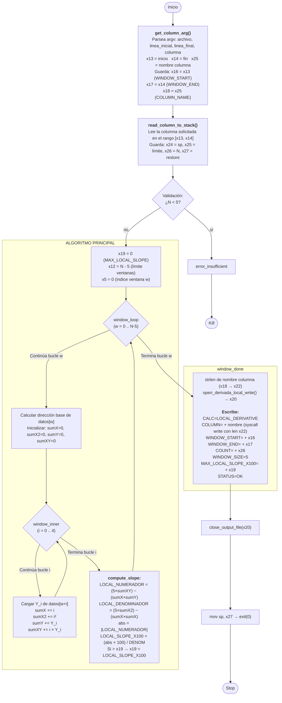

# Módulo 5 — Derivada Local

| Campo                          | Detalle                                           |
| ------------------------------ | ------------------------------------------------- |
| **Responsable**                | Kevin Rodrigo Sandoval Hernández                  |
| **Subsistema del invernadero** | Temperatura, humedad ambiental, gas y ventilación |
| **Archivo ARM64**              | `arm64/modulo_5_derivada_local.s`                 |
| **Biblioteca común**           | `arm64/utils.s`                                   |
| **Salida**                     | `resultados_arm64/resultado_derivada_local.txt`        |
| **Colección de resultados**    | `arm64_results`                                   |

---

## Explicación del algoritmo, registros, memoria y flujo

### 1. modulo_5_derivada_local.s — Derivada Suavizada por Regresión Local (Fase 2)

**Archivo:** `arm64/modulo_5_derivada_local.s`  
**Lenguaje:** Ensamblador ARM64 (AArch64)  
**Rutina:** 5 — Derivada suavizada por regresión local (Sección 4.19.5 del enunciado)  
**Propósito:** Calcular la velocidad de cambio local de una columna sensora usando mini-ventanas internas de 5 puntos con regresión lineal local. Reporta el mayor cambio local detectado (`MAX_LOCAL_SLOPE_X100`) entre todas las ventanas deslizantes.

#### 1.1 Ejecución

```bash
./modulo_5_derivada_local archivo.csv linea_inicial linea_final COLUMNA
# Ejemplo:
./modulo_5_derivada_local ../data/lecturas.csv 1 30 GAS
```

Requiere un mínimo de 5 datos en el rango seleccionado.

#### 1.2 Sección .data — Etiquetas y mensajes

El módulo define todas las etiquetas en `.data`.

**Etiquetas de salida exitosa:**

| Etiqueta | Contenido | Uso |
|----------|-----------|-----|
| `msg_calc` | `"CALC=LOCAL_DERIVATIVE\n"` | Tipo de cálculo ejecutado |
| `msg_column` | `"COLUMN="` | Columna analizada |
| `msg_window_start` | `"WINDOW_START="` | Línea inicial del rango |
| `msg_window_end` | `"WINDOW_END="` | Línea final del rango |
| `msg_count` | `"COUNT="` | Cantidad de datos procesados |
| `msg_window_size` | `"WINDOW_SIZE=5\n"` | Tamaño fijo de mini-ventana |
| `msg_max_slope` | `"MAX_LOCAL_SLOPE_X100="` | Máximo cambio local detectado |
| `msg_status_ok` | `"STATUS=OK\n"` | Estado de ejecución exitosa |

**Etiquetas de error:**

| Etiqueta | Contenido |
|----------|-----------|
| `msg_err_status` | `"STATUS=ERROR\n"` |
| `msg_err_insuf` | `"ERROR=INSUFFICIENT_DATA\n"` |
| `msg_err_detail` | `"DETAIL=LOCAL_DERIVATIVE_REQUIRES_AT_LEAST_5_VALUES\n"` |

#### 1.3 Biblioteca común

El módulo incluye `utils.s` mediante `.include "utils.s"`, accediendo a: `get_column_arg`, `read_column_to_stack`, `open_derivada_local_write`, `write_text`, `write_uint`, `write_newline`, `close_output_file`.

#### 1.4 Flujo completo del programa



#### 1.5 Registros utilizados

| Registro | Propósito | Tipo |
|:--------:|-----------|------|
| x16 | WINDOW_START (copia de x13) | Parámetro |
| x17 | WINDOW_END (copia de x14) | Parámetro |
| x18 | Puntero al nombre de la columna (copia de x25) | Parámetro |
| x19 | `MAX_LOCAL_SLOPE_X100` — máximo cambio local detectado | Resultado |
| x20 | File descriptor del archivo de salida | Salida |
| x24 | Inicio de datos en stack (sp actual) | Datos CSV |
| x25 | Límite final de datos (sp original) | Datos CSV |
| x26 | Cantidad de datos leídos (N) | Datos CSV |
| x27 | Posición original del stack para restaurar | Stack |
| x5 | Índice de ventana externa (w = 0 .. N−5) | Iterador |
| x12 | Límite de ventanas (N − 5) | Constante |
| x6 | Desplazamiento temporal (`w × 16`) | Temporal |
| x7 | Dirección base de la ventana actual | Temporal |
| x8 | `sumX` — acumulador de X (i) | Ventana |
| x9 | `sumX²` — acumulador de X² (i²) | Ventana |
| x10 | `sumY` — acumulador de Y (valores) | Ventana |
| x11 | `sumXY` — acumulador de X·Y | Ventana |
| x14 | Índice interno `i` (0 .. 4) | Iterador |
| x15 | `Y_i` — valor cargado de la ventana actual | Temporal |
| x13 | Temporal para desplazamientos y multiplicaciones | Temporal |
| x21 | Puntero para recorrer nombre de columna | strlen |
| x22 | Longitud del nombre de columna | strlen |
| w23 | Byte actual leído en strlen | strlen |

#### 1.6 Algoritmo — Derivada suavizada por regresión local

Para cada ventana de 5 puntos consecutivos (w = 0 hasta N−5):

```
X = 0, 1, 2, 3, 4      (posiciones dentro de la mini-ventana)
Y = valores del sensor en las posiciones w .. w+4

sumX  = 0 + 1 + 2 + 3 + 4  = 10
sumX² = 0²+1²+2²+3²+4²     = 30
sumY  = Y₀ + Y₁ + Y₂ + Y₃ + Y₄
sumXY = 0·Y₀ + 1·Y₁ + 2·Y₂ + 3·Y₃ + 4·Y₄

LOCAL_NUMERADOR   = (5 × sumXY) − (sumX × sumY)
LOCAL_DENOMINADOR = (5 × sumX²) − (sumX × sumX)

LOCAL_SLOPE_X100 = ( |LOCAL_NUMERADOR| × 100 ) / LOCAL_DENOMINADOR
```

El resultado final es:
```
MAX_LOCAL_SLOPE_X100 = max( LOCAL_SLOPE_X100₀, LOCAL_SLOPE_X100₁, ..., LOCAL_SLOPE_X100_{N-5} )
```

**Nota importante:** Los valores `sumX=10` y `sumX²=30` no están hardcodeados como constantes. Se calculan dinámicamente en cada ventana mediante acumulación (`add x8, x8, x14` para sumX, `mul x13, x14, x14; add x9, x9, x13` para sumX²). Esto permite que la fórmula sea general y funcione para cualquier tamaño de ventana futuro.

#### 1.7 Manejo del valor absoluto

El `LOCAL_NUMERADOR` puede ser negativo (tendencia decreciente). Para mantener solo división sin signo (`udiv`), se toma el valor absoluto antes de multiplicar por 100 y dividir:

```asm
    cmp x0, #0
    bge numerador_positive
    sub x0, xzr, x0        // x0 = |LOCAL_NUMERADOR|
numerador_positive:
    mov x2, #100
    mul x0, x0, x2          // x0 = |NUMERADOR| × 100
    udiv x0, x0, x1         // x0 = LOCAL_SLOPE_X100
```

La instrucción `sub x0, xzr, x0` (restar de cero) equivale a negar, y está presente en los archivos auxiliares del curso.

#### 1.8 Memoria

Los datos de la columna se almacenan en el stack (no en `.bss`). Cada valor ocupa 16 bytes (alineación ARM64). El stack crece hacia abajo:
- `x24` (sp actual) = valor más reciente (última línea del rango)
- `x25 − 16` = valor más antiguo (primera línea del rango)

Para leer datos en orden cronológico (del más antiguo al más reciente), el algoritmo calcula:
```
dirección(dato[w]) = (x25 − 16) − w × 16
dirección(dato[w+i]) = dirección(dato[w]) − i × 16
```

La multiplicación por 16 se implementa con desplazamiento lógico: `lsl x6, x5, #4` (×16 = shift left 4 bits).

#### 1.9 Manejo de errores

| Condición | Salida |
|-----------|--------|
| N < 5 datos | `STATUS=ERROR` / `ERROR=INSUFFICIENT_DATA` / `DETAIL=LOCAL_DERIVATIVE_REQUIRES_AT_LEAST_5_VALUES` |
| Archivo no existe | `utils.s` → `open_error` → stderr |
| Rango inválido | `utils.s` → `arg_error` o `range_error` → stderr |
| Columna no encontrada | `utils.s` → `col_error` → stderr |
| Valor no numérico | `utils.s` → `num_error` → stderr |

El único error propio del módulo es la validación de datos insuficientes (<5). El resto se delega a `utils.s`.

#### 1.10 Formato de salida

**Caso exitoso** (ejemplo con `GAS`, rango 1-30):
```
CALC=LOCAL_DERIVATIVE
COLUMN=GAS
WINDOW_START=1
WINDOW_END=30
COUNT=30
WINDOW_SIZE=5
MAX_LOCAL_SLOPE_X100=1450
STATUS=OK
```

**Caso error** (<5 datos):
```
STATUS=ERROR
ERROR=INSUFFICIENT_DATA
DETAIL=LOCAL_DERIVATIVE_REQUIRES_AT_LEAST_5_VALUES
```
