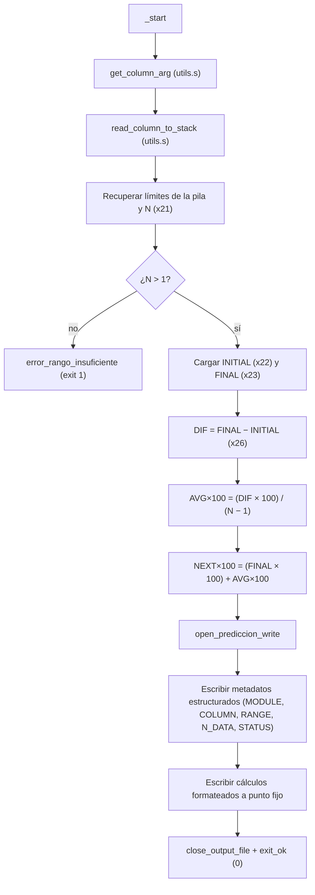

# Módulo 4 — Predicción lineal simple

| Campo | Detalle |
| ----- | ------- |
| **Responsable** | Alex Oswaldo López Alquejay |
| **Subsistema del invernadero** | Centro de control — LCD, botones, LEDs de estado y buzzer |
| **Archivo ARM64** | `arm64/modulo_4_prediccion.s` |
| **Biblioteca común** | `arm64/utils.s` |
| **Salida** | `resultados_arm64/resultado_prediccion.txt` |
| **Colección de resultados** | `arm64_results` |
| **Variable procesada** | Dinámica (vía argumento leído por el sistema, ej: TEMP) |

---

## 1. Algoritmo

Predicción lineal simple por tendencia promedio adaptada para **ventanas de tamaño variable** (Fase 2). El algoritmo determina dinámicamente la cantidad de datos (N) según el rango de líneas seleccionado por el usuario:

```text
DIF             = XFINAL − XINICIAL
PROMEDIO_CAMBIO = DIF / (N − 1)          con N = Cantidad dinámica de datos leídos
PREDICCION      = XFINAL + PROMEDIO_CAMBIO
```

Donde `XINICIAL` es el primer dato del rango extraído y `XFINAL` es el último. El módulo realiza la validación crítica de datos mínimos (N > 1) para evitar divisiones por cero o cálculos inconsistentes en rangos insuficientes.

### Punto fijo (2 decimales)
Para representar los valores con precisión de dos decimales sin usar unidad de punto flotante, se utiliza **punto fijo escalado ×100**:

```text
AVG_CHANGE(×100)  = (DIF × 100) / (N − 1)    (división de enteros con signo `sdiv`)
NEXT_VALUE(×100)  = XFINAL × 100 + AVG_CHANGE(×100)
```

La separación de la parte entera y los centésimos decimales se realiza mediante divisiones de base 100 (`udiv`, `msub`) directamente antes de la impresión, insertando de forma condicional un cero a la izquierda si el residuo de la fracción es menor a 10.

---

## 2. Flujo



---

## 3. Registros usados (en `_start`)

| Registro | Uso |
| -------- | --- |
| `x13` | Línea inicial del rango seleccionado (usado en la salida de `RANGE`) |
| `x14` | Línea final del rango seleccionado (usado en la salida de `RANGE`) |
| `x17` | Puntero al nombre de la columna analizada |
| `x18` | Dirección original de la pila (`SP`) para restaurar la memoria al finalizar |
| `x20` | Descriptor del archivo de salida (`fd`) |
| `x21` | Cantidad dinámica de datos reales leídos y procesados (N) |
| `x22` | `INITIAL_VALUE` (valor del primer dato del rango procesado) |
| `x23` | `FINAL_VALUE` (valor del último dato del rango procesado) |
| `x24` | Puntero a la cima de la pila (ubicación del último dato) |
| `x25` | Puntero al fondo de la pila (ubicación del primer dato) |
| `x26` | `TOTAL_DIFF` (Diferencia total calculada con signo) |
| `x27` | `AVG_CHANGE` escalado ×100 (Promedio de cambio con signo) |
| `x28` | `NEXT_VALUE` escalado ×100 (Predicción del siguiente valor con signo) |

Temporales de operación:
- `x9`, `x10`, `x11`: Operaciones aritméticas intermedio (`mul`, `sub`, `sdiv`).
- `x15`, `x16`, `x17`: Control de signo y desempaquetado de parte entera/fraccionaria para impresión.

---

## 4. Memoria (`.data`)

El módulo optimiza el uso de memoria en la Fase 2 al **eliminar los buffers estáticos en `.bss`**. Las lecturas del archivo se alojan dinámicamente en la pila del sistema. En la sección `.data` se mantienen únicamente las etiquetas literales de control de salida:

| Símbolo / Mensaje | Cadena ASCII | Uso |
| ----------------- | ------------ | --- |
| `msg_module` | `"MODULE=PREDICTION\n"` | Identificador del cálculo |
| `msg_column` | `"COLUMN="` | Prefijo de la columna analizada |
| `msg_rango` | `"RANGE="` | Prefijo de las líneas límites del rango |
| `msg_n_data` | `"N_DATA="` | Prefijo de muestras procesadas de forma dinámica |
| `msg_status_ok` | `"STATUS=OK\n"` | Estado de ejecución exitosa |
| `msg_initial` | `"INITIAL_VALUE="` | Prefijo del valor inicial |
| `msg_final` | `"FINAL_VALUE="` | Prefijo del valor final |
| `msg_diff` | `"TOTAL_DIFF="` | Prefijo del diferencial total |
| `msg_avg` | `"AVG_CHANGE="` | Prefijo de la tasa de cambio promedio |
| `msg_next` | `"NEXT_VALUE="` | Prefijo de la estimación lineal siguiente |
| `str_guion`, `str_minus`, `str_dot`, `str_zero` | `"-"`, `"-"`, `"."`, `"0"` | Caracteres de formateo sintáctico y numérico |

---

## 5. Lógica de formateo de punto fijo integrada

La impresión con formato decimal de 2 cifras `"[-]entero.frac"` se realiza directamente en el flujo de ejecución principal a través de los bloques `avg_positive` y `next_positive`:
- **Evaluación de signo:** Si el valor en punto fijo (`x15`) es negativo, imprime de inmediato el carácter `-` (`str_minus`) y aplica la instrucción `neg` para procesar su valor absoluto.
- **División de componentes:** Divide el número absoluto entre 100 (`udiv`) para aislar la parte entera (`x16`) y calcula el residuo exacto con la instrucción de multiplicación y sustracción `msub` para extraer la parte fraccionaria (`x17`).
- **Formateo de la fracción:** Si los centésimos residuales son menores a 10, antepone un carácter `0` (`str_zero`) antes de mandar a imprimir el residuo, garantizando salidas uniformes como `.06` en lugar de `.6`.

---

## 6. Entrada y salida

**Entrada:** Procesamiento del archivo CSV parametrizado a través de subrutinas de `utils.s`. Los datos no se restringen a un tamaño estático; se leen dinámicamente las filas intermedias delimitadas por las instrucciones del usuario.

**Salida:** Archivo estructurado con formato estricto de la Fase 2 en `../resultados_arm64/resultado_prediccion.txt`.

```text
MODULE=PREDICTION
COLUMN=<nombre_columna>
RANGE=<linea_inicial>-<linea_final>
N_DATA=<cantidad_datos_leidos>
STATUS=OK
INITIAL_VALUE=<entero>
FINAL_VALUE=<entero>
TOTAL_DIFF=<entero_con_signo>
AVG_CHANGE=<entero_o_decimal_punto_fijo>
NEXT_VALUE=<entero_o_decimal_punto_fijo>
```

### Salida verificada (Ejemplo de procesamiento dinámico en rango corto, TEMP)
```text
MODULE=PREDICTION
COLUMN=TEMP
RANGE=10-15
N_DATA=6
STATUS=OK
INITIAL_VALUE=28
FINAL_VALUE=30
TOTAL_DIFF=2
AVG_CHANGE=0.40
NEXT_VALUE=30.40
```
*(Análisis: Rango de 6 lecturas de la línea 10 a 15. DIF = 30 - 28 = 2; N - 1 = 5; AVG_CHANGE = 2 / 5 = 0.40; NEXT_VALUE = 30 + 0.40 = 30.40)*

---

## 7. Relación con `utils.s`

El módulo delega la gestión de interfaces e infraestructura a la biblioteca compartida, concentrándose exclusivamente en el cálculo y formateo de la predicción lineal:
- **`get_column_arg`**: Recupera y prepara el nombre de la columna proveniente de los argumentos.
- **`read_column_to_stack`**: Abre, salta encabezados y lee las líneas correspondientes al rango del usuario, empujando los enteros convertidos directamente a la pila y retornando los punteros de control geométrico (`cima`, `fondo`, `N`).
- **`open_prediccion_write`** y **`close_output_file`**: Controladores del ciclo de vida del descriptor de archivo de salida.
- **`write_text`**, **`write_uint`**, **`write_int`**, y **`write_newline`**: Subrutinas de bajo nivel para la serialización limpia de caracteres y números a formato ASCII.

---

## 8. Compilación, ejecución y depuración

```bash
cd arm64
make run-prediccion     # Compila, enlaza con utils.o y ejecuta el análisis dinámico
```

Depuración guiada con GDB para validación de ventanas variables:
```bash
cd arm64
make prediccion
gdb-multiarch build/modulo_4_prediccion
```
Comandos críticos de auditoría en GDB:
- `break _start` (Verificación de inicio de carga de argumentos).
- `break error_rango_insuficiente` (Comprobación del salto de seguridad cuando N <= 1).
- `print /d $x21` (Inspeccionar la cantidad de muestras reales inyectadas por la biblioteca).
- `print /d $x26` (Validar el cálculo del diferencial total con signo).
- `continue` (Finalizar el vaciado del reporte estructurado).

---

## 9. Restricciones del enunciado cumplidas
- **Procesamiento de tamaño variable:** El código se adaptó por completo para trabajar sobre ventanas dinámicas en lugar de un tamaño fijo de 30 datos.
- **Determinación e integración de límites:** Lee estrictamente entre los límites definidos, calculando N y ajustando los acumuladores y ciclos divisores a través de `sub x11, x21, #1`.
- **Validación del rango mínimo:** Implementa control de errores explícito ante la insuficiencia de muestras para realizar el análisis lineal.
- **Salida estructurada estricta de la Fase 2:** El archivo generado expone de manera explícita el cálculo (`MODULE`), la columna analizada (`COLUMN`), el rango procesado (`RANGE`), la cantidad de muestras (`N_DATA`) y el estado final (`STATUS`), cumpliendo rigurosamente el estándar del analizador.