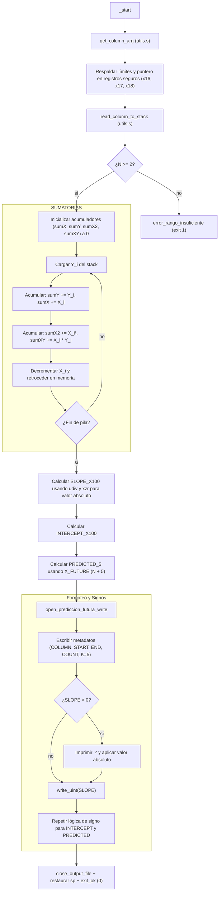

# Módulo 3 — Predicción futura por regresión

| Campo | Detalle |
| ----- | ------- |
| **Responsable** | Alex Oswaldo López Alquejay |
| **Subsistema del invernadero** | Centro de control |
| **Archivo ARM64** | `arm64/modulo_3_prediccion.s` |
| **Biblioteca común** | `arm64/utils.s` |
| **Salida** | `resultados_arm64/resultado_prediccion_futura.txt` |
| **Colección de resultados** | `arm64_results` |
| **Variable procesada** | Dinámica (vía argumento leído por el sistema) |

---

## 1. Algoritmo

Predicción futura ($K=5$) utilizando el método de Regresión Lineal por Mínimos Cuadrados. El algoritmo procesa un rango variable de datos ($N$) y asigna índices $X_i$ descendentes (desde $N$ hasta $1$) para alinear la recta con la línea de tiempo.

El cálculo matemático se divide en tres fases principales utilizando **punto fijo escalado ×100**:

**1. Pendiente escalada ($M\_X100$):**
$$M\_X100 = \frac{(N \sum XY - \sum X \sum Y) \times 100}{N \sum X^2 - (\sum X)^2}$$

**2. Intercepto escalado ($B\_X100$):**
$$B\_X100 = \frac{(\sum Y \times 100) - (M\_X100 \times \sum X)}{N}$$

**3. Predicción futura ($Y\_PRED$) para $K=5$:**
$$X\_FUTURE = N + 5$$
$$Y\_PRED = \frac{(M\_X100 \times X\_FUTURE) + B\_X100}{100}$$

*Nota:* Para garantizar la estabilidad del modelo de regresión, el módulo requiere estrictamente $N \ge 2$.

---

## 2. Flujo



---

## 3. Registros usados (en `_start`)

Se implementó un esquema estricto de protección de registros *callee-saved* para evitar colisiones con la biblioteca `utils.s`.

| Registro | Uso |
| -------- | --- |
| `x16` | `WINDOW_START` (Línea inicial del rango, protegido de sobrescrituras) |
| `x17` | `WINDOW_END` (Línea final del rango, protegido de sobrescrituras) |
| `x18` | Puntero al nombre de la columna analizada (`COLUMN_NAME`) |
| `x20` | Descriptor del archivo de salida (`fd`) |
| `x21` | Cantidad de datos leídos ($N$) |
| `x22` | Temporal para `sumX` / Almacena la magnitud final de `PREDICTED_5` |
| `x23` | Temporal para `sumY` |
| `x24` | Puntero al tope de la pila (último dato cronológico) |
| `x25` | Puntero al fondo de la pila (primer dato cronológico) |
| `x26` | Temporal para `sumX2` |
| `x27` | Dirección original de la pila (`SP`) para restaurar la memoria al finalizar |
| `x28` | Temporal para `sumXY` / Almacena la magnitud final de `SLOPE_X100` |
| `x29` | Almacena la magnitud final de `INTERCEPT_X100` |

---

## 4. Memoria (`.data`)

El módulo maneja el almacenamiento de los datos del CSV íntegramente en la pila (`stack`), eliminando el uso de la sección `.bss`. La sección `.data` contiene los literales de impresión:

| Símbolo | Cadena ASCII | Uso |
| ------- | ------------ | --- |
| `msg_calc` | `"CALC=PREDICTION\n"` | Identificador del módulo |
| `msg_column` | `"COLUMN="` | Prefijo de la columna analizada |
| `msg_window_start` | `"WINDOW_START="` | Prefijo del inicio de ventana |
| `msg_window_end` | `"WINDOW_END="` | Prefijo del fin de ventana |
| `msg_count` | `"COUNT="` | Prefijo de la cantidad de muestras |
| `msg_k` | `"K=5\n"` | Definición de pasos a predecir |
| `msg_slope` | `"SLOPE_X100="` | Pendiente escalada |
| `msg_intercept`| `"INTERCEPT_X100="` | Intercepto escalado |
| `msg_predicted`| `"PREDICTED_5="` | Valor de la predicción final |
| `msg_status_ok`| `"STATUS=OK\n"` | Cierre de flujo exitoso |
| `str_minus` | `"-"` | Inserción manual de signo negativo |

*(Las etiquetas de error `msg_err_status`, `msg_err_insuf` y `msg_err_detail` se utilizan si $N < 2$).*

---

## 5. Manejo de Signos y Valor Absoluto (`xzr`)

Como las divisiones con signo en arquitecturas ARM64 pueden requerir manejos complejos de hardware, este algoritmo utiliza división sin signo (`udiv`). Para soportar tendencias decrecientes y coordenadas negativas, se aplica valor absoluto en vuelo usando el registro **`xzr`** (Zero Register).

**1. Conversión a positivo:**
```assembly
    cmp x10, #0
    bge num_pos_slope
    sub x10, xzr, x10   // x10 = 0 - x10 (Valor absoluto)
    mov x15, #1         // Bandera de negatividad activada
```

**2. Impresión condicional del signo:**
Al momento de vaciar los datos al archivo, si la variable original era negativa, se invoca a `write_text` para imprimir un guion (`-`) y luego se pasa la magnitud absoluta a `write_uint`.

---

## 6. Entrada y salida

**Entrada:** Procesamiento del archivo CSV desde la terminal.
```bash
./modulo_3_prediccion ../data/lecturas.csv 1 30 GAS
```

**Salida Exitosa:** (Almacenada en `.txt`)
```text
CALC=PREDICTION
COLUMN=GAS
WINDOW_START=1
WINDOW_END=30
COUNT=30
K=5
SLOPE_X100=36
INTERCEPT_X100=13835
PREDICTED_5=150
STATUS=OK
```

**Salida de Error:** (Activada si se pasa un rango como `10 10`)
```text
STATUS=ERROR
ERROR=INSUFFICIENT_DATA
DETAIL=REGRESSION_REQUIRES_AT_LEAST_2_VALUES
```

## 7. Compilación, ejecución y depuración

**Ejecución automatizada (Recomendado):**
```bash
cd arm64
make run-prediccion-futura     # Compila, enlaza en ARM64 y ejecuta el análisis de regresión
```

**Compilación manual (Enlazado estricto):**
```bash
cd arm64
aarch64-linux-gnu-as -g -o build/modulo_3_prediccion.o modulo_3_prediccion.s
aarch64-linux-gnu-ld -o build/modulo_3_prediccion build/modulo_3_prediccion.o build/utils.o
qemu-aarch64 ./build/modulo_3_prediccion ../data/lecturas.csv 1 30 GAS
```

**Depuración guiada con GDB:**
Debido a que el módulo valida la presencia estricta de 5 argumentos (`argc`), la depuración debe realizarse inyectando los parámetros directamente o conectando GDB a un puerto de QEMU.

**Terminal 1 (Levantar entorno de emulación):**
```bash
cd arm64
qemu-aarch64 -g 1234 ./build/modulo_3_prediccion ../data/lecturas.csv 1 30 GAS
```

**Terminal 2 (Auditoría de registros):**
```bash
cd arm64
gdb-multiarch build/modulo_3_prediccion
```
Comandos críticos de auditoría en GDB:
- `target remote localhost:1234` (Conexión al emulador).
- `break _start` (Verificación de carga de argumentos y registros seguros).
- `break calc_sums_done` (Inspección de las sumatorias $X$, $Y$, $X^2$, $XY$).
- `print /d $x28` (Validar la pendiente calculada antes del formateo de salida).
- `continue` (Finalizar ejecución y vaciar el buffer al archivo `.txt`).