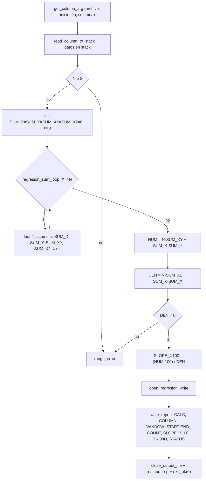

# Módulo 2 (Fase 2) — Regresión lineal simple (mínimos cuadrados)

| Campo                          | Detalle                                         |
| ------------------------------ | ----------------------------------------------- |
| **Responsable**                | Alex Ricardo Castañeda Rodríguez                |
| **Subsistema del invernadero** | MQTT, MongoDB, dashboard e integración general  |
| **Archivo ARM64**              | `arm64/modulo_2_regresion.s`                    |
| **Biblioteca común**           | `arm64/utils.s` (mantenida por este integrante) |
| **Salida**                     | `resultados_arm64/resultado_regresion.txt`      |
| **Colección de resultados**    | `arm64_results`                                 |

---

## 1. Algoritmo

La rutina calcula la **regresión lineal simple** (método de mínimos cuadrados) sobre una columna del CSV dentro de un rango de líneas `[inicio, fin]`. La columna se interpreta como serie temporal:

```text
X = índice temporal:  0, 1, 2, ..., N-1   (orden de las lecturas)
Y = valor leído de la columna en cada línea
```

Durante un solo recorrido se acumulan las cuatro sumas necesarias:

```text
SUM_X  = Σ X_i
SUM_Y  = Σ Y_i
SUM_XY = Σ (X_i · Y_i)
SUM_X2 = Σ (X_i²)
```

Con ellas se calcula la **pendiente** de la recta de ajuste. Como ARM64 trabaja con enteros y divisiones truncadas (sin punto flotante), la pendiente se multiplica por 100 antes de dividir para conservar dos decimales como entero (`SLOPE_X100`):

```text
NUM = N · SUM_XY − SUM_X · SUM_Y
DEN = N · SUM_X2 − SUM_X · SUM_X
SLOPE_X100 = (NUM · 100) / DEN      (división entera con signo, sdiv)
```

Clasificación de la tendencia según el signo de la pendiente:

```text
SLOPE_X100 > 0  =>  ASCENDING
SLOPE_X100 < 0  =>  DESCENDING
SLOPE_X100 = 0  =>  STABLE
```

Se requieren al menos **2 valores** (`N ≥ 2`) y un denominador distinto de cero (`DEN ≠ 0`); en caso contrario se emite el error de rango estructurado.

---

## 2. Flujo de la rutina



---

## 3. Registros utilizados

Registros persistentes en `_start` (callee-saved, preservados según AAPCS64):

| Registro | Uso                                                       |
| -------- | --------------------------------------------------------- |
| `x21`    | puntero al nombre de la columna (`COLUMN`)                 |
| `x22`    | línea inicial del rango (`WINDOW_START`)                   |
| `x23`    | línea final del rango (`WINDOW_END`)                       |
| `x24`    | inicio de los datos en el stack                           |
| `x25`    | límite final de los datos en el stack                     |
| `x26`    | `N` = cantidad de datos leídos (`COUNT`)                   |
| `x27`    | posición para restaurar el stack                          |
| `x15`    | `SUM_X`                                                   |
| `x16`    | `SUM_Y`                                                   |
| `x17`    | `SUM_XY`                                                  |
| `x18`    | `SUM_X2`                                                  |
| `x19`    | índice temporal `X` en el lazo; luego `SLOPE_X100`        |
| `x28`    | puntero al dato temporal actual dentro del stack          |
| `x20`    | descriptor del archivo de resultado                       |

Temporales: en el lazo `x10` (Y actual) y `x11` (producto `X·Y` / `X·X`); en el cálculo final `x9` (`N·SUM_XY`, `N·SUM_X2`), `x10` (`SUM_X·SUM_Y`, `SUM_X·SUM_X`), `x11` (`NUM`), `x12` (`DEN`) y `x13` (constante `100`).

---

## 4. Memoria

Este módulo **no usa `.bss` propia**: los datos se cargan en el **stack** mediante `read_column_to_stack` (cada valor ocupa 16 bytes para mantener la alineación). El primer dato temporal se ubica en `x25 − 16` y el recorrido avanza restando `#16` hasta llegar al inicio; al terminar se restaura `sp` con `x27`.

Sección `.data` (cadenas literales del reporte):

| Símbolo                                          | Contenido                                          |
| ------------------------------------------------ | -------------------------------------------------- |
| `msg_calc`                                       | `CALC=LINEAR_REGRESSION\n`                          |
| `msg_column`, `msg_window_start`, `msg_window_end` | etiquetas `COLUMN=`, `WINDOW_START=`, `WINDOW_END=` |
| `msg_count`, `msg_slope`, `msg_trend`            | etiquetas `COUNT=`, `SLOPE_X100=`, `TREND=`         |
| `trend_ascending` / `trend_descending` / `trend_stable` | valores `ASCENDING` / `DESCENDING` / `STABLE`      |
| `msg_status`                                     | `STATUS=OK\n`                                       |

El buffer de lectura del CSV vive en `utils/utils_data.s`, compartido por todos los módulos.

---

## 5. Ciclos, saltos y subrutinas

- **Ciclo:** `regresion_sum_loop` recorre los `N` valores en **orden temporal** (de la línea inicial a la final) acumulando las cuatro sumas en un solo paso.
- **Saltos condicionales:**
  - validación mínima de datos: `cmp x26, #2` / `blt range_error`;
  - fin del lazo: `cmp x19, x26` / `beq regresion_sum_done`;
  - validación de división entre cero: `cmp x12, #0` / `beq range_error`;
  - clasificación de la tendencia: `cmp x19, #0` con `bgt` (ASCENDING), `blt` (DESCENDING) o caída a STABLE.
- **Etiquetas propias:** `regresion_sum_loop`, `regresion_sum_done`, `regresion_write_ascending`, `regresion_write_descending`, `regresion_write_stable`, `regresion_write_status`, `exit_ok`.
- **Subrutinas:** la lógica de regresión es propia del módulo; toda la E/S y el parseo se delegan a `utils.s`.

---

## 6. Entrada y salida

**Entrada:** argumentos de consola `archivo inicio fin columna` —
`./build/modulo_2_regresion ../data/lecturas.csv 1 30 TEMP`.
`get_column_arg` valida y extrae los argumentos; `read_column_to_stack` localiza la columna por nombre en el encabezado y carga al stack únicamente los valores del rango `[inicio, fin]`, con conversión ASCII→entero (`atoi_csv`).

**Salida:** `../resultados_arm64/resultado_regresion.txt`, escrita con `write_text` (texto), `write_cstring` (nombre de columna), `write_uint` (sin signo) y `write_int` (con signo, para la pendiente):

```text
CALC=LINEAR_REGRESSION
COLUMN=TEMP
WINDOW_START=1
WINDOW_END=20
COUNT=20
SLOPE_X100=-3
TREND=DESCENDING
STATUS=OK
```

`SLOPE_X100=-3` representa una pendiente de `-0.03` por lectura (descendente).

---

## 7. Relación con `utils.s`

El módulo se apoya en la biblioteca común para toda la E/S, el parseo y el manejo del stack:

- **Argumentos:** `get_column_arg`.
- **Lectura de la columna al stack:** `read_column_to_stack`, que internamente usa `open_csv_read`, `read_file`, `close_file`, `find_column_by_name`, `skip_to_next_line`, `atoi_csv` y `save_number_to_stack`.
- **Salida:** `open_regresion_write`, `write_text`, `write_cstring`, `write_uint`, `write_int`, `write_newline`, `close_output_file`.
- **Errores:** `range_error` (rango inválido, sin datos o `DEN = 0`) y `arg_error` (argumentos incompletos).

La única lógica propia del módulo es el cálculo de las sumas y de la pendiente por mínimos cuadrados.

---

## 8. Compilación, ejecución y depuración

```bash
cd arm64
make run-regresion LEC=../data/lecturas.csv INI=1 FIN=30 COL=TEMP
# compila y ejecuta; genera ../resultados_arm64/resultado_regresion.txt
```

Depuración con **gdb-multiarch + QEMU** (dos terminales en paralelo):

```bash
# Terminal 1 — emulador esperando conexión
cd arm64
make regresion
qemu-aarch64 -g 1234 ./build/modulo_2_regresion ../data/lecturas.csv 1 30 GAS

# Terminal 2 — depurador
gdb-multiarch ./build/modulo_2_regresion
```

Dentro de GDB: `target remote localhost:1234`, `break _start`, `break regresion_sum_loop`, `run`/`continue`, `stepi`, `info registers x15 x16 x17 x18 x19`, `x/16x $sp`. Evidencia en `docs/evidencias/gdb/modulo_2_regresion.png`.
