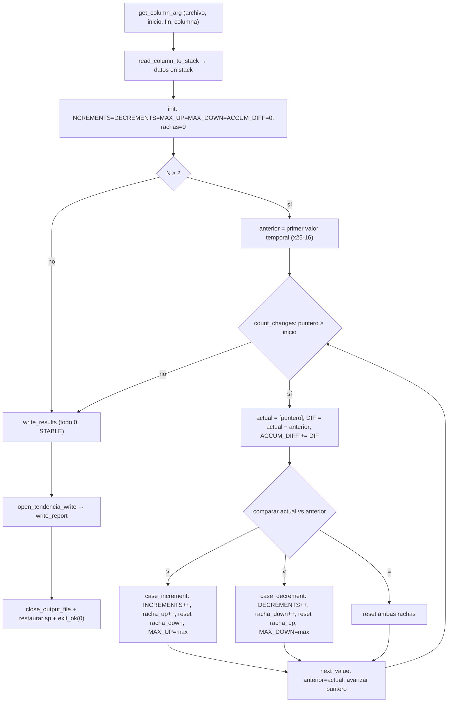

# Módulo 5 — Tendencia acumulada avanzada

| Campo                          | Detalle                                         |
| ------------------------------ | ----------------------------------------------- |
| **Responsable**                | Alex Ricardo Castañeda Rodríguez                |
| **Subsistema del invernadero** | MQTT, MongoDB, dashboard e integración general  |
| **Archivo ARM64**              | `arm64/modulo_5_tendencia.s`                    |
| **Biblioteca común**           | `arm64/utils.s` (mantenida por este integrante) |
| **Salida**                     | `resultados_arm64/resultado_tendencia.txt`      |
| **Colección de resultados**    | `arm64_results`                                 |

---

## 1. Algoritmo

La rutina analiza la tendencia de **una columna** del CSV dentro de un rango de líneas `[inicio, fin]`, interpretada como serie temporal. Recorre los valores en orden temporal comparando cada lectura con la anterior:

```text
DIF_i = X_i − X_(i-1)
```

Por cada diferencia acumula y clasifica:

- si `DIF_i > 0` → **incremento**: suma 1 a `INCREMENTS`, extiende la racha de subidas y reinicia la de bajadas;
- si `DIF_i < 0` → **decremento**: suma 1 a `DECREMENTS`, extiende la racha de bajadas y reinicia la de subidas;
- si `DIF_i = 0` → reinicia **ambas** rachas (sin contar incremento ni decremento).

Cada diferencia se suma a `ACCUM_DIFF`, que telescopa al cambio neto entre la primera y la última lectura. Las rachas máximas (`MAX_UP_STREAK`, `MAX_DOWN_STREAK`) guardan la mayor secuencia consecutiva de subidas o bajadas observada.

Clasificación final según el signo de la diferencia acumulada:

```text
ACCUM_DIFF > 0  =>  UP
ACCUM_DIFF < 0  =>  DOWN
ACCUM_DIFF = 0  =>  STABLE
```

Si el rango tiene menos de 2 valores (`N < 2`) no hay comparaciones: todos los contadores quedan en 0 y la tendencia es `STABLE`.

---

## 2. Flujo de la rutina



---

## 3. Registros utilizados

Registros persistentes en `_start` (callee-saved, preservados según AAPCS64):

| Registro | Uso                                                       |
| -------- | --------------------------------------------------------- |
| `x24`    | inicio de los datos en el stack                           |
| `x25`    | límite final de los datos en el stack                     |
| `x26`    | `N` = cantidad de datos leídos (`TOTAL_VALUES`)           |
| `x27`    | posición para restaurar el stack                          |
| `x15`    | `INCREMENTS` (conteo de subidas)                          |
| `x16`    | `DECREMENTS` (conteo de bajadas)                          |
| `x17`    | `MAX_UP_STREAK` (racha máxima de subidas)                 |
| `x18`    | `MAX_DOWN_STREAK` (racha máxima de bajadas)               |
| `x19`    | `ACCUM_DIFF` (diferencia acumulada, con signo)            |
| `x22`    | racha actual de subidas                                   |
| `x28`    | racha actual de bajadas                                   |
| `x20`    | descriptor del archivo de resultado                       |

Temporales del lazo: `x12` (puntero al valor actual en el stack), `x13` (valor anterior), `x14` (valor actual) y `x23` (diferencia `actual − anterior`).

---

## 4. Memoria

Este módulo **no usa `.bss` propia**: los datos se cargan en el **stack** mediante `read_column_to_stack` (cada valor ocupa 16 bytes para mantener la alineación). El primer dato temporal se ubica en `x25 − 16` y el recorrido avanza restando `#16` hasta llegar al inicio (`x24`); al terminar se restaura `sp` con `x27`.

Sección `.data` (cadenas literales del reporte):

| Símbolo                                                          | Contenido                                                       |
| --------------------------------------------------------------- | -------------------------------------------------------------- |
| `msg_module`                                                    | `MODULE=ADVANCED_TREND\n`                                       |
| `msg_total`, `msg_increments`, `msg_decrements`                 | etiquetas `TOTAL_VALUES=`, `INCREMENTS=`, `DECREMENTS=`         |
| `msg_max_up`, `msg_max_down`, `msg_accum_diff`, `msg_trend`     | etiquetas `MAX_UP_STREAK=`, `MAX_DOWN_STREAK=`, `ACCUM_DIFF=`, `TREND=` |
| `trend_up` / `trend_down` / `trend_stable`                      | valores `UP` / `DOWN` / `STABLE`                               |

El buffer de lectura del CSV vive en `utils/utils_data.s`, compartido por todos los módulos.

---

## 5. Ciclos, saltos y subrutinas

- **Ciclo:** `count_changes` recorre los `N` valores en **orden temporal** comparando cada lectura con la anterior y actualizando contadores, rachas y la diferencia acumulada.
- **Saltos condicionales:**
  - datos insuficientes: `cmp x26, #2` / `blt write_results`;
  - fin del recorrido: `cmp x12, x24` / `blt write_results`;
  - clasificación de cada diferencia: `cmp x14, x13` con `bgt case_increment` / `blt case_decrement` (igualdad reinicia rachas);
  - actualización de racha máxima: `cmp x22, x17` / `ble next_value` (y análogo con `x28`/`x18`);
  - clasificación final: `cmp x19, #0` con `bgt write_trend_up` / `blt write_trend_down` / caída a `write_trend_stable`.
- **Etiquetas propias:** `count_changes`, `case_increment`, `case_decrement`, `next_value`, `write_results`, `write_trend_up`, `write_trend_down`, `write_trend_stable`, `close_result_file`, `exit_ok`.
- **Subrutinas:** la lógica de tendencia es propia del módulo; toda la E/S y el parseo se delegan a `utils.s`.

---

## 6. Entrada y salida

**Entrada:** argumentos de consola `archivo inicio fin columna` —
`./build/modulo_5_tendencia ../data/lecturas.csv 1 30 TEMP`.
`get_column_arg` valida y extrae los argumentos; `read_column_to_stack` localiza la columna por nombre en el encabezado y carga al stack únicamente los valores del rango `[inicio, fin]`, con conversión ASCII→entero (`atoi_csv`).

**Salida:** `../resultados_arm64/resultado_tendencia.txt`, escrita con `write_text` (texto), `write_uint` (contadores sin signo) y `write_int` (con signo, para `ACCUM_DIFF`):

```text
MODULE=ADVANCED_TREND
TOTAL_VALUES=30
INCREMENTS=17
DECREMENTS=12
MAX_UP_STREAK=3
MAX_DOWN_STREAK=2
ACCUM_DIFF=2
TREND=UP
```

---

## 7. Relación con `utils.s`

El módulo se apoya en la biblioteca común para toda la E/S, el parseo y el manejo del stack:

- **Argumentos:** `get_column_arg`.
- **Lectura de la columna al stack:** `read_column_to_stack`, que internamente usa `open_csv_read`, `read_file`, `close_file`, `find_column_by_name`, `skip_to_next_line`, `atoi_csv` y `save_number_to_stack`.
- **Salida:** `open_tendencia_write`, `write_text`, `write_uint`, `write_int`, `write_newline`, `close_output_file`.
- **Errores:** `range_error` (rango inválido o sin datos) y `arg_error` (argumentos incompletos), invocados desde las utilidades.

La única lógica propia del módulo es el conteo de cambios, las rachas y la diferencia acumulada sobre los valores en el stack.

---

## 8. Compilación, ejecución y depuración

```bash
cd arm64
make run-tendencia LEC=../data/lecturas.csv INI=1 FIN=30 COL=TEMP
# compila y ejecuta; genera ../resultados_arm64/resultado_tendencia.txt
```

Depuración con **gdb-multiarch + QEMU** (dos terminales en paralelo):

```bash
# Terminal 1 — emulador esperando conexión
cd arm64
make tendencia
qemu-aarch64 -g 1234 ./build/modulo_5_tendencia ../data/lecturas.csv 1 30 TEMP

# Terminal 2 — depurador
gdb-multiarch ./build/modulo_5_tendencia
```

Dentro de GDB: `target remote localhost:1234`, `break _start`, `break count_changes`, `run`/`continue`, `stepi`, `info registers x15 x16 x17 x18 x19`, `x/16x $sp`. Evidencia en `docs/evidencias/gdb/modulo_5_tendencia.png`.
