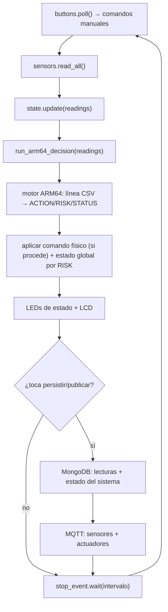

# Lógica de control en Python (`iot_program`)

El programa que corre en la Raspberry Pi implementa el núcleo del invernadero: lectura de sensores por GPIO/I2C, accionamiento de actuadores, manejo del estado global, publicación/recepción por MQTT y persistencia en MongoDB. **La decisión de control automático no la toma Python: cada lectura se envía al motor ARM64 (`arm64/build/motor`), que devuelve la acción y el nivel de riesgo.** Python ejecuta esa decisión sobre el hardware.

---

## 1. Estructura

```text
iot_program/
├── main.py                  # bucle principal e integración
├── config.py                # configuración (.env → Settings)
├── arm64_bridge.py          # puente con el motor ARM64 (decisión en vivo)
├── global_state.py          # estado global (último valor conocido)
├── rules.py                 # estado/evento derivado de cada comando
├── models.py                # modelos de documentos para MongoDB
├── topics.py                # topics MQTT
├── mqtt_client.py           # cliente MQTT (texto plano)
├── mongo_repository.py      # persistencia en MongoDB
├── sensors/                 # un archivo por sensor + managers (real/simulado)
├── actuators/               # un archivo por actuador + managers (real/simulado)
└── local_panel/             # LCD y botones físicos
```

> No existe `automation.py`: la lógica de umbrales con histéresis se trasladó al motor ARM64 (`arm64/motor.s`). `rules.py` ya **no** decide el control automático; solo traduce un comando ya ejecutado a su estado global y descripción de evento.

---

## 2. Bucle principal

Cada ciclo (`SENSOR_INTERVAL_SECONDS`, por defecto `0.2 s`): lee botones, lee sensores, **manda la lectura al motor ARM64 y aplica su decisión**, actualiza el estado global, los LEDs de estado y la LCD; y —según `MQTT_PUBLISH_INTERVAL_SECONDS` (por defecto `1.0 s`)— persiste en MongoDB y publica por MQTT.



Ante una excepción en el ciclo, se registra `last_error`, se inserta un evento de `ADVERTENCIA` en MongoDB y el bucle continúa.

---

## 3. Decisión en vivo con ARM64 (`arm64_bridge.py`)

`Arm64Bridge` mantiene el binario del motor (`arm64/build/motor`) como un proceso persistente (lo compila con `make motor` si falta) y se comunica por **stdin/stdout** en texto plano:

1. **Entrada:** arma la línea `TEMP,HUM_AIRE,SOIL1,SOIL2,LUZ,GAS,MODO` con los enteros de la lectura (`MODO` = `0` automático / `1` manual) y la escribe por stdin.
2. **Salida:** lee el bloque de respuesta `clave=valor` del motor (`ACTION`, `TARGET`, `RISK`, `REASON`, `VALUE`, `INDICATOR`, `STATUS`).
3. **Mapa acción → comando** (`ACTION_TO_COMMAND`):

   | ACTION (ARM64) | Comando físico       |
   | -------------- | -------------------- |
   | `RIEGO_1_ON`   | `ACTIVAR_RIEGO_1`    |
   | `RIEGO_2_ON`   | `ACTIVAR_RIEGO_2`    |
   | `FAN_ON`       | `ACTIVAR_VENTILADOR` |
   | `LIGHT_ON`     | `ENCENDER_LUCES`     |
   | `ALARM_ON`     | `ACTIVAR_ALARMA`     |
   | `LED_GREEN`    | _(sin acción)_       |
   | `NO_ACTION`    | _(sin acción)_       |

4. **Estado global por `RISK`** (en `main.run_arm64_decision`): `CRITICAL → EMERGENCIA`; en modo manual → `MODO_MANUAL`; `MEDIUM`/`HIGH → ADVERTENCIA`; en otro caso → `NORMAL`.
5. **Modo manual:** en `MODO=1` solo se ejecuta físicamente `ALARM_ON`; las demás acciones del motor se ignoran (las controla el usuario).

Cada decisión se guarda en MongoDB como resultado ARM64 (`insert_arm64_result`, `source="live_engine"`) y, si cambia el estado, genera un evento. Si el motor no responde (timeout/EOF) se registra `ADVERTENCIA` y se conserva el estado anterior.

Los umbrales (`TEMP_ALTA`, `LUZ_BAJA`, `SOIL_BAJO`, `GAS_ALTO`, etc.) viven en `arm64/motor.s`; ver [arm64.md](arm64.md).

---

## 4. Sensores

| Sensor                 | Archivo                          | Conexión          | Salida        |
| ---------------------- | -------------------------------- | ----------------- | ------------- |
| Temperatura y humedad  | `sensors/temperatura_humedad.py` | DHT11 (GPIO4)     | °C / %        |
| Humedad de suelo área 1| `sensors/suelo_area1.py`         | ADS1115 A0 (I2C)  | % (0–100)     |
| Humedad de suelo área 2| `sensors/suelo_area2.py`         | ADS1115 (I2C)     | % (0–100)     |
| Gas                    | `sensors/gas.py`                 | ADS1115 A1 (I2C)  | escala 0–1000 |
| Luz                    | `sensors/luz.py`                 | ADS1115 A3 (I2C)  | escala 0–1000 |

El bus I2C y el conversor ADS1115 (dirección `0x48`) se resuelven en `sensors/i2c_bus.py`. Cada sensor cae a **simulación** si la librería de hardware no está disponible. `SensorManager`/`RaspberrySensors` exponen `read_all()`. Pines y bus en [conexiones_fisicas.md](conexiones_fisicas.md).

---

## 5. Actuadores

| Actuador        | Archivo                    | Pin (BCM)            |
| --------------- | -------------------------- | -------------------- |
| Riego área 1    | `actuators/riego_area1.py` | relé (bomba área 1)  |
| Riego área 2    | `actuators/riego_area2.py` | relé (bomba área 2)  |
| Ventilador      | `actuators/ventilador.py`  | GPIO23               |
| Luces           | `actuators/luces.py`       | GPIO25               |
| Buzzer / alarma | `actuators/alarma.py`      | GPIO24               |
| LEDs de estado  | `actuators/leds_estado.py` | verde 5 / amarillo 6 / rojo 13 |

`ActuatorManager`/`RaspberryActuators` exponen `apply_command(comando)` y devuelven los cambios de estado aplicados. Los relés trabajan en lógica activa-baja por defecto.

---

## 6. Estado del sistema (`global_state.py`)

`GlobalState` es un singleton con el último valor conocido de todas las variables (`StateSnapshot`), de modo que el sistema conserve un estado consistente aunque una lectura puntual falle:

| Campo                                          | Tipo / valores                                  |
| ---------------------------------------------- | ----------------------------------------------- |
| `temperatura`, `humedad_ambiente`              | float                                           |
| `humedad_suelo_area1`, `humedad_suelo_area2`   | float                                           |
| `luz`, `gas`                                   | int                                             |
| `riego_1`, `riego_2`                           | int (0/1)                                        |
| `ventilador`                                   | `VENTILACION_OFF` / `VENTILACION_ON`            |
| `luces`, `alarma`                              | `OFF` / `ON`                                     |
| `modo`                                         | `AUTOMATICO` / `MANUAL`                           |
| `estado_global`                                | `NORMAL` / `ADVERTENCIA` / `EMERGENCIA` / `MODO_MANUAL` / `RIEGO_ACTIVO` |
| `last_error`                                   | str                                              |

---

## 7. Control manual (botones y dashboard)

Las órdenes manuales se validan contra `VALID_COMMANDS` y se ejecutan con `_execute_command`, que aplica el comando, calcula el estado con `rules.estado_for_command`, actualiza el estado global, registra comando/log/evento en MongoDB y publica los actuadores por MQTT.

- **Botones físicos** (`local_panel/buttons.py`, lectura por GPIO cada ciclo):

  | Botón / evento  | Acción resultante                              |
  | --------------- | ---------------------------------------------- |
  | `TOGGLE_MODE`   | alterna `CAMBIAR_MODO_AUTOMATICO`/`_MANUAL`     |
  | `TOGGLE_WATER`  | `ACTIVAR_RIEGO_MANUAL` / `DESACTIVAR_RIEGO`     |
  | `TOGGLE_LIGHTS` | `ENCENDER_LUCES` / `APAGAR_LUCES`              |
  | `SILENCE_ALARM` | `SILENCIAR_ALARMA`                             |

- **Dashboard:** comandos publicados por MQTT en `invernadero/control/remoto` e `invernadero/control/manual` (con el prefijo configurado). `_handle_mqtt_command` valida el payload contra `VALID_COMMANDS` antes de ejecutarlo.

`rules.py` aporta `estado_for_command` (estado global resultante del comando: p. ej. riego → `RIEGO_ACTIVO`, alarma → `EMERGENCIA`, modo manual → `MODO_MANUAL`) y `event_description_for_command` (texto del evento).

---

## 8. MQTT (`mqtt_client.py`, `topics.py`)

Comunicación en **texto plano**, un dato por topic. Los topics base de `topics.py` se prefijan con `MQTT_TOPIC_PREFIX` (por defecto `greenpi/g15`):

- **Sensores:** `invernadero/sensores/{temperatura, humedad_ambiente, humedad_suelo_area1, humedad_suelo_area2, luz, gas}`.
- **Estado:** `invernadero/estado/global`.
- **Actuadores:** `invernadero/actuadores/{riego, riego_area1, riego_area2, ventilador, luces, alarma}`.
- **Comandos (suscripción):** `invernadero/control/remoto`, `invernadero/control/manual`.

Broker, puerto, credenciales y QoS provienen de `.env` (`MQTT_HOST` por defecto `broker.emqx.io:1883`). Ver [mqtt.md](mqtt.md).

---

## 9. Persistencia en MongoDB (`mongo_repository.py`, `models.py`)

Cada ciclo (según `MQTT_PUBLISH_INTERVAL_SECONDS`) inserta la lectura con su estado y actualiza el estado del sistema. Además se registran resultados del motor ARM64, comandos, logs de actuador y eventos. Las colecciones y la forma de los documentos (definidos en `models.py`) se describen en [mongodb.md](mongodb.md).

---

## 10. Reparto de responsabilidades: Python vs ARM64

Python se encarga del **hardware en tiempo real**: lee sensores, acciona relés/LEDs, maneja LCD/botones, MQTT y MongoDB. **ARM64 toma las decisiones**, en dos planos:

- **En vivo:** `motor.s` recibe la lectura actual por stdin y devuelve la acción y el riesgo (control automático del invernadero).
- **Histórico:** los `modulo_*.s` calculan estadísticas sobre `lecturas.csv` (media, varianza, anomalías, predicción, tendencia, regresión, etc.).

Python **no** calcula esos resultados ni aplica los umbrales: genera el CSV, ejecuta el motor y los módulos, y ejecuta sobre el hardware lo que ARM64 decide.

---

## 11. Ejecución

```bash
cd iot_program
python main.py        # SIMULATION_MODE=true por defecto; =false para hardware real
```

Configuración relevante en `.env`: `SIMULATION_MODE`, `SENSOR_INTERVAL_SECONDS` (0.2), `MQTT_PUBLISH_INTERVAL_SECONDS` (1.0), `MQTT_*`, `MONGODB_*`. El motor ARM64 se compila automáticamente la primera vez si no existe el binario.
