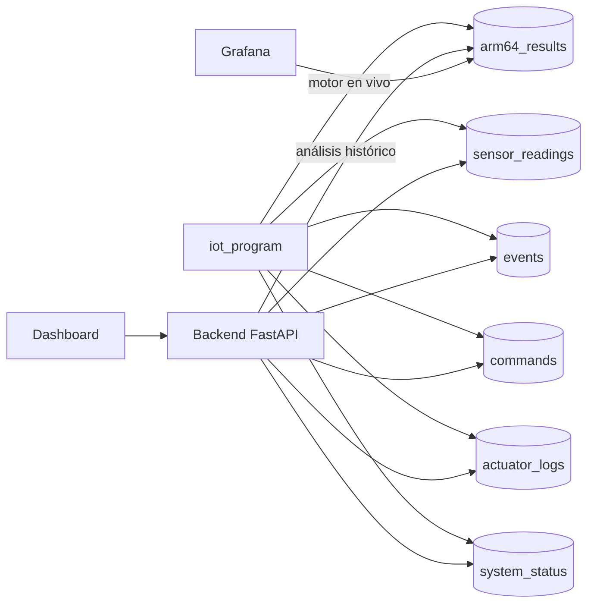

# Modelo de datos (MongoDB Atlas)

La persistencia del sistema vive en **MongoDB Atlas**, base de datos `greenpi_iot`. La Raspberry Pi registra lecturas, eventos, comandos, logs y estado, y además las **decisiones del motor ARM64 en vivo**; el backend agrega los **resultados del análisis histórico** y realiza las consultas. El dashboard accede a los datos a través del backend; Grafana lee directamente las colecciones para visualización.

---

## 1. Colecciones

| Colección         | Contenido                                                | Escribe               | Consulta |
| ----------------- | -------------------------------------------------------- | --------------------- | -------- |
| `sensor_readings` | Lecturas de sensores con timestamp.                      | iot_program           | backend  |
| `events`          | Alertas, emergencias, activaciones y cambios de estado.  | iot_program           | backend  |
| `commands`        | Comandos enviados desde el dashboard o los botones.      | iot_program / backend | backend  |
| `system_status`   | Estado global actual (`_id = "current"`).                | iot_program / backend | backend  |
| `actuator_logs`   | Activaciones de bomba, ventilador, luces, buzzer y LEDs. | iot_program           | backend  |
| `arm64_results`   | Decisiones del motor en vivo y resultados del analizador histórico. | iot_program / backend | backend / Grafana |



---

## 2. Estructura de los documentos

Las cinco colecciones de Fase 1 (`sensor_readings`, `events`, `commands`, `actuator_logs`, `system_status`) comparten la estructura base `BaseRecord`: fecha y hora, tipo de dato, valor, origen y estado relacionado.

```json
{
  "timestamp": "fecha y hora (UTC)",
  "tipo_dato": "tipo del registro",
  "valor": {},
  "origen": "iot_program | dashboard_mqtt | backend",
  "estado_relacionado": "NORMAL | ADVERTENCIA | EMERGENCIA | RIEGO_ACTIVO | MODO_MANUAL"
}
```

> La colección **`arm64_results` no usa esta estructura base**: tiene su propio esquema plano (ver §3), porque guarda decisiones y análisis de ARM64 con campos propios (`source`, `module`, `result`, `risk`, etc.).

---

## 3. Ejemplos

### `sensor_readings`

```json
{
  "timestamp": "2026-06-14T12:00:00Z",
  "tipo_dato": "lectura_sensores",
  "valor": {
    "temperatura": 28.7,
    "humedad_ambiente": 70.4,
    "humedad_suelo_area1": 45.8,
    "humedad_suelo_area2": 45.8,
    "luz": 320,
    "gas": 120,
    "riego_1": 0,
    "riego_2": 0
  },
  "origen": "iot_program",
  "estado_relacionado": "NORMAL"
}
```

### `events`

```json
{
  "timestamp": "2026-06-14T12:00:05Z",
  "tipo_dato": "evento_iot",
  "valor": {
    "descripcion": "riego automatico activado area 1",
    "humedad_suelo": 30.0,
    "area": 1
  },
  "origen": "iot_program",
  "estado_relacionado": "RIEGO_ACTIVO"
}
```

### `commands`

```json
{
  "timestamp": "2026-06-14T12:01:00Z",
  "tipo_dato": "comando_mqtt",
  "valor": { "accion": "ENCENDER_LUCES", "payload_original": "ENCENDER_LUCES" },
  "origen": "dashboard_mqtt",
  "estado_relacionado": "NORMAL"
}
```

### `actuator_logs`

```json
{
  "timestamp": "2026-06-14T12:01:00Z",
  "tipo_dato": "log_actuador",
  "valor": { "accion": "ENCENDER_LUCES", "cambios": { "luces": "ON" } },
  "origen": "iot_program",
  "estado_relacionado": "NORMAL"
}
```

### `system_status` (`_id = "current"`)

```json
{
  "_id": "current",
  "timestamp": "2026-06-14T12:01:02Z",
  "tipo_dato": "estado_sistema",
  "valor": {
    "temperatura": 28.7,
    "humedad_ambiente": 70.4,
    "humedad_suelo_area1": 45.8,
    "humedad_suelo_area2": 45.8,
    "luz": 320,
    "gas": 120,
    "riego_1": 0,
    "riego_2": 0,
    "ventilador": "VENTILACION_OFF",
    "luces": "ON",
    "alarma": "OFF",
    "modo": "AUTOMATICO",
    "estado_global": "NORMAL"
  },
  "origen": "iot_program",
  "estado_relacionado": "NORMAL"
}
```

### `arm64_results`

Esquema plano propio. Cada documento es **una** decisión del motor o **un** análisis histórico; el campo `source` los distingue: `live_engine` (motor en vivo, escrito por iot_program) o `historical_analyzer` (módulos `modulo_*.s`, escritos por el backend).

**Decisión del motor en vivo** (`source: "live_engine"`):

```json
{
  "timestamp": "2026-06-14T12:00:00Z",
  "source": "live_engine",
  "module": "motor",
  "input": "28,70,45,45,320,120,0",
  "range": null,
  "column": null,
  "result": {
    "ACTION": "FAN_ON",
    "TARGET": "VENTILADOR",
    "RISK": "MEDIUM",
    "REASON": "TEMP_ALTA",
    "VALUE": "35",
    "INDICATOR": "TEMP",
    "STATUS": "OK"
  },
  "decision": "FAN_ON",
  "risk": "MEDIUM",
  "status": "OK",
  "error_detail": null
}
```

**Análisis histórico** (`source: "historical_analyzer"`):

```json
{
  "timestamp": "2026-06-14T12:05:00Z",
  "source": "historical_analyzer",
  "module": "regresion",
  "input": "../data/lecturas.csv",
  "range": { "inicio": 1, "fin": 20 },
  "column": "TEMP",
  "result": {
    "CALC": "LINEAR_REGRESSION",
    "COLUMN": "TEMP",
    "SLOPE_X100": "-3",
    "TREND": "DESCENDING",
    "STATUS": "OK"
  },
  "decision": null,
  "risk": null,
  "status": "OK",
  "error_detail": null
}
```

`result` guarda los campos `clave=valor` ya parseados de la salida de ARM64. En el motor en vivo `range` y `column` son `null`; en el análisis histórico se llenan con el rango de líneas y la columna procesada. Si `status` es `ERROR`, `error_detail` describe el fallo.

---

## 4. Conexión

- **iot_program:** cliente síncrono (PyMongo). Si la base no está disponible, el sistema continúa con MQTT y simulación.
- **backend:** cliente asíncrono (PyMongo), abierto al iniciar la API y cerrado al apagarla.

Base de datos: `greenpi_iot`. La cadena de conexión real se mantiene fuera del repositorio mediante variables de entorno.
