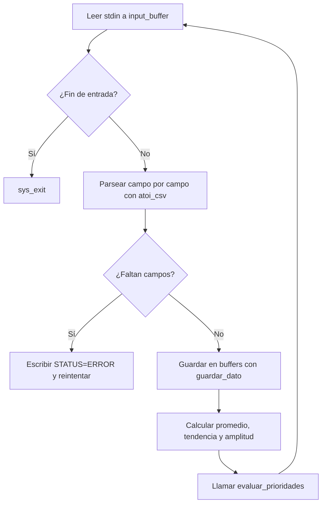

# Documentación del Motor de Decisión en Vivo (ARM64)

El **Motor en Vivo** procesa lecturas en tiempo real enviadas por Python a través de `stdin`, mantiene arreglos estáticos de historial y evalúa una matriz de prioridades para decidir qué acción tomar.

---

## 1. Arquitectura de Módulos (Includes)

El motor modulariza sus responsabilidades cargando las siguientes rutinas auxiliares:

| Archivo | Responsabilidad |
| :--- | :--- |
| `utils.s` | Funciones comunes: lectura, conversión, escritura de texto |
| `motor/array.s` | Administra la inserción ordenada de datos mediante `guardar_dato` |
| `motor/promedio.s` | Cálculo del promedio reciente sobre el historial |
| `motor/tendencia.s` | Cálculo de la tendencia acumulada sobre el historial |
| `motor/amplitud.s` | Cálculo de la amplitud (máximo - mínimo) sobre el historial |
| `motor/temperatura.s` | Lógica de evaluación para el sensor de temperatura |
| `motor/luz.s` | Lógica de evaluación para el sensor de iluminación |
| `motor/gas.s` | Lógica de evaluación para el sensor de gas |
| `motor/soil1.s` | Lógica de evaluación para humedad de suelo zona 1 |
| `motor/soil2.s` | Lógica de evaluación para humedad de suelo zona 2 |
| `motor/led_red.s` | Evaluación de riesgo alto: `LED_RED` |
| `motor/led_yellow.s` | Evaluación de advertencia: `LED_YELLOW` |
| `motor/prioridades.s` | Orquestador principal: llama evaluadores en orden de prioridad |

---

## 2. Estructura de Memoria y Buffers

El historial reciente se almacena en arreglos de **5 elementos de 64 bits** (`.quad`) inicializados en cero, cada uno con su respectivo contador de elementos ingresados:

```assembly
temp_buffer:  .quad 0, 0, 0, 0, 0
hum_buffer:   .quad 0, 0, 0, 0, 0
soil1_buffer: .quad 0, 0, 0, 0, 0
soil2_buffer: .quad 0, 0, 0, 0, 0
luz_buffer:   .quad 0, 0, 0, 0, 0
gas_buffer:   .quad 0, 0, 0, 0, 0

temp_count:   .quad 0
hum_count:    .quad 0
soil1_count:  .quad 0
soil2_count:  .quad 0
luz_count:    .quad 0
gas_count:    .quad 0
```

Cada vez que Python envía una nueva lectura, `guardar_dato` inserta el valor en el buffer correspondiente usando una política circular — cuando el buffer está lleno (5 elementos), el valor más antiguo es reemplazado por el nuevo.

---

## 3. Mapeo de Registros para la Toma de Decisiones

Antes de llamar a la rutina `evaluar_prioridades`, el motor parsea el string CSV y almacena los indicadores calculados en registros específicos:

| Registro | Sensor | Indicador |
| :---: | :--- | :--- |
| `x19` | Temperatura (`TEMP`) | Promedio reciente |
| `x20` | Temperatura (`TEMP`) | Tendencia acumulada |
| `x23` | Suelo Zona 1 (`SOIL1`) | Promedio reciente |
| `x24` | Suelo Zona 1 (`SOIL1`) | Tendencia acumulada |
| `x25` | Suelo Zona 2 (`SOIL2`) | Promedio reciente |
| `x26` | Suelo Zona 2 (`SOIL2`) | Tendencia acumulada |
| `x27` | Iluminación (`LUZ`) | Promedio reciente |
| `x28` | Iluminación (`LUZ`) | Tendencia acumulada |
| `x11` | Gas (`GAS`) | Promedio reciente |
| `x12` | Gas (`GAS`) | Amplitud reciente |
| `x13` | Modo de operación | `0` = Automático, `1` = Manual |

---

## 4. Ciclo de Ejecución Principal (`main_loop`)



### Funciones Envolturas de Indicadores

Para mantener la abstracción, el programa utiliza funciones envolventes que recuperan el contador de la memoria antes de llamar a las operaciones matemáticas base:

```assembly
promedio:
    mov x3, x0           // Dirección del buffer
    ldr x2, [x1]         // Cantidad de elementos actuales
    str x30, [sp, #-16]! // Guardar link register
    bl calcular_promedio
    ldr x30, [sp], #16   // Restaurar link register
    ret

tendencia:
    mov x3, x0
    ldr x2, [x1]
    str x30, [sp, #-16]!
    bl calcular_tendencia
    ldr x30, [sp], #16
    ret

amplitud:
    mov x3, x0
    ldr x2, [x1]
    str x30, [sp, #-16]!
    bl calcular_amplitud
    ldr x30, [sp], #16
    ret
```

---

## 3. Mapeo de Registros para la Toma de Decisiones
Antes de llamar a la rutina `evaluar_prioridades`, el motor parsea el String CSV y almacena los indicadores calculados en registros específicos:

| Registro | Sensor Evaluado | Indicador Almacenado |
| :--- | :--- | :--- |
| `x19` | Temperatura (`TEMP`) | Promedio reciente |
| `x20` | Temperatura (`TEMP`) | Tendencia acumulada |
| `x23` | Suelo Zona 1 (`SOIL1`) | Promedio reciente |
| `x24` | Suelo Zona 1 (`SOIL1`) | Tendencia acumulada |
| `x25` | Suelo Zona 2 (`SOIL2`) | Promedio reciente |
| `x26` | Suelo Zona 2 (`SOIL2`) | Tendencia acumulada |
| `x27` | Iluminación (`LUZ`) | Promedio reciente |
| `x28` | Iluminación (`LUZ`) | Tendencia acumulada |
| `x11` | Sensor de Gas (`GAS`) | Promedio reciente |
| `x12` | Sensor de Gas (`GAS`) | Amplitud reciente |
| `x13` | Modo de Operación | `0` = Automático, `1` = Manual |

---

## 6. Formato de Comunicación con Python

### Entrada por `stdin`

Python envía una línea CSV con exactamente **7 campos** por cada ciclo de lectura:

```
TEMP,HUM_AIRE,SOIL1,SOIL2,LUZ,GAS,MODO
```

**Ejemplo:**
```
31,68,34,41,280,160,0
```

| Campo | Descripción |
| :--- | :--- |
| `TEMP` | Temperatura ambiental |
| `HUM_AIRE` | Humedad ambiental |
| `SOIL1` | Humedad suelo zona 1 |
| `SOIL2` | Humedad suelo zona 2 |
| `LUZ` | Nivel de iluminación |
| `GAS` | Nivel de gas |
| `MODO` | `0` = automático, `1` = manual |

### Salida por `stdout`

El motor responde con formato de múltiples líneas (Opción B):

```
ACTION=ALARM_ON
TARGET=GAS
RISK=CRITICAL
REASON=HIGH_GAS_OR_HIGH_AMP
VALUE=420
INDICATOR=90
STATUS=OK
```

| Campo | Descripción |
| :--- | :--- |
| `ACTION` | Acción recomendada por ARM64 |
| `TARGET` | Sensor o actuador relacionado |
| `RISK` | Nivel: `LOW`, `MEDIUM`, `HIGH` o `CRITICAL` |
| `REASON` | Motivo técnico de la decisión |
| `VALUE` | Promedio del sensor principal usado |
| `INDICATOR` | Indicador secundario usado (tendencia o amplitud) |
| `STATUS` | `OK` o `ERROR` |

---

## 7. Control de Errores de Entrada

Si el procesamiento falla al validar la presencia de los 7 campos necesarios (datos incompletos o texto no numérico), el motor lo detecta mediante el flag `x7` retornado por `atoi_csv`.

**Salida de error:**
```
STATUS=ERROR
ERROR=INVALID_INPUT
DETAIL=EXPECTED_7_FIELDS
```

El motor **no interrumpe su ejecución** ante una lectura errónea; limpia el estado y regresa al ciclo `main_loop` para esperar la siguiente línea de datos.