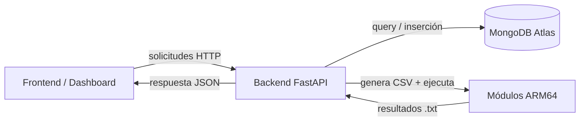
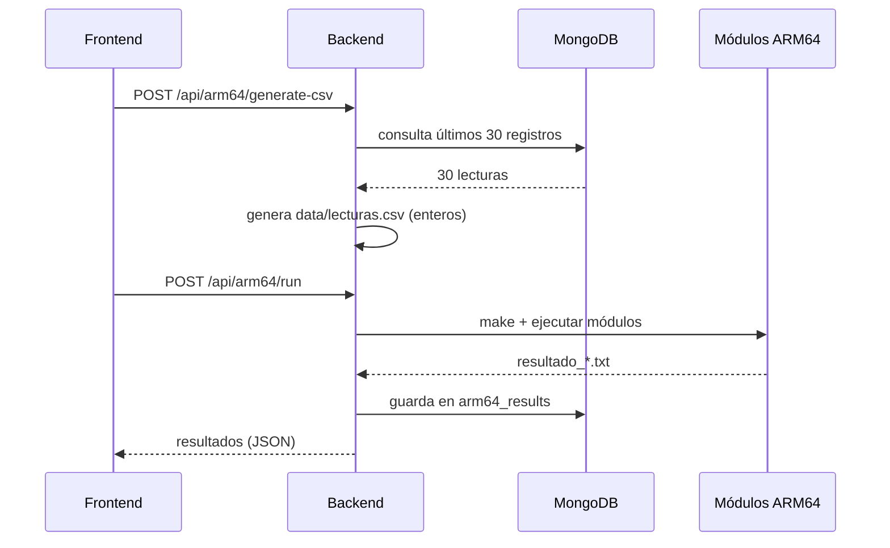

# ❀ Backend FastAPI — GreenPi IoT

API REST que alimenta al dashboard. Se comunica con **MongoDB Atlas** mediante la API asíncrona de PyMongo, registra comandos y coordina el flujo **ARM64**.

## Arquitectura



---

## ☰ Contenido

- [Requisitos](#-requisitos)
- [Puesta en marcha](#-puesta-en-marcha)
- [Variables de entorno](#-variables-de-entorno)
- [Probar la API](#-probar-la-api)
- [Colecciones de MongoDB](#-colecciones-de-mongodb)
- [Flujo ARM64](#-flujo-arm64)

---

## ✦ Requisitos

- Python 3.10+
- Una URI de MongoDB Atlas
- Los módulos ARM64 compilables (`arm64/` en la raíz del repositorio)

---

## ✶ Puesta en marcha

### 1. Crear el entorno virtual

**Linux / macOS**

```bash
cd server
python -m venv .venv
source .venv/bin/activate
```

**Windows**

```bash
cd server
python -m venv .venv
.venv\Scripts\activate
```

### 2. Instalar dependencias

```bash
pip install -r requirements.txt
```

### 3. Configurar variables de entorno

```bash
cp .env.example .env
```

Luego completá tus valores (ver la sección siguiente).

### 4. Ejecutar el backend

```bash
fastapi dev
```

La API queda disponible en **http://127.0.0.1:8000**

> Alternativa con Uvicorn:
>
> ```bash
> uvicorn app.main:app --reload
> ```

---

## ✷ Variables de entorno

| Variable       | Descripción                            | Ejemplo                 |
| -------------- | -------------------------------------- | ----------------------- |
| `MONGODB_URI`  | Cadena de conexión a MongoDB Atlas     | _(privada)_             |
| `MONGODB_DB`   | Nombre de la base de datos             | `greenpi_iot`           |
| `FRONTEND_URL` | Origen permitido para CORS             | `http://localhost:3000` |
| `ARM64_DIR`    | Ruta a la carpeta de los módulos ARM64 | `../arm64`              |

> ❈ **Nunca subas el archivo `.env` al repositorio.** Contiene credenciales y debe quedar solo en tu máquina.

---

## ❊ Probar la API

### Documentación interactiva

Abrí **http://127.0.0.1:8000/docs**

### Probar la conexión a MongoDB

Con el `.env` ya configurado:

```bash
# Inserta una lectura de prueba en sensor_readings
curl -X POST http://127.0.0.1:8000/api/readings/test

# Consulta la última lectura guardada
curl http://127.0.0.1:8000/api/readings/latest
```

---

## ▤ Colecciones de MongoDB

| Colección         | Contenido                       |
| ----------------- | ------------------------------- |
| `sensor_readings` | Lecturas de sensores            |
| `events`          | Eventos del sistema             |
| `commands`        | Comandos recibidos              |
| `system_status`   | Estado global del invernadero   |
| `actuator_logs`   | Activaciones de actuadores      |
| `arm64_results`   | Resultados de los módulos ARM64 |

Los documentos de `arm64_results` siguen el **esquema plano del PDF**:

```json
{
  "timestamp": "fecha y hora UTC",
  "source": "historical_analyzer | live_engine",
  "module": "media | varianza | regresion | ... | motor",
  "input": "lecturas.csv 1 30 TEMP",
  "range": { "line_start": 1, "line_end": 30 },
  "column": "temp",
  "result": { "raw": "texto del .txt", "fields": {} },
  "decision": null,
  "risk": null,
  "status": "OK | ERROR",
  "error_detail": null
}
```

El **analizador histórico** (backend) usa `source: "historical_analyzer"`; el **motor en vivo** (`iot_program`) usa `source: "live_engine"` con `module: "motor"`.

---

## ❂ Flujo ARM64

El backend coordina la generación de datos, la ejecución de los módulos y el guardado de resultados.



### 1. Generar el CSV — `POST /api/arm64/generate-csv`

Consulta los **últimos 30 documentos** de `sensor_readings` y genera `data/lecturas.csv` (en la raíz del repositorio) con este formato:

```csv
TEMP,HUM_AIRE,SOIL1,SOIL2,LUZ,GAS,MODO
28,70,45,48,320,120,0
```

### 2. Ejecutar los módulos — `POST /api/arm64/run`

1. Genera `lecturas.csv` con los últimos `N` registros.
2. Ejecuta `make run-all` (o `make run-<modulo>` para uno solo) dentro de `arm64/`, pasando `LEC` (archivo), `INI`/`FIN` (rango de líneas) y `COL` (columna).
3. Lee cada salida `.txt` en `resultados_arm64/` y la guarda en `arm64_results` con `source: "historical_analyzer"`.

Módulos del **analizador histórico** (según el PDF):

| Clave            | Archivo                     | Salida                            |
| ---------------- | --------------------------- | --------------------------------- |
| `media`          | `modulo_1_media.s`          | `resultado_media.txt`             |
| `rmse`           | `modulo_1_rmse.s`           | `resultado_rmse.txt`              |
| `varianza`       | `modulo_2_varianza.s`       | `resultado_varianza.txt`          |
| `regresion`      | `modulo_2_regresion.s`      | `resultado_regresion.txt`         |
| `anomalias`      | `modulo_3_anomalias.s`      | `resultado_anomalias.txt`         |
| `prediccion_reg` | `modulo_3_prediccion.s`     | `resultado_prediccion_futura.txt` |
| `prediccion`     | `modulo_4_prediccion.s`     | `resultado_prediccion.txt`        |
| `integral`       | `modulo_4_integral_error.s` | `resultado_integral_error.txt`    |
| `derivada`       | `modulo_5_derivada_local.s` | `resultado_derivada_local.txt`    |
| `tendencia`      | `modulo_5_tendencia.s`      | `resultado_tendencia.txt`         |
