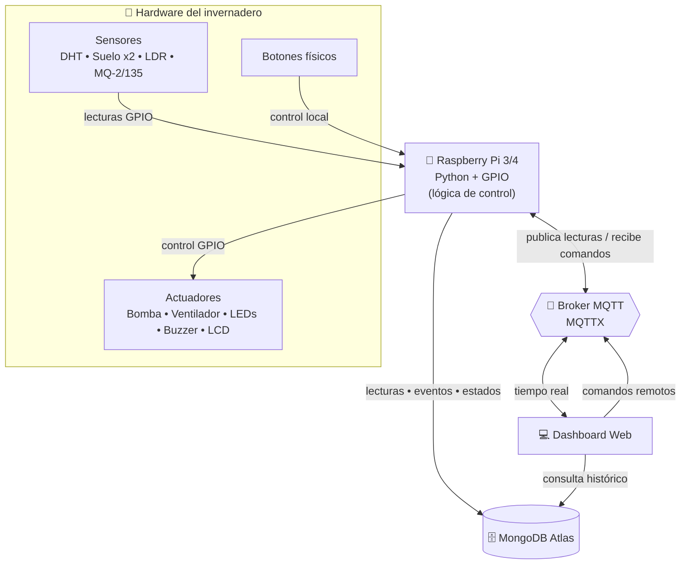
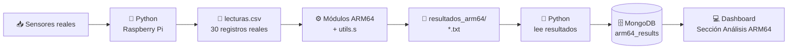
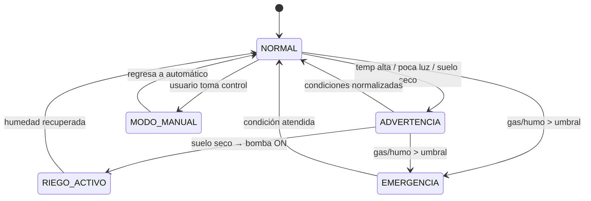

# 🌱 Invernadero Inteligente IoT

Proyecto académico del curso **Arquitectura de Computadores y Ensambladores 1** — Segundo Semestre 2026.

Sistema IoT sobre **Raspberry Pi** que monitorea y controla un invernadero dividido en dos áreas de cultivo y un centro de control, integrando sensores, actuadores, comunicación MQTT, persistencia en MongoDB Atlas, un dashboard web y procesamiento de datos en ensamblador **ARM64/AArch64**.

---

## 📑 Contenido

- [Integrantes](#-integrantes)
- [Objetivo](#-objetivo)
- [Arquitectura general](#-arquitectura-general)
- [Distribución física de la maqueta](#-distribución-física-de-la-maqueta)
- [Flujo de procesamiento ARM64](#-flujo-de-procesamiento-arm64)
- [Estados globales del sistema](#-estados-globales-del-sistema)
- [Sensores y actuadores](#-sensores)
- [Tecnologías](#-tecnologías)
- [Módulos ARM64](#-módulos-arm64)
- [Distribución del trabajo](#-distribución-del-trabajo)
- [Estructura del proyecto](#-estructura-del-proyecto)
- [Estado del proyecto](#-estado-del-proyecto)

---

## 👥 Integrantes

| Carnet    | Nombre                           |
| --------- | -------------------------------- |
| 202406918 | Claudia Maribel Tigüilá Tecum    |
| 202403929 | Emiliana Elizabeth Pú Lara       |
| 202300476 | Alex Ricardo Castañeda Rodríguez |
| 202100171 | Alex Oswaldo López Alquejay      |
| 202001376 | Kevin Rodrigo Sandoval Hernández |

---

## 🎯 Objetivo

Diseñar e implementar un sistema IoT capaz de monitorear y controlar un invernadero de forma automática y remota, integrando hardware, software, comunicación MQTT, base de datos MongoDB Atlas, dashboard web y procesamiento de datos en ARM64.

La maqueta física se divide en tres zonas:

- **Área de cultivo 1** — planta, sensor de humedad de suelo, riego e iluminación.
- **Área de cultivo 2** — planta, sensor de humedad de suelo, riego e iluminación.
- **Centro de control** — Raspberry Pi, pantalla LCD, botones físicos, LEDs de estado y buzzer.

---

## 🏗️ Arquitectura general

Flujo bidireccional entre el hardware del invernadero, la Raspberry Pi, el broker MQTT, la base de datos y el dashboard web.

---

## 🧱 Distribución física de la maqueta

```mermaid
flowchart LR
    subgraph A1["Área de cultivo 1"]
        direction TB
        P1["🌱 Planta"]
        HS1["Sensor humedad suelo 1"]
        R1["💧 Riego 1"]
        L1["💡 LEDs"]
    end

    subgraph CC["⚙️ Centro de control"]
        direction TB
        RPI["🍓 Raspberry Pi"]
        LCD["🖥️ LCD 16x2 / 20x4"]
        BTNS["🔘 4+ botones"]
        LEDS["🟢🟡🔴 LEDs de estado"]
        BUZ["🔔 Buzzer"]
    end

    subgraph A2["Área de cultivo 2"]
        direction TB
        P2["🌱 Planta"]
        HS2["Sensor humedad suelo 2"]
        R2["💧 Riego 2"]
        L2["💡 LEDs"]
    end

    A1 --- CC --- A2
```

---

## 🔬 Flujo de procesamiento ARM64

Python genera los datos reales; **todos los cálculos estadísticos se hacen en ensamblador ARM64** (Python no puede calcularlos).

> **Regla clave:** los módulos ARM64 no pueden simular cálculos, y Python no puede realizar los cálculos que corresponden a ARM64.

---

## 🚦 Estados globales del sistema

> En **EMERGENCIA** el sistema no regresa automáticamente a NORMAL mientras el sensor de gas siga por encima del umbral.

---

## 🌡️ Sensores

| Sensor                       | Función                                         |
| ---------------------------- | ----------------------------------------------- |
| DHT11 o DHT22                | Medir temperatura y humedad ambiental           |
| Sensor de humedad de suelo 1 | Medir humedad del suelo en el área de cultivo 1 |
| Sensor de humedad de suelo 2 | Medir humedad del suelo en el área de cultivo 2 |
| LDR                          | Detectar el nivel de luz                        |
| MQ-2 o MQ-135                | Detectar gas, humo o mala calidad del aire      |

## 🔌 Actuadores

| Actuador        | Función                                        |
| --------------- | ---------------------------------------------- |
| Bomba de agua   | Activar el sistema de riego                    |
| Ventilador      | Activar ventilación por temperatura alta o gas |
| LEDs blancos    | Iluminación artificial del invernadero         |
| LED verde       | Estado normal                                  |
| LED amarillo    | Estado de advertencia                          |
| LED rojo        | Estado de emergencia                           |
| Buzzer          | Alarma sonora                                  |
| LCD             | Mostrar lecturas y estados                     |
| Botones físicos | Permitir control manual                        |

---

## 🛠️ Tecnologías

| Área                   | Tecnología      |
| ---------------------- | --------------- |
| Control principal      | Raspberry Pi    |
| Lenguaje principal     | Python          |
| Comunicación IoT       | MQTT / MQTTX    |
| Base de datos          | MongoDB Atlas   |
| Dashboard              | Aplicación web  |
| Procesamiento de datos | ARM64 / AArch64 |
| Control de versiones   | Git y GitHub    |

---

## ⚙️ Módulos ARM64

Cada integrante desarrolla una rutina individual en ensamblador ARM64. Todos los módulos usan la biblioteca común `utils.s` y trabajan sobre los mismos 30 datos reales de `lecturas.csv`.

| Archivo                 | Descripción                    | Salida                     |
| ----------------------- | ------------------------------ | -------------------------- |
| `modulo_1_media.s`      | Media aritmética ponderada     | `resultado_media.txt`      |
| `modulo_2_varianza.s`   | Varianza y desviación estándar | `resultado_varianza.txt`   |
| `modulo_3_anomalias.s`  | Detección de anomalías         | `resultado_anomalias.txt`  |
| `modulo_4_prediccion.s` | Predicción lineal simple       | `resultado_prediccion.txt` |
| `modulo_5_tendencia.s`  | Tendencia acumulada avanzada   | `resultado_tendencia.txt`  |

---

## 🧑‍💻 Distribución del trabajo

| Integrante                       | Responsabilidad principal                               | Módulo ARM64                   |
| -------------------------------- | ------------------------------------------------------- | ------------------------------ |
| Claudia Maribel Tigüilá Tecum    | Área de cultivo 1, sensor de suelo 1 y riego del área 1 | Media aritmética ponderada     |
| Emiliana Elizabeth Pú Lara       | Área de cultivo 2, sensor de suelo 2 y riego del área 2 | Varianza y desviación estándar |
| Alex Oswaldo López Alquejay      | Centro de control, LCD, botones, LEDs y buzzer          | Predicción lineal simple       |
| Kevin Rodrigo Sandoval Hernández | Temperatura, humedad ambiental, gas y ventilación       | Detección de anomalías         |
| Alex Ricardo Castañeda Rodríguez | MQTT, MongoDB, dashboard e integración general          | Tendencia acumulada avanzada   |

Todos los integrantes participan en la construcción física de la maqueta y en las pruebas de integración.

---

## 📌 Estado del proyecto

🟡 En fase inicial de análisis, diseño y planificación.
