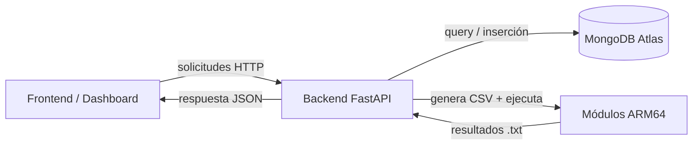
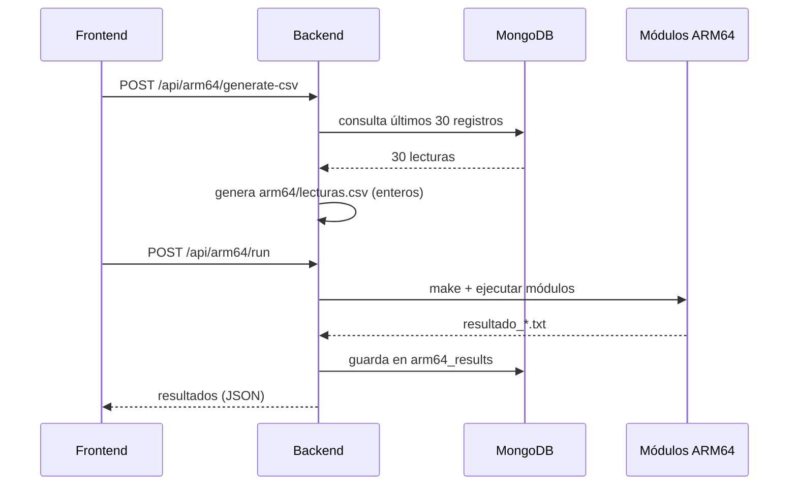

# 🌱 Backend FastAPI — GreenPi IoT

API REST que alimenta al dashboard. Se comunica con **MongoDB Atlas** mediante la API asíncrona de PyMongo, registra comandos y coordina el flujo **ARM64**.

## Arquitectura



---

## 📑 Contenido

- [Requisitos](#-requisitos)
- [Puesta en marcha](#-puesta-en-marcha)
- [Variables de entorno](#-variables-de-entorno)
- [Probar la API](#-probar-la-api)
- [Colecciones de MongoDB](#-colecciones-de-mongodb)
- [Flujo ARM64](#-flujo-arm64)

---

## ✅ Requisitos

- Python 3.10+
- Una URI de MongoDB Atlas
- Los módulos ARM64 compilables (`arm64/` en la raíz del repositorio)

---

## 🚀 Puesta en marcha

### 1. Crear el entorno virtual

**Linux / macOS**

```bash
cd server
python -m venv .venv
source .venv/bin/activate
```

**Windows**

```bash
cd server
python -m venv .venv
.venv\Scripts\activate
```

### 2. Instalar dependencias

```bash
pip install -r requirements.txt
```

### 3. Configurar variables de entorno

```bash
cp .env.example .env
```

Luego completá tus valores (ver la sección siguiente).

### 4. Ejecutar el backend

```bash
fastapi dev
```

La API queda disponible en **http://127.0.0.1:8000**

> Alternativa con Uvicorn:
>
> ```bash
> uvicorn app.main:app --reload
> ```

---

## 🔧 Variables de entorno

| Variable       | Descripción                            | Ejemplo                 |
| -------------- | -------------------------------------- | ----------------------- |
| `MONGODB_URI`  | Cadena de conexión a MongoDB Atlas     | _(privada)_             |
| `MONGODB_DB`   | Nombre de la base de datos             | `greenpi_iot`           |
| `FRONTEND_URL` | Origen permitido para CORS             | `http://localhost:3000` |
| `ARM64_DIR`    | Ruta a la carpeta de los módulos ARM64 | `../arm64`              |

> ⚠️ **Nunca subas el archivo `.env` al repositorio.** Contiene credenciales y debe quedar solo en tu máquina.

---

## 🧪 Probar la API

### Documentación interactiva

Abrí **http://127.0.0.1:8000/docs**

### Probar la conexión a MongoDB

Con el `.env` ya configurado:

```bash
# Inserta una lectura de prueba en sensor_readings
curl -X POST http://127.0.0.1:8000/api/readings/test

# Consulta la última lectura guardada
curl http://127.0.0.1:8000/api/readings/latest
```

---

## 🗄️ Colecciones de MongoDB

| Colección         | Contenido                       |
| ----------------- | ------------------------------- |
| `sensor_readings` | Lecturas de sensores            |
| `events`          | Eventos del sistema             |
| `commands`        | Comandos recibidos              |
| `system_status`   | Estado global del invernadero   |
| `actuator_logs`   | Activaciones de actuadores      |
| `arm64_results`   | Resultados de los módulos ARM64 |

Cuando aplica, los documentos siguen esta estructura base:

```json
{
  "timestamp": "fecha y hora actual",
  "tipo_dato": "tipo del registro",
  "valor": {},
  "origen": "backend_fastapi | dashboard | iot_program | arm64",
  "estado_relacionado": "NORMAL | ADVERTENCIA | EMERGENCIA | RIEGO_ACTIVO | MODO_MANUAL | PENDIENTE"
}
```

---

## ⚙️ Flujo ARM64

El backend coordina la generación de datos, la ejecución de los módulos y el guardado de resultados.



### 1. Generar el CSV — `POST /api/arm64/generate-csv`

Consulta los **últimos 30 documentos** de `sensor_readings` y genera `arm64/lecturas.csv` (en la raíz del repositorio) con este formato:

```csv
ID,TEMP,HUM_AIRE,HUM_SUELO_1,HUM_SUELO_2,LUZ,GAS,RIEGO_1,RIEGO_2
1,28,70,45,48,320,120,0,0
```

### 2. Ejecutar los módulos — `POST /api/arm64/run`

1. Verifica que exista `lecturas.csv`.
2. Ejecuta `make` dentro de `arm64/` y luego un target `run`, `ejecutar` o `all-run` si existe.
3. Si el Makefile no tiene target de ejecución, intenta correr los binarios directamente:

   ```text
   modulo_1_media
   modulo_2_varianza
   modulo_3_anomalias
   modulo_4_prediccion
   modulo_5_tendencia
   ```

4. Lee los resultados esperados en `resultados_arm64/` (en la raíz):

   ```text
   resultado_media.txt
   resultado_varianza.txt
   resultado_anomalias.txt
   resultado_prediccion.txt
   resultado_tendencia.txt
   ```

5. Guarda cada resultado en la colección `arm64_results` con `origen: "arm64"`.

> Si faltan el Makefile, los binarios o los archivos `.txt`, la API devuelve **errores claros** indicando qué falta implementar.
